此处是一些 Java 高频面试题（持续更新中...）。

<!-- more -->

## 目录

### 基础

- [基础](/audition/java/core/README.md)

### 集合

- [集合](/audition/java/collection/README.md)

### 并发编程

- [并发编程](/audition/java/concurrent/README.md)

### IO

- [IO](/audition/java/io/README.md)

### JVM

- [JVM](/audition/java/jvm/README.md)

### 新特性

- [新特性](/audition/java/new/README.md)
  - [JDK8](/audition/java/new/jdk8.md)
  - [JDK9](/audition/java/new/jdk9.md)
  - [JDK10](/audition/java/new/jdk10.md)
  - [JDK11](/audition/java/new/jdk11.md)
  - [JDK12](/audition/java/new/jdk12.md)
  - [JDK13](/audition/java/new/jdk13.md)
  - [JDK14](/audition/java/new/jdk14.md)
  - [JDK15](/audition/java/new/jdk15.md)
  - [JDK16](/audition/java/new/jdk16.md)
  - [JDK17](/audition/java/new/jdk17.md)
  - [JDK18](/audition/java/new/jdk18.md)
  - [JDK19](/audition/java/new/jdk19.md)
  - [JDK20](/audition/java/new/jdk20.md)
  - [JDK21](/audition/java/new/jdk21.md)

## 面试题汇总

### 常见集合面试题

::: info Java 集合体系。

> 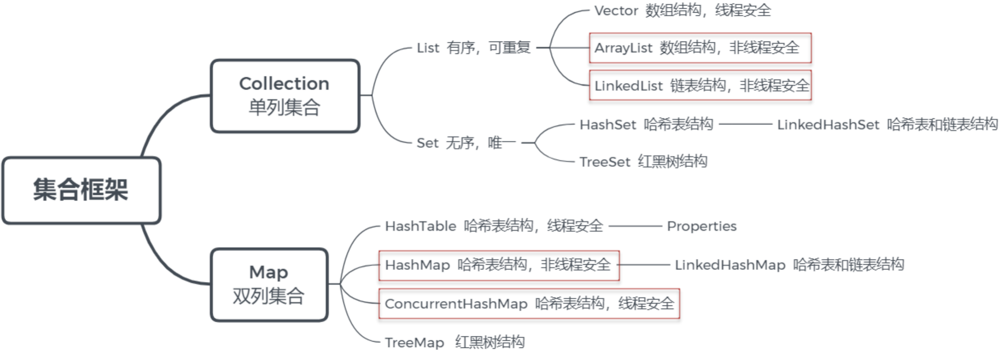

:::

::: info ArrayList 底层的数据结构和扩容的机制。

> 每次扩容是原来的 1.5 倍。

:::

::: info 如何实现数组和 List 之间的转换？

> 数组转 List：`Arrays.asList(T... a)`。
>
> - 如果修改了原数组的内容，会影响转换后的 List。
> - 使用的是 Arrays 类内部的一个 ArrayList 来构建的集合。
>
> List 转数组：`List.toArray()` - 不影响原 List。
>
> - 如果修改的原 List 的内容，不会影响转换后的数组。
> - 底层进行了数组的拷贝。

:::

::: info ArrayList 和 LinkedList 的区别是什么？

> **从几个方面回答**：
>
> - 底层数据结构：动态数组、双向链表的不同特点。
> - 操作效率。
> - 占用的内存空间（数组需要连续的内存空间、链表不需要）。
> - 线程是否安全：ArrayList 和 LinkedList 都不是线程安全的类。

:::

::: info HashMap 相关面试题。

> 底层数据结构：
>
> - JDK 1.7：数组 + 链表（采用的是拉链法）。
> - JDK 1.8：数组 + 链表 + 红黑树。
>
> 名词：哈希碰撞、拉链法、头插法（JDK 1.7）、扰动算法、加载因子（0.75）。
>
> 树化：链表的长度大于 8 且数组的长度大于 64 则链表转化为红黑树（默认数组长度为 16）。
>
> 退化：红黑树拆分成的树的节点数小于等于临界值 6 时则退化为链表。
>
> **HashMap 的 `put` 流程**：
>
> 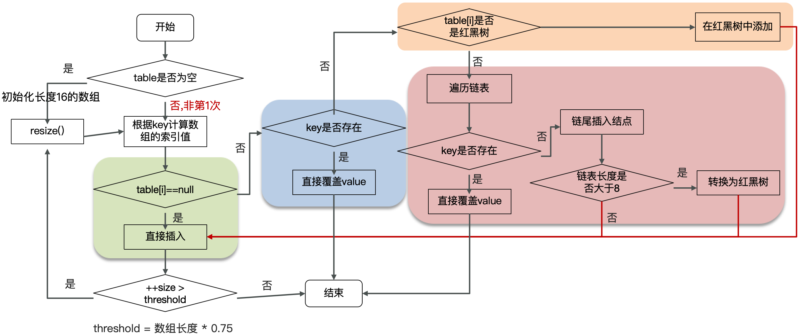
>
> **文字描述 `put` 的流程**：
>
> 1. 判断键值对数组 `table` 是否为空或为 `null`，否则执行 `resize()` 方法进行扩容（初始化）。
> 2. 根据键值 `key` 计算 `hash` 值得到数组索引。
> 3. 判断 `table[i]==null`，条件成立，直接新建节点添加。
> 4. 如果 `table[i]==null`，不成立：
>    1. 判断 `table[i]` 的首个元素是否和 `key` 一样，如果相同直接覆盖 `value`。
>    2. 判断 `table[i]` 是否为 `treeNode`，即 `table[i]` 是否是红黑树，如果是红黑树，则直接在树中插入键值对。
>    3. 遍历 `table[i]`，链表的尾部插入数据，然后判断链表长度是否大于 8，大于 8 的话把链表转换为红黑树，在红黑树中执行插入操作，遍历过程中若发现 `key` 已经存在直接覆盖 `value`。
> 5. 插入成功后，判断实际存在的键值对数量 `size` 是否超多了最大容量 `threshold`（数组长度 * 0.75），如果超过，进行扩容。
>
> **HashMap 的寻址算法**：
>
>

:::

### 多线程面试题

::: info 线程和进程的区别？

:::

::: info 并行和并发有什么区别？

> 并发（单核 CPU）：同一时间应对多件事情的能力。
>
> 并行（多核 CPU）：同一时间动手做多件事情的能力。

:::

::: info 创建线程的方式有哪些？

> 四种（包括线程池）：
>
> - 继承 `Thread` 类。
> - 实现 `Runnable` 接口。
> - 实现 `Callable` 接口（结合 `FutureTask` 可获取异步执行的结果、可抛出异常）。
> - 线程池创建线程。

:::

::: info Runnable 和 Callable 有什么区别？

> Runnable 接口 `run()` 方法没有返回值。
>
> Callable 接口 `call()` 方法有返回值，是个泛型，和 Future、FutureTask 配合可以用来获取异步执行的结果。
>
> Callable 接口的 `call()` 方法允许抛出异常，而 Runnable 接口的 `run()` 方法的异常只能在内部消化，不能继续上抛。

:::

::: info 调用 run() 方法和 start() 方法有什么区别？

> `start()`：用来启动线程（只能调用一次）。
>
> `run()`：封装了要被线程执行的代码（可以被调用多次）。

:::

::: info 线程包括哪些状态？状态之间是如何变化的？

> 见“并发编程”章节。

:::

::: info 如何保证多个线程按照指定的顺序执行？

> `Thread.join()` 方法。
>
> 作用：等待当前调用 `join()` 方法的这个线程结束。

:::

::: info notify() 和 notifyAll() 有什么区别？

> `notify()`：随机唤醒一个 `wait()`、`wait(long)` 的线程。
>
> `notifyAll()`：唤醒全部 `wait()`、`wait(long)` 的线程。

:::

::: info wait 方法和 sleep 方法的不同？

> 见“并发编程”章节。

:::

::: info 如何停止一个正在运行的线程？

> 有三种方式可以停止线程：
>
> - 使用退出标志，使线程正常退出，也就是当 `run()` 方法完成后线程终止。
> - 使用 `stop()` 方法强行终止（不推荐 - 方法已作废）。
> - 使用 `interrupt()` 方法中断线程：
>   - 打断阻塞的线程（`sleep`、`wait`、`join`）的线程会抛出 `InterruptedException` 异常。
>   - 打断正常运行的线程，可以根据打断状态来标记是否退出线程 `Thread.currentThread().isInterrupted()`。

:::

::: info synchronized 关键字的底层原理。

> Monitor 属性：
>
> - WaitSet - 关联调用了 `wait()`、`wait(long)`、`sleep()` 方法的线程（处于 Waiting 状态的线程）。
> - EntryList - 关联没有抢到锁的线程（处于 Blocked 状态的线程）。
> - Owner - 存储当前获取锁的线程（只能有一个线程可以获取）。
>
> 见“并发编程”章节。

:::

::: info Monitor 实现的锁属于重量级锁？你了解过锁升级吗？

> Monitor 实现的锁属于重量级锁：里面涉及到了用户态和内核态的切换、进程的上下文切换，成本较高，性能比较低。
>
> 在 JDK 1.6 引入了两种新型锁机制：偏向锁和轻量级锁，它们的引入是为了解决在没有多线程竞争或基本没有竞争的场景下因使用传统锁机制带来的性能开销问题。
>
> 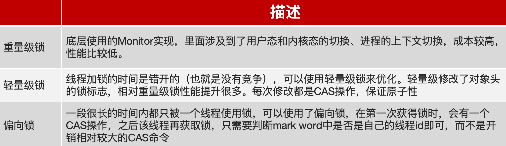
>
> ==一旦锁发生了竞争，都会升级为重量级锁==。

:::

::: info 谈谈 JMM（Java内存模型）。

> JMM（Java Memory Model）Java 内存模型，定义了==共享内存==中==多线程程序读写操作==的行为规范，通过这些规则来规范对内存的读写操作从而保证指令的正确性。
>
> JMM 把内存分为两块：一块是私有线程的工作区域（工作内存）、一块是所有线程的共享区域（主内存）。
>
> 线程跟线程之间是相互隔离，线程跟线程交互需要通过主内存。

:::

::: info CAS 你知道吗？

:::

::: info 乐观锁和悲观锁。

:::

::: info 谈谈你对 volatile 的理解。

> **保证线程间的可见性**：用 `volatile` 关键字修饰共享变量，能够防止编译器等优化发生，让一个线程对共享变量的修改对另一个线程可见。
>
> **禁止进行指令重排序**：用 `volatile` 修饰共享变量会在读、写共享变量时加入不同的屏障，阻止其他读写操作越过屏障，从而达到阻止重排序的效果。
>
> 见“并发编程”章节。

:::

::: info 什么是AQS ？

:::

::: info ReentrantLock。

> ReentrantLock 翻译过来是可重入锁，相对于 synchronized 它具备以下特点：
>
> - 可中断。
> - 可以设置超时时间。
> - 可以设置公平锁。
> - 支持多个条件变量。
> - 与 synchronized 一样都支持重入。

:::

::: info synchronized 和 Lock 有什么区别？

> 见“并发编程”章节。

:::

::: info 死锁产生的条件是什么？

> 一个线程需要同时获取多把锁。

:::

::: info 如何进行死锁诊断？

> jps（查看进程 ID）、jstack（查看 Java 进程内线程的堆栈信息）。
>
> 可视化工具：jconsole、VisualVM。

:::

::: info ConcurrentHashMap。

> 见“并发编程”章节。

:::

::: info Java 并发编程三大特性。

> 原子性：加锁来保证原子性（`synchronized`、`Lock`）。
>
> 可见性：使用 `volatile` 关键字和 `synchronized`、`Lock` 保证可见性。
>
> 有序性：使用 `volatile` 关键字保证有序性。

:::

::: info 线程池的核心参数有哪些？

> 参数最多的有 7 个：
>
> ```java
> public ThreadPoolExecutor(
>   int corePoolSize,
>   int maximumPoolSize,
>   long keepAliveTime,
>   TimeUnit unit,
>   BlockingQueue<Runnable> workQueue,
>   ThreadFactory threadFactory,
>   RejectedExecutionHandler handler
> )
> ```
>
> - corePoolSize 核心线程数目。
> - maximumPoolSize 最大线程数目 = (核心线程+救急线程的最大数目)。
> - keepAliveTime 生存时间 - 救急线程的生存时间，生存时间内没有新任务，此线程资源会释放。
> - unit 时间单位 - 救急线程的生存时间单位，如秒、毫秒等。
> - workQueue - 当没有空闲核心线程时，新来任务会加入到此队列排队，队列满会创建救急线程执行任务。
>   - ArrayBlockingQueue：基于数组结构的有界阻塞队列，FIFO。
>   - LinkedBlockingQueue：基于链表结构的有界阻塞队列，FIFO。
>   - DelayedWorkQueue ：是一个优先级队列，它可以保证每次出队的任务都是当前队列中执行时间最靠前的。
>   - SynchronousQueue：不存储元素的阻塞队列，每个插入操作都必须等待一个移出操作。
> - threadFactory 线程工厂 - 可以定制线程对象的创建，例如设置线程名字、是否是守护线程等。
> - handler 拒绝策略 - 当所有线程都在繁忙，workQueue 也放满时，会触发拒绝策略。
>   - AbortPolicy：直接抛出异常，默认策略。
>   - CallerRunsPolicy：用调用者所在的线程来执行任务。
>   - DiscardOldestPolicy：丢弃阻塞队列中靠最前的任务，并执行当前任务。
>   - DiscardPolicy：直接丢弃任务。
>
> **如何确定核心线程数？**
>
> IO 密集型任务：文件读写、DB 读写、网络请求等，核心线程数大小设置为：
>
> - 高并发场景：CPU 核数 + 1。
> - 并发不高、任务执行时间长：CPU 核数 * 2 + 1。
>
> CPU 密集型任务：计算型代码、Bitmap 转换、Gson 转换等，核心线程数大小设置为：CPU 核数 + 1。
>
> ```java
> public static void main(String[] args) {
>   // 查看机器的 CPU 核数
>   System.out.println(Runtime.getRuntime().availableProcessors());
> }
> ```
>
> 查看机器的 CPU 核数。

:::

::: info 线程池的种类有哪些？

> newFixedThreadPool：创建一个定长线程池，可控制线程最大并发数，超出的线程会在队列中等待。
>
> newSingleThreadExecutor：创建一个单线程化的线程池，它只会用唯一的工作线程来执行任 务，保证所有任务按照指定顺序(FIFO)执行。
>
> newCachedThreadPool：创建一个可缓存线程池，如果线程池长度超过处理需要，可灵活回收空闲线程，若无可回收，则新建线程。
>
> newScheduledThreadPool：可以执行延迟任务的线程池，支持定时及周期性任务执行。

:::

::: info 为什么不建议用 Executors 创建线程池？

> 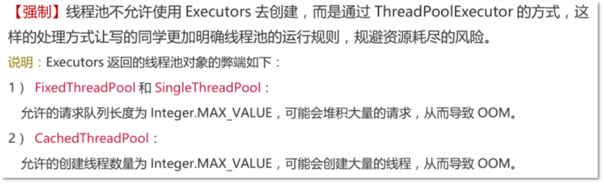

:::

::: info 线程池使用场景。

> **ES 数据批量导入**：
>
> 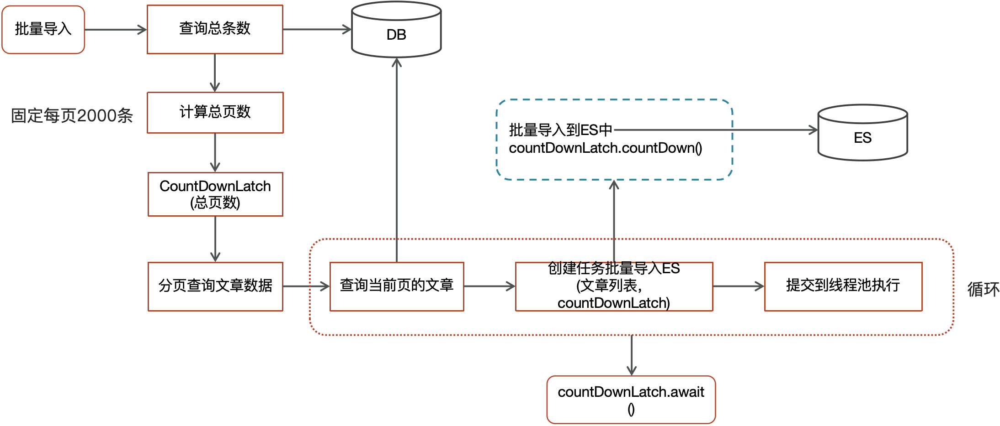
>
> **多个查询结果汇总**：
>
> 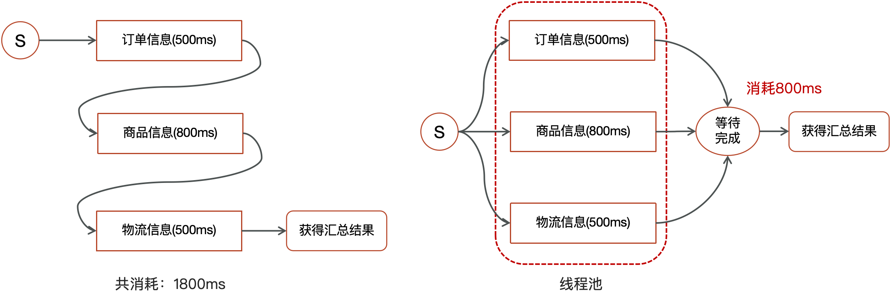
>
> **你们项目哪里用到了多线程？**
>
> - 批量导入：使用了线程池 + CountDownLatch 批量把数据库中的数据导入到了 ES 中，避免 OOM。
> - 数据汇总：调用多个接口来汇总数据，如果所有接口（或部分接口）的没有依赖关系，就可以使用线程池 + future 来提升性能。
> - 异步线程（线程池）：为了避免下一级方法影响上一级方法（性能考虑），可使用异步线程调用下一个方法（不需要下一级方法返回值），可以提升方法响应时间。

:::

::: info ThreadLocal。

> 见“并发编程”章节。

:::

### 场景面试题

::: info 单点登录这块怎么实现的？

> 单点登录的英文名叫做：Single Sign On（简称SSO），只需要登录一次，就可以访问所有信任的应用系统。
>
> 单点登录解决方案：
>
> - ==JWT==。
> - Oauth2。
> - CAS。
> - ...。
>
> **JWT 登录实现**（由网关统一验证 Token 后路由到目标服务）：
>
> 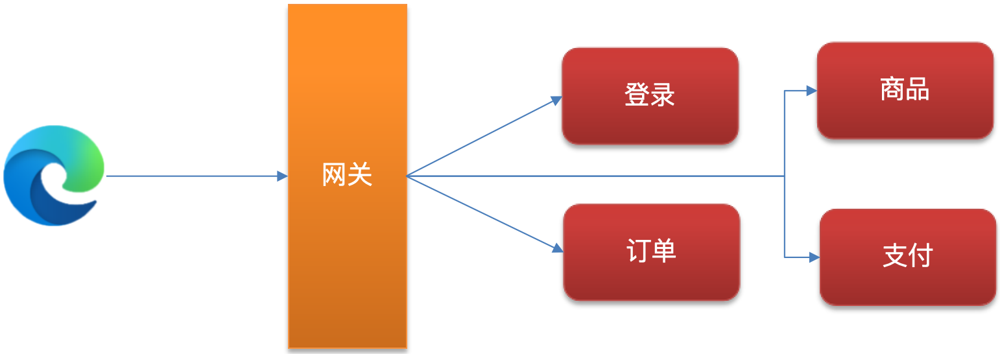
>
> 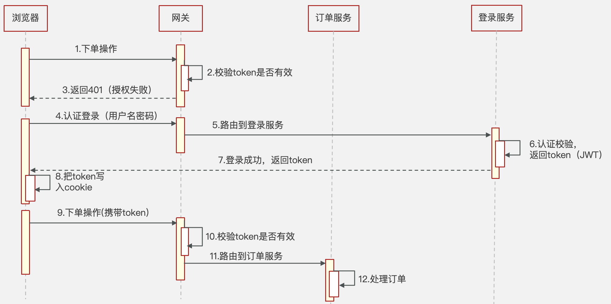

:::

::: info 权限认证是如何实现的？

> RBAC（Role-Based Access Control）基于角色的访问控制模型。
>
> 基础组成部分：用户、角色、权限。
>
> 具体实现：
>
> - 5 张表（用户表、角色表、权限表、用户角色中间表、角色权限中间表）- 最基本的实现。
> - 7 张表（用户表、角色表、权限表、菜单表、用户角色中间表、角色权限中间表、权限菜单中间表）- 多了一个菜单控制。
>
> 权限框架：Apache Shiro   、 Spring Security（推荐）。

:::

::: info 上传数据的安全性你们怎么控制？

> 使用==非对称加密==（或对称加密），给前端一个公钥让他把数据加密后传到后台，后台负责解密后处理数据。

:::

::: info 你负责的项目有没有遇到了哪些比较棘手的问题？怎么解决的？

> 回答的路径：
>
> 1. 什么背景（技术问题）。
> 2. 解决问题的过程。
> 3. 最终落地的方案。
>
> 示例：线上 BUG 排查（CPU 飙高、内存泄露、线程死锁、...）- 参考 JVM 学习笔记。

:::

::: info 你们项目中日志怎么采集的？

> 为什么要采集日志？
>
> - 日志是定位系统问题的重要手段，可以根据日志信息快速定位系统中的问题。
>
> 采集日志的方式有哪些？
>
> - ELK（即 Elasticsearch、Logstash 和 Kibana 三个软件的首字母）。
> - 常规采集：==按天保存到一个日志文件==。
>
> 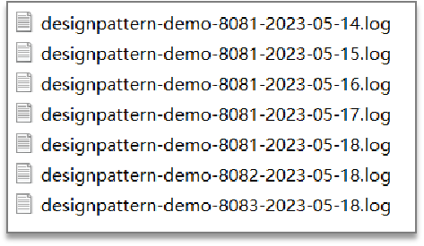
>
> **ELK 日志采集过程示例**：
>
> 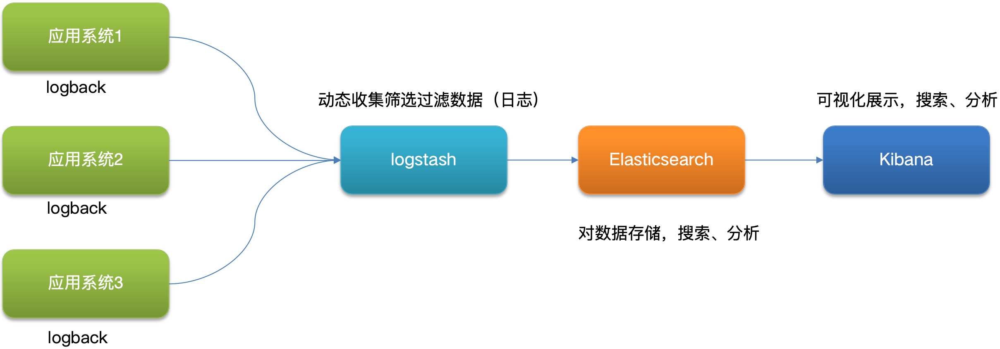
>
> **参考回答**：
>
> - 我们搭建了ELK日志采集系统。
> - 介绍 ELK 的三个组件：
>   - Elasticsearch 是全文搜索分析引擎，可以对数据存储、搜索、分析。
>   - Logstash 是一个数据收集引擎，可以动态收集数据，可以对数据进行过滤、分析，将数据存储到指定的位置。
>   - Kibana 是一个数据分析和可视化平台，配合 Elasticsearch 对数据进行搜索，分析，图表化展示。

:::

::: info 查看日志的命令有哪些？

> 参考 Linux 笔记 - 常用命令 - 查看文件的命令。

:::

::: info 生产问题该怎么排查？

> 已经上线的 BUG 排查的思路：
>
> 1. 先分析日志：通常在业务中都会有日志的记录，或者查看系统日志，或者查看日志文件，然后定位问题。
> 2. IDEA 远程 DEBUG 测试环境（测试环境代码需跟生产环境代码一致）- （通常公司的生产环境是不允许远程 DEBUG 的）。

:::

::: info 怎么快速定位系统的瓶颈？

> 压测（性能测试）：项目上线之前测评系统的压力。
>
> - 压测目的：给出系统当前的性能状况，定位系统性能瓶颈或潜在性能瓶颈。
> - 性能指标：响应时间、 QPS、并发数、吞吐量、 CPU 利用率、内存使用率、磁盘 IO、错误率。
> - 压测工具：LoadRunner、==Apache Jmeter==、…。
> - 后端工程师：根据压测的结果进行解决或调优（接口慢、代码报错、并发达不到要求、…）。
>
> 监控工具、链路追踪工具：项目上线之后的监控。
>
> - 监控工具：Prometheus + Grafana。
> - 链路追踪工具：Skywalking、Zipkin。
>
> 线上诊断工具 Arthas（阿尔萨斯）：项目上线之后的监控、排查问题。
>
> 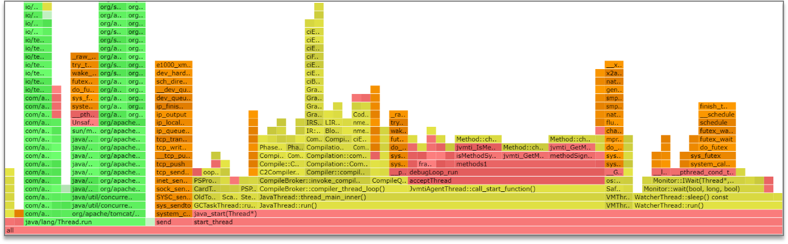

:::
