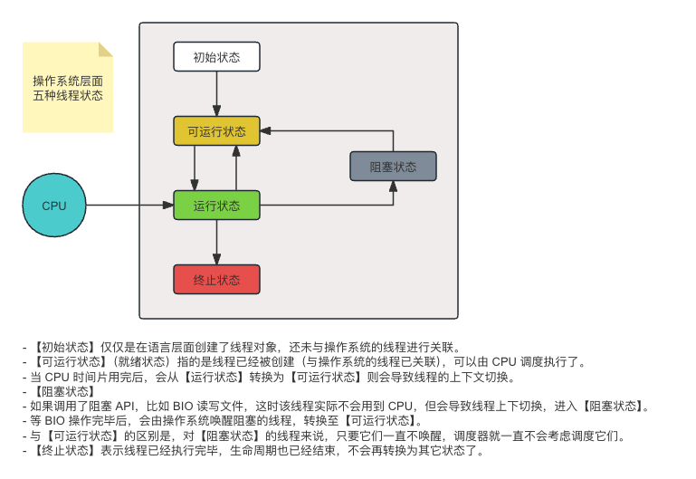
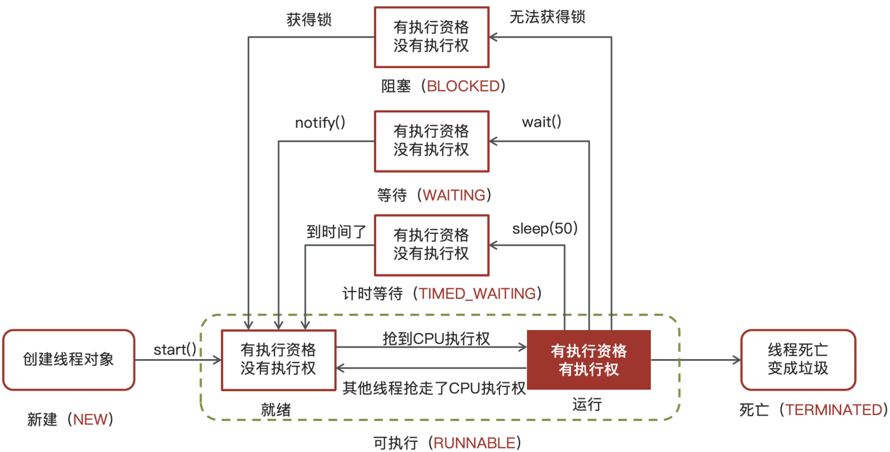

此处是一些 Java 并发编程的高频面试题（持续更新中...）。

<!-- more -->

## 线程状态

::: tip 操作系统层面五种线程状态。

:::

::: tip JavaAPI 层面的六种状态。

这是从 Java API 层面来描述的六种状态（在 `Thread.State` 枚举类中定义）。

:::

::: tip 详细的文字描述。

* **新建**：
  * 当一个线程对象被创建，但还未调用 `start` 方法时处于**新建**状态。
  * 此时未与操作系统底层线程关联。
* **可运行**：
  * 调用了 `start` 方法，就会由**新建**进入**可运行**。
  * 此时与底层线程关联，由操作系统调度执行。
* **终结**：
  * 线程内代码已经执行完毕，由**可运行**进入**终结**。
  * 此时会取消与底层线程关联。
* **阻塞**：
  * 当获取锁失败后，由**可运行**进入 Monitor 的阻塞队列**阻塞**，此时不占用 CPU 时间。
  * 当持锁线程释放锁时，会按照一定规则唤醒阻塞队列中的**阻塞**线程，唤醒后的线程进入**可运行**状态。
* **等待**：
  * 当获取锁成功后，但由于条件不满足，调用了 `wait()` 方法，此时从**可运行**状态释放锁进入 Monitor 等待集合**等待**，同样不占用 CPU 时间。
  * 当其它持锁线程调用 `notify()` 或 `notifyAll()` 方法，会按照一定规则唤醒等待集合中的**等待**线程，恢复为**可运行**状态。
* **有时限等待**：
  * 当获取锁成功后，但由于条件不满足，调用了 `wait(long)` 方法，此时从**可运行**状态释放锁进入 Monitor 等待集合进行**有时限等待**，同样不占用 CPU 时间。
  * 当其它持锁线程调用 `notify()` 或 `notifyAll()` 方法，会按照一定规则唤醒等待集合中的**有时限等待**线程，恢复为**可运行**状态，并重新去竞争锁。
  * 如果等待超时，也会从**有时限等待**状态恢复为**可运行**状态，并重新去竞争锁。
  * 还有一种情况是调用 `sleep(long)` 方法也会从**可运行**状态进入**有时限等待**状态，但与 Monitor 无关，不需要主动唤醒，超时时间到自然恢复为**可运行**状态。

> 其它情况（只需了解即可）:
>
> * 可以用 `interrupt()` 方法打断**等待**、**有时限等待**的线程，让它们恢复为**可运行**状态。
> * `park`、`unpark` 等方法也可以让线程等待和唤醒。

:::

## 线程池

::: tip 线程池的 7 大核心参数。

1. corePoolSize 核心线程数目 - 池中会保留的最多线程数。
2. maximumPoolSize 最大线程数目 - 核心线程+救急线程的最大数目。
3. keepAliveTime 生存时间 - 救急线程的生存时间，生存时间内没有新任务，此线程资源会释放。
4. unit 时间单位 - 救急线程的生存时间单位，如秒、毫秒等。
5. workQueue - 当没有空闲核心线程时，新来任务会加入到此队列排队，队列满会创建救急线程执行任务。
6. threadFactory 线程工厂 - 可以定制线程对象的创建，例如设置线程名字、是否是守护线程等。
7. handler 拒绝策略 - 当所有线程都在繁忙，workQueue 也放满时，会触发拒绝策略：
   1. 抛异常 java.util.concurrent.ThreadPoolExecutor.AbortPolicy。
   2. 由调用者执行任务 java.util.concurrent.ThreadPoolExecutor.CallerRunsPolicy。
   3. 丢弃任务 java.util.concurrent.ThreadPoolExecutor.DiscardPolicy。
   4. 丢弃最早排队任务 java.util.concurrent.ThreadPoolExecutor.DiscardOldestPolicy。

:::

## wait vs sleep

::: tip wait 和 sleep 方法的区别。

一个共同点、三个不同点：

**共同点**：

* `wait()` 、`wait(long)` 和 `sleep(long)` 的效果都是让当前线程暂时放弃 CPU 的使用权，进入阻塞状态。

**不同点**：

* 方法归属不同：
  * `sleep(long)` 是 Thread 类的静态方法。
  * 而 `wait()` 、`wait(long)` 都是 Object 类的成员方法（每个对象都有）。

* 醒来时机不同：
  * 执行 `sleep(long)` 和 `wait(long)` 的线程都会在等待相应毫秒后醒来。
  * `wait(long)` 和 `wait()` 还可以被 `notify()` 唤醒，而 `wait()` 如果不唤醒就一直等下去。
  * 它们都可以被打断唤醒。

* 锁特性不同（重点）：
  * `wait()` 方法的调用必须先获取 `synchronized` 对象的锁，而 `sleep()` 则无此限制。
  * `wait()` 方法执行后会释放对象锁，允许其它线程获得该对象锁（我放弃 CPU，但你们还可以用）。
  * 而 `sleep()` 如果在 `synchronized` 代码块中执行，并不会释放对象锁（我放弃 CPU，你们也用不了）。

:::

## lock vs synchronized

::: tip lock 和 synchronized 锁的区别。

**三个层面**：

不同点：

* 语法层面：
  * synchronized 是关键字，源码在 jvm 中，用 c++ 语言实现。
  * Lock 是接口，源码由 jdk 提供，用 java 语言实现。
  * 使用 synchronized 时，退出同步代码块锁会自动释放，而使用 Lock 时，需要手动调用 unlock 方法释放锁。
* 功能层面：
  * 二者均属于悲观锁、都具备基本的互斥、同步、锁重入功能。
  * Lock 提供了许多 synchronized 不具备的功能，例如获取等待状态、公平锁、可打断、可超时、多条件变量。
  * Lock 有适合不同场景的实现，如 ReentrantLock， ReentrantReadWriteLock。
* 性能层面：
  * 在没有竞争时，synchronized 做了很多优化，如偏向锁、轻量级锁，性能不赖。
  * 在竞争激烈时，Lock 的实现通常会提供更好的性能。

**公平锁**：

* 公平锁的公平体现：
  * **已经处在阻塞队列**中的线程（不考虑超时）始终都是公平的，先进先出。
  * 公平锁是指**未处于阻塞队列**中的线程来争抢锁，如果队列不为空，则老实到队尾等待。
  * 非公平锁是指**未处于阻塞队列**中的线程来争抢锁，与队列头唤醒的线程去竞争，谁抢到算谁的。
* 公平锁会降低吞吐量，一般不用。

**条件变量**：

* ReentrantLock 中的条件变量功能类似于普通 synchronized 的 wait，notify，用在当线程获得锁后，发现条件不满足时，临时等待的链表结构。
* 与 synchronized 的等待集合不同之处在于，ReentrantLock 中的条件变量可以有多个，可以实现更精细的等待、唤醒控制。

:::

## volatile

::: tip volatile 关键字的作用。

**要求**：

* 掌握线程安全要考虑的三个问题。
* 掌握 volatile 能解决哪些问题。

**原子性**：

* 起因：多线程下，不同线程的**指令发生了交错**导致的共享变量的读写混乱。
* 解决：用悲观锁或乐观锁解决，volatile 并不能解决原子性。

**可见性**：

* 起因：由于**编译器优化、或缓存优化、或 CPU 指令重排序优化**导致的对共享变量所做的修改另外的线程看不到。
* 解决：用 volatile 修饰共享变量，能够防止编译器等优化发生，让一个线程对共享变量的修改对另一个线程可见。

**有序性**：

* 起因：由于**编译器优化、或缓存优化、或 CPU 指令重排序优化**导致指令的实际执行顺序与编写顺序不一致。
* 解决：用 volatile 修饰共享变量会在读、写共享变量时加入不同的屏障，阻止其他读写操作越过屏障，从而达到阻止重排序的效果。
* 注意：
  * **volatile 变量写**加的屏障是阻止上方其它写操作越过屏障排到 **volatile 变量写**之下。
  * **volatile 变量读**加的屏障是阻止下方其它读操作越过屏障排到 **volatile 变量读**之上。
  * volatile 读写加入的屏障只能防止同一线程内的指令重排。

:::

## 悲观锁 vs 乐观锁

::: tip 掌握悲观锁和乐观锁的区别。

**对比悲观锁与乐观锁**：

* 悲观锁的代表是 synchronized 和 Lock 锁。
  * 其核心思想是【线程只有占有了锁，才能去操作共享变量，每次只有一个线程占锁成功，获取锁失败的线程，都得停下来等待】。
  * 线程从运行到阻塞、再从阻塞到唤醒，涉及线程上下文切换，如果频繁发生，影响性能。
  * 实际上，线程在获取 synchronized 和 Lock 锁时，如果锁已被占用，都会做几次重试操作，减少阻塞的机会。

* 乐观锁的代表是 AtomicInteger，使用 cas 来保证原子性。
  * 其核心思想是【无需加锁，每次只有一个线程能成功修改共享变量，其它失败的线程不需要停止，不断重试直至成功】。
  * 由于线程一直运行，不需要阻塞，因此不涉及线程上下文切换。
  * 它需要多核 cpu 支持，且线程数不应超过 cpu 核数。

:::
