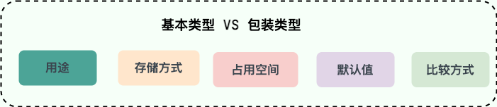

此处是一些 Java 基础的高频面试题（持续更新中...）。

<!-- more -->

## 基础语法

### <span style="color: #fb9b5f">Java 中的注释有哪几种形式？</span>

单行注释：通常用于解释方法内某单行代码的作用。

多行注释：通常用于解释一段代码的作用。

文档注释：通常用于生成 Java 开发文档。

### <span style="color: #fb9b5f">标识符和关键字的区别是什么？</span>

在我们编写程序的时候，需要大量地为程序、类、变量、方法等取名字，于是就有了**标识符**。

> 简单来说：标识符就是一个名字 。

有一些标识符，Java 语言已经赋予了其特殊的含义，只能用于特定的地方，这些特殊的标识符就是**关键字** 。

> 简单来说：关键字是被赋予了特殊含义的标识符 。

### <span style="color: #fb9b5f">Java 语言关键字有哪些？</span>

访问控制类：private、protected、public。

类/方法和变量修饰符：abstract、class、extends、final、implements、interface、native、new、static、strictfp、synchronized、transient、volatile、enum。

程序控制：break、continue、return、do、while、if、else、for、instanceof、switch、case、default、assert。

错误处理：try、catch、finally、throw、throws。

包相关：import、package。

基本类型：boolean、byte、char、double、float、int、long、short。

变量引用：super、this、void。

保留字：goto、const。

> 官方文档：[https://docs.oracle.com/javase/tutorial/java/nutsandbolts/_keywords.html](https://docs.oracle.com/javase/tutorial/java/nutsandbolts/_keywords.html)
>
> **注意**：虽然 `true`、`false`和 `null` 看起来像关键字，但实际上他们是字面值，同时你也不可以作为标识符来使用。

### <span style="color: #fb9b5f">`continue`、`break`、`return` 的区别是什么？</span>

在循环结构中，当循环条件不满足或者循环次数没有达到要求时，循环会正常结束。

但是，有时候可能需要在循环的过程中，当发生了某种条件之后 ，提前终止循环。

这就需要用到下面几个关键词：

1. `continue`：指跳出当前的这一次循环，继续下一次循环。
2. `break`：指跳出整个循环体，继续执行循环下面的语句。
3. `return` 用于跳出所在的方法，结束该方法的运行（有两种不同的用法）。
   1. `return;`：直接使用结束方法的执行，用于没有返回值函数的方法。
   2. `return value;`：返回一个特定的值，用于有返回值函数的方法。

## 数据类型

### <span style="color: #fb9b5f">Java 中的几种基本数据类型了解么？</span>

Java 中有 8 种基本数据类型。

- 6 种数字类型：
  - 4 种整数型：`byte`、`short`、`int`、`long`。
  - 2 种浮点型：`float`、`double`。
- 1 种字符类型：`char`。
- 1 种布尔型：`boolean`。

| 基本类型  | 位数 | 字节 | 默认值  | 取值范围                                                     |
| --------- | ---- | ---- | ------- | ------------------------------------------------------------ |
| `byte`    | 8    | 1    | 0       | -128 ~ 127                                                   |
| `short`   | 16   | 2    | 0       | -32768（-2^15） ~ 32767（2^15 - 1）                          |
| `int`     | 32   | 4    | 0       | -2147483648 ~ 2147483647                                     |
| `long`    | 64   | 8    | 0L      | -9223372036854775808（-2^63） ~ 9223372036854775807（2^63 -1） |
| `char`    | 16   | 2    | 'u0000' | 0 ~ 65535（2^16 - 1）                                        |
| `float`   | 32   | 4    | 0f      | 1.4E-45 ~ 3.4028235E38                                       |
| `double`  | 64   | 8    | 0d      | 4.9E-324 ~ 1.7976931348623157E308                            |
| `boolean` | 1    | -    | false   | true、false                                                  |

> 对于 `boolean` 所占的字节数官方文档未明确定义，它依赖于 JVM 厂商的具体实现。
>
> 逻辑上理解是占用 1 位，但是实际中会考虑计算机高效存储因素。

> 拓展：这八种基本类型都有对应的包装类分别为：`Byte`、`Short`、`Integer`、`Long`、`Float`、`Double`、`Character`、`Boolean` 。

### <span style="color: #fb9b5f">基本类型和包装类型的区别？</span>



**用途**：除了定义一些常量和局部变量之外，我们在其它地方比如方法参数、对象属性中很少会使用基本类型来定义变量。并且，包装类型可用于泛型，而基本类型不可以。

**存储方式**：基本数据类型的局部变量存放在 Java 虚拟机栈中的局部变量表中，基本数据类型的成员变量（未被 `static` 修饰 ）存放在 Java 虚拟机的堆中。包装类型属于对象类型，我们知道几乎所有对象实例都存在于堆中。

**占用空间**：相比于包装类型（对象类型）， 基本数据类型占用的空间往往非常小。

**默认值**：成员变量包装类型不赋值就是 `null` ，而基本类型有默认值且不是 `null`。

**比较方式**：对于基本数据类型来说，`==` 比较的是值。对于包装数据类型来说，`==` 比较的是对象的内存地址。所有整型包装类对象之间值的比较，全部使用 `equals()` 方法。

### <span style="color: #fb9b5f">为什么说是几乎所有对象实例都存在于堆中呢？</span>

这是因为 HotSpot 虚拟机引入了 JIT 优化之后，会对对象进行逃逸分析，如果发现某一个对象并没有逃逸到方法外部，那么就可能通过标量替换来实现栈上分配，而避免堆上分配内存。

> **注意**：基本数据类型存放在栈中是一个常见的误区！！！
>
> 基本数据类型的存储位置取决于它们的作用域和声明方式。
>
> 如果它们是局部变量，那么它们会存放在栈中，如果它们是成员变量，那么它们会存放在堆中。

### <span style="color: #fb9b5f">自动装箱与拆箱了解吗？原理是什么？</span>

什么是自动拆装箱？

- 装箱：将基本类型用它们对应的引用类型包装起来。
- 拆箱：将包装类型转换为基本数据类型。

> **注意**：如果频繁拆装箱的话，也会严重影响系统的性能，我们应该尽量避免不必要的拆装箱操作。

### <span style="color: #fb9b5f">为什么浮点数运算的时候会有精度丢失的风险？</span>

浮点数运算精度丢失代码演示：

```java
float a = 2.0f - 1.9f;
float b = 1.8f - 1.7f;
System.out.println(a); // 0.100000024
System.out.println(b); // 0.099999905
System.out.println(a == b); // false
```

为什么会出现这个问题呢？

这个和计算机保存浮点数的机制有很大关系，我们知道计算机是二进制的，而且计算机在表示一个数字时，宽度是有限的，无限循环的小数存储在计算机时，只能被截断，所以就会导致小数精度发生损失的情况，这也就是解释了为什么浮点数没有办法用二进制精确表示。

就比如说十进制下的 0.2 就没办法精确转换成二进制小数：

```java
// 0.2 转换为二进制数的过程为，不断乘以 2，直到不存在小数为止，
// 在这个计算过程中，得到的整数部分从上到下排列就是二进制的结果。
0.2 * 2 = 0.4 -> 0
0.4 * 2 = 0.8 -> 0
0.8 * 2 = 1.6 -> 1
0.6 * 2 = 1.2 -> 1
0.2 * 2 = 0.4 -> 0（发生循环）
...
```

关于浮点数的更多内容，建议看一下[计算机系统基础（四）浮点数](http://kaito-kidd.com/2018/08/08/computer-system-float-point/)这篇文章。

### <span style="color: #fb9b5f">如何解决浮点数运算的精度丢失问题？</span>

`BigDecimal` 可以实现对浮点数的运算，不会造成精度丢失。

通常情况下，大部分需要浮点数精确运算结果的业务场景（比如涉及到钱的场景）都是通过 `BigDecimal` 来做的。

```java
BigDecimal a = new BigDecimal("1.0");
BigDecimal b = new BigDecimal("0.9");
BigDecimal c = new BigDecimal("0.8");

BigDecimal x = a.subtract(b);
BigDecimal y = b.subtract(c);

System.out.println(x); /* 0.1 */
System.out.println(y); /* 0.1 */
System.out.println(Objects.equals(x, y)); /* true */
```

## 变量

持续更新中...

## 方法

持续更新中...
