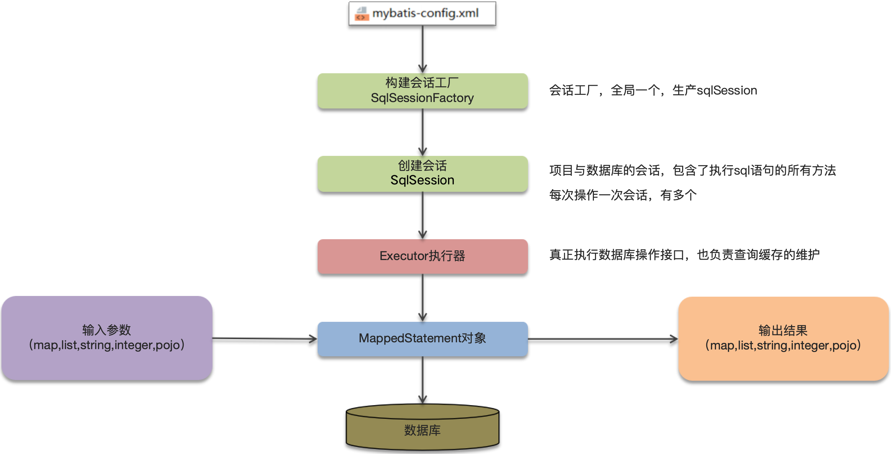

::: note

此处是一些 Mybatis 高频面试题（持续更新中...）。

:::

<!-- more -->

## 面试题汇总

::: info MyBatis 的执行流程。

> 理解了各个组件的关系。
>
> SQL 的执行过程（参数映射、SQL 解析、执行和结果处理）。
>
> 
>
> **文字描述**：
>
> 1. 读取 MyBatis 配置文件：mybatis-config.xml 加载运行环境和映射文件。
> 2. 构造会话工厂 SqlSessionFactory。
> 3. 会话工厂创建 SqlSession 对象（包含了执行 SQL 语句的所有方法）。
> 4. 操作数据库的接口：Executor 执行器，同时负责查询缓存的维护。
> 5. Executor 接口的执行方法中有一个 MappedStatement 类型的参数，封装了映射信息。
> 6. 输入参数映射。
> 7. 输出结果映射。

:::

::: info Mybatis 是否支持延迟加载？

> Mybatis 支持延迟记载（但默认没有开启）。
>
> 什么叫做延迟加载？
>
> - 查询用户的时候：把用户所属的订单数据也查询出来，这个是立即加载。
> - 查询用户的时候：暂时不查询订单数据，当需要订单的时候，再查询订单，这个就是延迟加载。
>
> MyBatis 执行一对一关联对象和一对多关联集合对象的延迟加载。
>
> 在 MyBatis 配置文件中，可以配置是否启用延迟加载 `lazyLoadingEnabled=true|false`（默认时关闭的）。
>
> **延迟加载的底层原理知道吗（衍生问题）？**
>
> 延迟加载在底层主要使用的 CGLIB 动态代理完成的：
>
> 1. 使用 CGLIB 创建目标对象的代理对象，这里的目标对象就是开启了延迟加载的 Mapper；
> 2. 当调用目标方法时，进入拦截器 invoke 方法，发现目标方法是 null 值，再执行 sql 查询；
> 3. 获取数据以后，调用 set 方法设置属性值，再继续查询目标方法，就有值了。

:::

::: info Mybatis 的一级、二级缓存用过吗？

>

:::

::: info 。

>

:::
