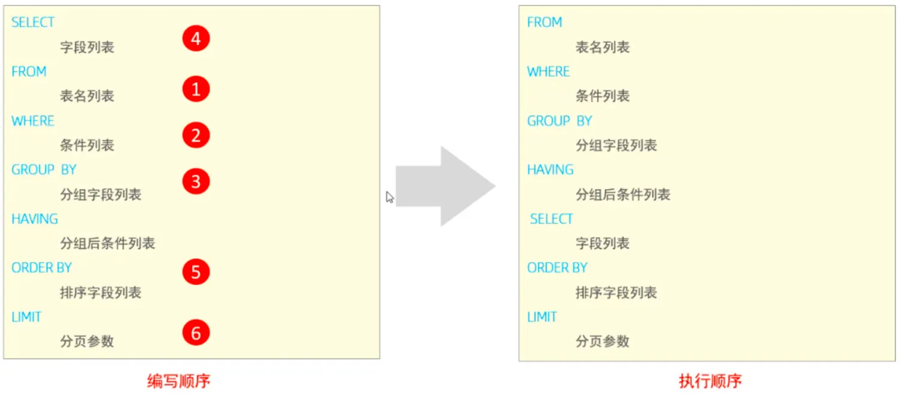
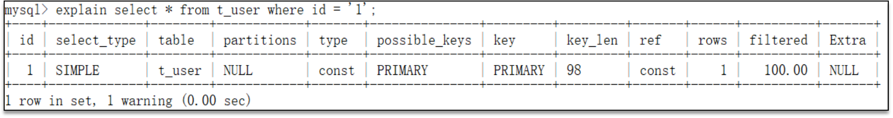
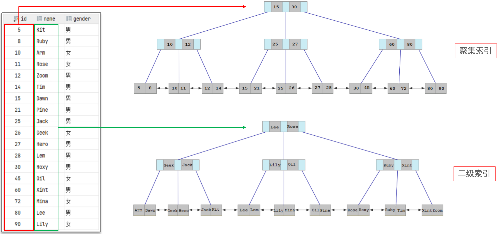
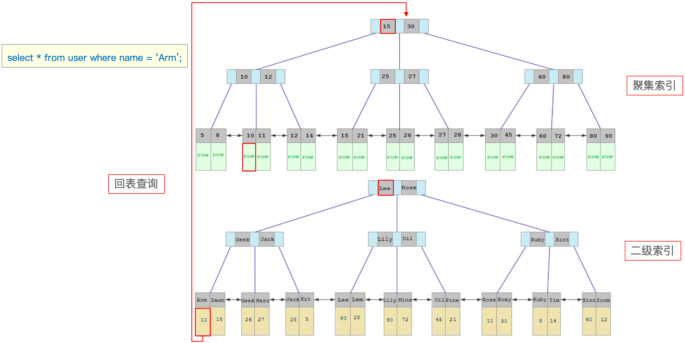
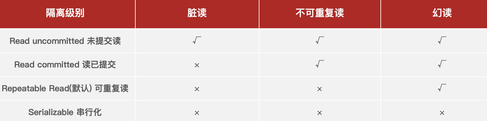
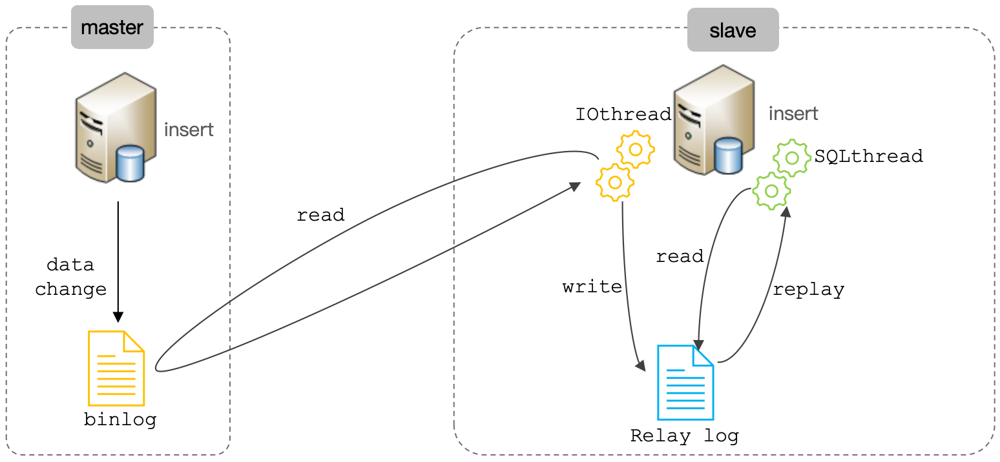
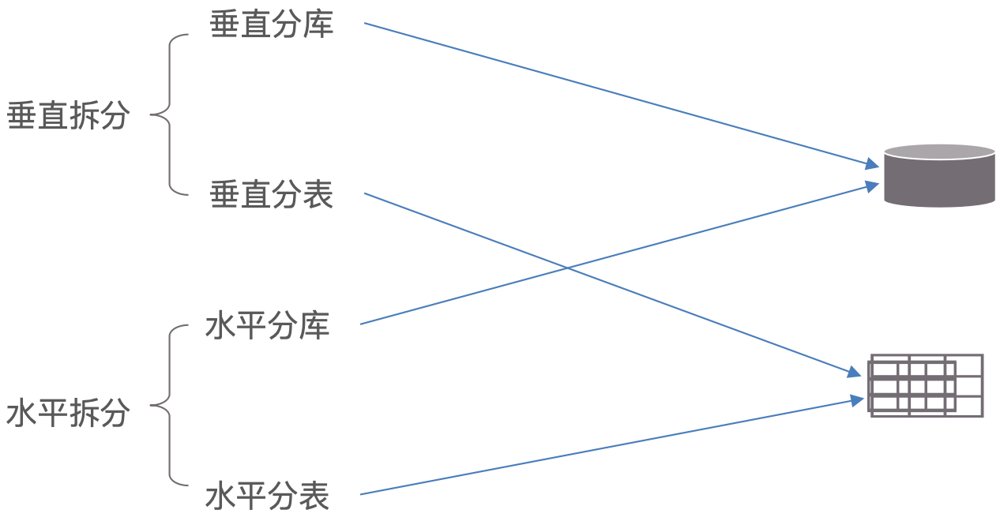

::: note

此处是一些 MySQL 高频面试题（持续更新中...）。

:::

<!-- more -->

## 面试题汇总

### 优化

::: info DQL 语句的执行顺序？

> 

:::

::: info 在 MySQL 中如何定位慢查询？

> **原因**：
>
> - 聚合查询。
> - 多表查询。
> - 表数据量过大查询。
> - 深度分页查询。
>
> **表现**：页面加载过慢、接口压测响应时间过长（例如：超过 1s）。
>
> **定位**：
>
> - 开源工具：
>
>   - 调试工具：Arthas。
>
>   - 运维工具：Prometheus、Skywalking。
>
> - 配置 MySQL 自带慢查询日志（`/etc/my.cnf`）：
>
>   - 开启慢查询日志：`slow_query_log=1`（默认是 0 - 关闭状态）。
>   - 设置慢查询日志：`long_query_time=2`（SQL 执行超过 2 秒的则是慢查询 SQL - 默认 10 秒）。

:::

::: info 如何分析 SQL 执行慢的原因？

> SQL 执行计划：`explain`、`desc`（命令获取 MySQL 如何执行 SELECT 语句的信息）。
>
> 
>
> type 字段表示这条 SQL 的连接的类型，性能由好到差为：
>
> - system：查询系统中的表。
> - const：根据主键查询。
> - eq_ref：主键索引查询或唯一索引查询。
> - ref：索引查询。
> - range：范围查询。
> - index：索引树扫描（==避免出现==）。
> - all：全盘扫描（==避免出现==）。
>
> 

参考回答：

> 可以采用 MySQL 自带的分析工具 EXPLAIN 来查询 SELECT 语句的执行计划：
>
> - 通过 key 和 key_len 字段检查是否命中了索引（索引本身是否存在有失效的情况）。
> - 通过 type 字段查看 SQL 是否有进一步的优化空间，是否存在全索引扫描或全盘扫描。
> - 通过 extra 字段的额外建议判断，是否出现了回表的情况，如果出现了，可以尝试添加索引或修改返回字段来修复。

:::

::: info MYSQL 支持的存储引擎有哪些？它们有什么区别？

> 存储引擎就是存储数据、建立索引、更新/查询数据等技术的实现方式。
>
> 存储引擎是基于表的，而不是基于库的，所以存储引擎也可被称为表类型。
>
> 
>
> InnoDB 存储引擎：支持事务、外键、表级锁和行级锁（MySQL 5.5 之后的默认存储引擎）。
>
> MyISAM 是早期的存储引擎：它不支持事务、只有表级锁、也没有外键（用的不多）。
>
> Memory 主要把数据存储在内存中：支持表级锁、没有外键、没有事务（用的也不多）。

:::

::: info 什么是索引？有了解过索引吗？

> 索引（index）是帮助 MySQL 高效获取数据的一种**有序**的数据结构（不需要全标扫描）。

:::

::: info 索引的底层数据结构了解过嘛？

> MySQL 的 InnoDB 引擎采用的是 B+ 树的数据结构来存储索引的。
>
> 非叶子节点存储指针、叶子节点存储数据、叶子节点是一个双向循环链表。

:::

::: info B 树和 B+ 树有什么区别？

> Tips：B+Tree 是在 BTree 基础上的一种优化。
>
> B 树与 B+ 树的对比：
>
> 1. 磁盘读写代价 B+ 树更低。
> 2. 查询效率 B+ 树更加稳定。
> 3. B+ 树便于扫库和区间查询。

:::

::: info 什么是聚集索引和二级索引？

> 聚集索引：将数据存储与索引放到了一块，索引结构的叶子节点保存了整行的数据（有且只有一个）。
>
> 二级索引：将数据与索引分开存储，索引结构的叶子节点关联的是对应行的主键值（可以有多个）。
>
> 聚集索引选取规则：
>
> 1. 如果存在主键，则主键索引就是聚集索引。
> 2. 如果不存在主键，将使用第一个唯一（UNIQUE）索引作为聚集索引。
> 3. 如果表没有主键，也没有合适的唯一（UNIQUE）索引，则 InnoDB 存储引擎会自动生成一个 `rowid` 作为隐藏的聚集索引。
>
> 

:::

::: info 什么是回表查询？

> 通过二级索引找到对应的主键值，然后到聚集索引中查找整行数据，这个过程就是回表查询。
>
> 

:::

::: info 什么是覆盖索引？

> 覆盖索引是指：查询使用了索引，并且需要返回的列，在该索引中已经全部能够找到（不需要回表查询）。

:::

::: info MySQL 超大分页怎么处理？

> 可以通过覆盖索引加子查询的方式来解决。
>
> ```sql
> select * from tb_sku t,  (select id from tb_sku order by id limit 9000000, 10) a where t.id = a.id;
> ```
>
> 在数据量比较大时，如果进行 `limit` 分页查询，在查询时，越往后，分页查询效率越低。

:::

::: info 索引创建原则有哪些？

> 主键索引。
>
> 唯一索引。
>
> 复合索引（根据业务情况创建的索引）。
>
> **索引创建的规则如下**：
>
> 1. 针对于数据量较大，且查询比较频繁的表建立索引（一般单表超过10万数据（增加用户体验））- ==重点==。
> 2. 针对于常作为查询条件（`where`）、排序（`order by`）、分组（`group by`）操作的字段建立索引 - ==重点==。
> 3. 尽量选择区分度高的列作为索引，尽量建立唯一索引，区分度越高，使用索引的效率越高。
> 4. 如果是字符串类型的字段，字段的长度较长，可以针对于字段的特点，建立前缀索引。
> 5. 尽量使用联合索引，减少单列索引，查询时，联合索引很多时候可以覆盖索引，节省存储空间，避免回表，提高查询效率 - ==重点==。
> 6. 如果索引列不能存储 `NULL` 值，请在创建表时使用 `NOT NULL` 约束它。当优化器知道每列是否包含 `NULL` 值时，它可以更好地确定哪个索引最有效地用于查询。
>
> 注意：要控制索引的数量，索引并不是多多益善，索引越多，维护索引结构的代价也就越大，会影响增删改的效率 - ==重点==。

:::

::: info 什么情况下索引会失效？

> 首先通过 `explain` 命令查看 SQL 语句执行计划。
>
> 1. 违反最左前缀法则（联合索引的情况下）：
>    - 指的是查询从索引的最左前列开始，并且不跳过索引中的列（索引生效）。
>    - 违反最左前缀法则（索引失效）。
>    - 如果符合最左前缀法则，但是出现跳跃某一列，则只有最左列的索引生效（最左列的部分生效）。
> 2. 如果在添加了索引的字段上进行了运算操作则索引会失效。
> 3. 字符串不加单引号会造成索引失效（只要发生了类型转换就会导致索引失效）。
> 4. 模糊查询的时候，如果 % 号在前面也会导致索引失效。

:::

::: info 谈一谈你对 SQL 的优化的经验。

> 表的设计优化（参考阿里开发手册《嵩山版》）：
>
> - 比如设置合适的数值（`tinyint`、`int`、`bigint`）- 要根据实际情况选择。
> - 比如设置合适的字符串类型（`char`、`varchar`）`char` 定长效率高、`varchar` 可变长度，效率稍低。
>
> 索引优化（参考索引创建原则和索引失效的情况）。
>
> SQL 语句优化：
>
> - SELECT 语句务必指明字段名称（避免直接使用 `select *`）。
> - SQL 语句要避免造成索引失效的写法。
> - 尽量用 `union all` 代替 `union`（`union` 会多一次过滤 - 效率低）。
> - 避免在 `where` 子句中对字段进行表达式操作。
> - Join 优化能用 `inner join` 就不用 `left join`、`right join`，如必须使用，一定要以小表为驱动，内连接会对两个表进行优化，优先把小表放到外边，把大表放到里边（`left join` 或 `right join` 不会重新调整顺序）。
>
> 集群优化（主从复制、读写分离）：
>
> - 如果数据库的使用场景读的操作比较多的时候，为了避免写的操作所造成的性能影响，可以采用读写分离的架构。
> - 读写分离解决的是，数据库的写入，影响了查询的效率。
>
> 分库分表。

:::

### 其它

::: info 事物的特性是什么？ACID 是什么？

> 事务是一组操作的集合，它是一个不可分割的工作单位，事务会把所有的操作作为一个整体一起向系统提交或撤销操作请求，即这些操作要么同时成功，要么同时失败。
>
> **原子性**（==A==tomicity）：事务是不可分割的最小操作单元，要么全部成功，要么全部失败。
>
> **一致性**（==C==onsistency）：事务完成时，必须使所有的数据都保持一致状态。
>
> **隔离性**（==I==solation）：数据库系统提供的隔离机制，保证事务在不受外部并发操作影响的独立环境下运行。
>
> **持久性**（==D==urability）：事务一旦提交或回滚，它对数据库中的数据的改变就是永久的。

:::

::: info 并发事务会带来哪些问题？怎么解决这些问题？MySQL 的默认隔离级别是？

> 并发事务问题：脏读、不可重复读、幻读。
>
> 
>
> 隔离级别：读未提交、读已提交、==可重复读==（默认）、串行化。
>
> 
>
> 注意：事务隔离级别越高，数据越安全，但是性能越低！

:::

::: info undo log 和 redo log 的区别。

> `redo log`：记录的是数据页的物理变化，服务宕机可用来同步数据。
>
> `undo log`：记录的是逻辑日志，当事务回滚时，通过逆操作恢复原来的数据。
>
> `redo log` 保证了事务的持久性、`undo log` 保证了事务的原子性和一致性。
>
> **参考回答**：
>
> 其中 `redo log` 日志记录的是数据页的物理变化，服务宕机可以用来恢复数据，而 `undo log` 不同，它主要记录的是逻辑日志，当事务回滚时，通过逆向操作恢复原来的数据，比如我们删除一条数据的时候，就会在 `undo log` 日志文件中新增一条 `delete` 语句，如果发生回滚就执行逆向操作。
>
> `redo log` 保证了事务的持久性、`undo log` 保证了事务的原子性和一致性。

:::

::: info 事务中的隔离性是如何保证的？

> 事务的隔离性是由锁和 MVCC 实现的。
>
> **锁**：排他锁（如一个事务获取了一个数据行的排他锁，其他事务就不能再获取该行的其他锁）。
>
> **MVCC** : 多版本并发控制。

:::

::: info 你解释一下 MVCC ？

> 全称 ==M==ulti-==V==ersion ==C==oncurrency ==C==ontrol（多版本并发控制）。
>
> 指维护一个数据的多个版本，使得读写操作没有冲突。
>
> MVCC 的具体实现，主要依赖于数据库记录中的隐式字段、`undo log` 日志、`readView`。
>
> **参考回答**：
>
> 事务的隔离性是由锁和 MVCC 实现的。
>
> 其中 MVCC 的意思是多版本并发控制。指维护一个数据的多个版本，使得读写操作没有冲突，它的底层实现主要分为三个部分：第一个是隐藏字段、第二个是 `undo log` 日志、第三个是 `readView` 读视图。
>
> 隐藏字段：是指在 MySQL 中给每个表都设置了隐藏的字段，有一个是 `trx_id`（事务 ID），记录每一次操作的事务 ID，是自增的、另一个字段是 `roll_pointer`（回滚指针），指向上一个版本的事务版本记录的地址。 
>
> `undo log`：主要的作用是记录回滚日志，存储老版本的数据，在内部会形成一个版本链，在多个事务并行操作某一行记录时，记录不同事务修改数据的版本，通过 `roll_pointer` 指针形成一个链表。
>
> `readView`：解决的事一个事务查询选择版本的问题，在内部定义了一些匹配规则和当前的一些事务 ID 判断访问哪个版本的数据，不同的隔离级别快照读是不一样的，最终的访问结果不一样。如果是读已提交的隔离级别，那每一次执行快照读时生成 `readView`，如果是可重复读隔离级别，则仅在事务中每一次执行快照读时才会生成 `readView` 供后续复用。

:::

::: info MySQL 主从同步原理？。

> MySQL 主从复制的核心就是二进制日志。
>
> > 二进制日志（BINLOG）：记录了所有的 DDL（数据定义语言）语句和 DML（数据操纵语言）语句，但不包括数据查询（SELECT、SHOW）语句。
>
> 复制分成三步：
>
> 1. Master 主库在事务提交时，会把数据变更记录在二进制日志文件 Binlog 中。
> 2. 从库读取主库的二进制日志文件 Binlog ，写入到从库的中继日志 Relay Log 。
> 3. Slave 重做中继日志中的事件，将改变反映它自己的数据。
>
> 

:::

::: info MySQL 分库分表如何实现？

> 分库分表的时机：
>
> 1. 前提：项目业务数据逐渐增多，或业务发展比较迅速（单表的数据量达 1000W 或 20G 以后）。
> 2. 优化已解决不了性能问题（主从读写分离、查询索引、…）。
> 3. IO 瓶颈（磁盘 IO、网络 IO）、CPU 瓶颈（聚合查询、连接数太多）。
>
> 
>
> 第三方插件实现分库分表：ShardingSphere、Mycat。

:::
