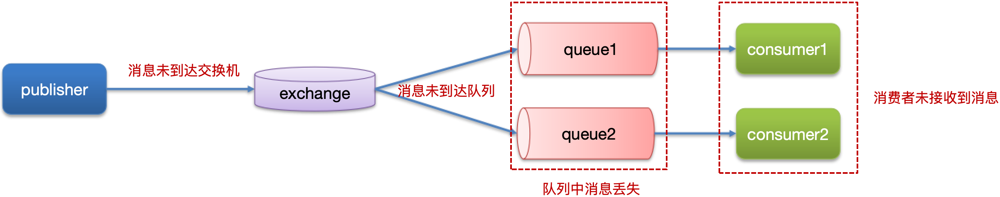
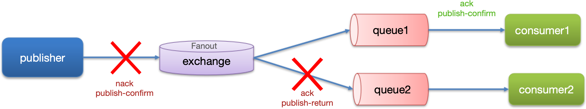
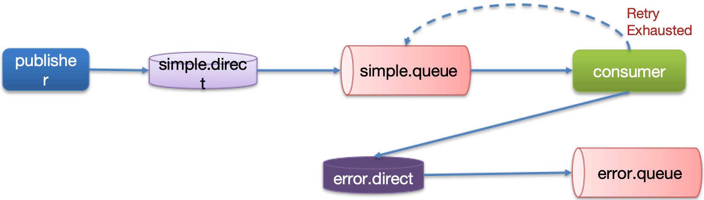
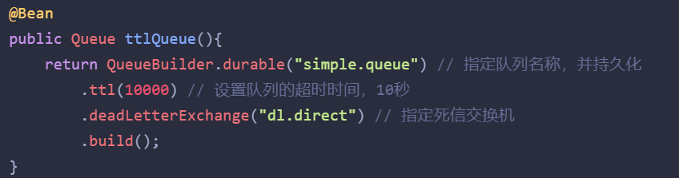
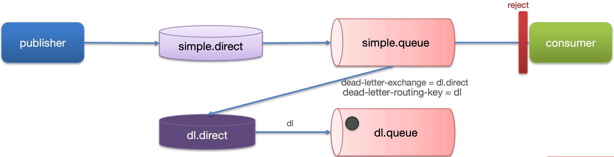
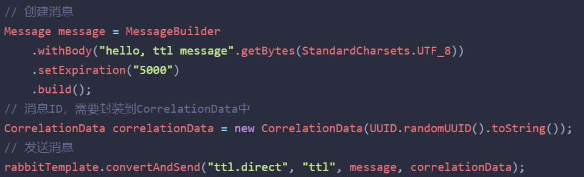
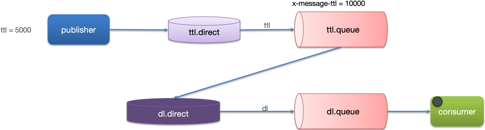
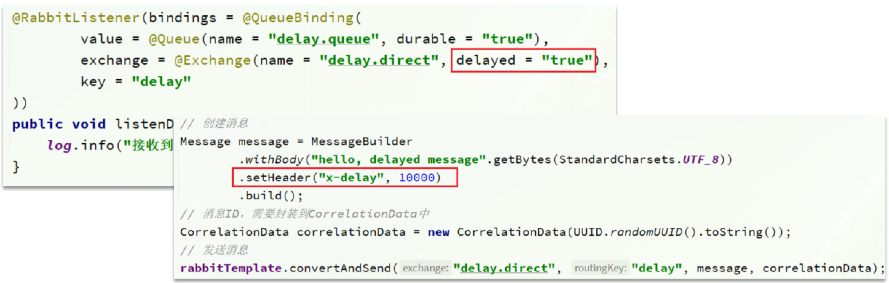
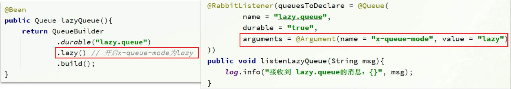
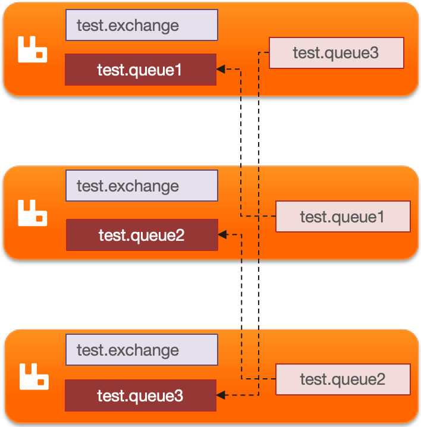

::: note

此处是一些 RabbitMQ 高频面试题（持续更新中...）。

:::

<!-- more -->

## 面试题汇总

::: warning RabbitMQ 能做什么？

异步发送（验证码、手机短信、邮件、...）。

MySQL 和 Redis、ES 之间的数据同步（双写一致性）。

分布式事务。

削峰填谷。

......。

:::

::: info RabbitMQ 如何保证消息不丢失？

> **可能出现消息丢失的节点**：
>
> 
>
> **生产者确认机制**：
>
> RabbitMQ 提供了 `publisher confirm` 机制来避免消息发送到 MQ 过程中丢失。
>
> 消息发送到 MQ 以后，会返回一个结果给发送者，表示消息是否处理成功。
>
> 
>
> **消息失败之后如何处理呢？**
>
> - 回调方法即时重发。
> - 记录日志。
> - 保存到数据库然后定时重发，成功发送后即刻删除表中的数据。
>
> **消息持久化（确保 MQ 消息不丢失）**：
>
> RabbitMQ 默认是内存存储消息，开启持久化功能可以确保缓存在 RabbitMQ 中的消息不丢失。
>
> 1. 交换机持久化：
>
>    ```java
>    @Bean
>    public DirectExchange simpleExchange(){
>      // 三个参数：交换机名称、是否持久化、当没有 queue 与其绑定时是否自动删除
>      return new DirectExchange("simple.direct", true, false);
>    }
>    ```
>
> 2. 队列持久化：
>
>    ```java
>    @Bean
>    public Queue simpleQueue(){
>      // 使用 QueueBuilder 构建队列，durable 就是持久化的
>      return QueueBuilder.durable("simple.queue").build();
>    }
>    ```
>
> 3. 消息持久化：
>
>    SpringAMQP 中的的消息默认是持久的，可以通过 MessageProperties 中的 DeliveryMode 来指定的。
>
>    ```java
>    Message msg = MessageBuilder
>      .withBody(message.getBytes(StandardCharsets.UTF_8)) // 消息体
>      .setDeliveryMode(MessageDeliveryMode.PERSISTENT) // 持久化
>      .build();
>    ```
>
> **消费者确认机制**：
>
> RabbitMQ 支持消费者确认机制，就是消费者处理完消息后可以向 RabbitMQ 发送 `ack` 回执，RabbitMQ 收到 `ack` 回执后才会删除该消息。
>
> 而 SpringAMQP 则允许配置三种确认模式：
>
> - manual：手动 ack，需要在业务代码结束后，调用 api 发送 ack。
> - auto：自动 ack，由 Spring 监测 listener 代码是否出现异常，没有异常则返回 ack，否则抛出异常则返回 nack。
> - none：关闭 ack，RabbitMQ 假定消费者获取消息后会成功处理，因此消息投递后立即被删除。
>
> 我们可以利用 Spring 的 `retry` 机制，在消费者出现异常时利用本地重试，设置重试次数，当次数达到了以后，如果消息依然失败，将消息投递到异常交换机，交由人工处理。
>
> 
>
> **参考回答**：
>
> - 开启生产者确认机制，确保生产者的消息能到达队列。
> - 开启持久化功能，确保消息未消费前在队列中不会丢失。
> - 开启消费者确认机制为 auto，由 spring 确认消息处理成功后完成 ack。
> - 开启消费者失败重试机制，多次重试失败后将消息投递到异常交换机，交由人工处理。

:::

::: info RabbitMQ 消息的重复消费问题如何解决的？

>产生的原因：网络抖动、消费者挂了（重启后）。
>
>解决方案：
>
>- 每条消息设置一个唯一的标识 ID。
>- 幂等方案 - 分布式锁、数据库锁（悲观锁、乐观锁）。

:::

::: info RabbitMQ 中死信交换机？RabbitMQ 延迟队列有了解过吗？

>延迟队列：进入队列的消息会被延迟消费的队列。
>
>应用场景：超时订单、限时优惠、定时发布。
>
>**==延迟队列 = 死信交换机 + TTL（生存时间）。==**
>
>当一个队列中的消息满足下列情况之一时，可以成为==死信（dead letter）==：
>
>- 消费者使用 `basic.reject` 或 `basic.nack` 声明消费失败，并且消息的 `requeue` 参数设置为 `false`。
>- 消息是一个过期消息，超时无人消费。
>- 要投递的队列消息堆积满了，最早的消息可能成为死信。
>
>如果该队列配置了 `dead-letter-exchange` 属性，指定了一个交换机，那么队列中的死信就会投递到这个交换机中，而这个交换机称为死信交换机（Dead Letter Exchange）简称 DLX。
>
>
>
>
>
>**TTL（Time-To-Live）**：
>
>如果一个队列中的消息 TTL 结束了，但仍未消费，则会变为死信，TTL 超时分为两种情况：
>
>- 消息所在的队列设置了存活时间。
>- 消息本身设置了存活时间。
>
>
>
>
>
>**延迟队列插件**：
>
>DelayExchange 插件，需要安装在 RabbitMQ 的插件目录中。
>
>RabbitMQ 有一个官方的插件社区：<https://www.rabbitmq.com/community-plugins.html>
>
>DelayExchange 的本质还是官方的三种交换机，只是添加了延迟功能。
>
>因此使用时只需要声明一个交换机，交换机的类型可以是任意类型，然后设定 `delayed` 属性为 `true` 即可。
>
>

:::

::: info RabbitMQ 如果有 100 万消息堆积在 RabbitMQ 如何解决（消息堆积怎么解决）？

>**原因**：当生产者发送消息的速度超过了消费者处理消息的速度，就会导致队列中的消息堆积，直到队列存储消息达到上限。之后发送的消息就会成为死信，可能会被丢弃，这就是消息堆积问题。
>
>**解决消息堆积有三种种思路**：
>
>- 加更多消费者，提高消费速度。
>- 在消费者内开启线程池加快消息处理速度。
>- 扩大队列容积，提高堆积上限。
>
>**惰性队列**（惰性队列的特征如下）：
>
>- 接收到消息后直接存入磁盘而非内存。
>- 消费者要消费消息时才会从磁盘中读取并加载到内存。
>- 支持数百万条的消息存储。
>
>
>
>**参考回答**：
>
>- 提高消费者的消费能力，可以使用多线程消费任务。
>- 增加更多的消费者，提高消息的消费速度。
>- 可以使用 RabbitMQ 的惰性队列，惰性队列主要的好处是：
> - 接收到消息后直接存入磁盘而非内存。
> - 消费者要消费消息时才会从磁盘中读取消息并加载到内存中。
> - 支持数百万条消息的存储。

:::

::: info RabbitMQ 的高可用机制有了解过吗？

>在生产环境下，使用集群来保证高可用性。
>
>普通集群、==镜像集群==、仲裁队列。
>
>镜像集群：
>
>

:::

::: info 。

>

:::
