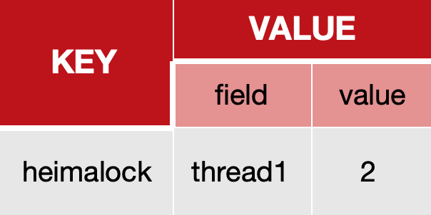

::: note

此处是一些 Redis 高频面试题（持续更新中...）。

:::

<!-- more -->

## 目录

- [基础篇](/audition/redis/core/README.md)
- [集群篇](/audition/redis/clusters/README.md)

## 面试题汇总

::: info 你在最近的项目中哪些场景使用了 Redis 呢？

> Redis 的使用场景有哪些。

:::

::: info 如果发生了缓存穿透、缓存击穿、缓存雪崩该如何解决？

> 缓存穿透、缓存击穿、缓存雪崩产生的原因以及解决方案有哪些。

:::

::: info 如何保证 Redis 的双写一致性。

> 保证双写一致性的方案有哪些。
>
> 每个方案的优缺点是什么（一致性要求高、允许延迟一致）。
>
> 衍生问题：
>
> 1. 先删缓存再更新数据库，还是先更新数据库再删缓存？
> 2. 为什么不使用延迟双删？

:::

::: info Redis 的数据持久化是怎么做的？

> RDB、AOF。
>
> AOF 的刷盘策略、命令重写。
>
> 这两种模式哪个恢复得更快。

:::

::: info Redis 的数据过期策略。

> 惰性删除、定期删除（SLOW、FAST）。

:::

::: info Redis 的内存淘汰策略。

> 有 8 种。
>
> 默认的淘汰策略是什么。
>
> 开发中最常使用的是什么策略。
>
> LRU（Least Recently Used）淘汰**最近最少使用**的 Key。
>
> LFU（Least Frequently Used）淘汰**最少频率使用**的 Key。

:::

::: info Redis 的分布式锁是如何实现的？

> 根据业务场景回答（比如：抢券业务）。
>
> `setnx` 命令（set if not exists）和 `lua` 脚本（原子性）。
>
> 看门狗机制（Watch dog）。
>
> 锁的续期（releaseTime / 3）。
>
> `while` 循环，不断尝试获取锁，达到一定次数未获得锁后才返回失败。

:::

::: info Redisson 实现的分布式锁可重入吗？

> 利用 `hash` 结构记录线程 `id` 和重入次数。
>
> 

:::

::: info Redisson 实现的分布式锁能解决主从一致性的问题吗？

> 不能。
>
> Redisson 红锁（性能低）。
>
> zookeeper（保证数据的强一致性）。

:::

::: info Redis 集群有哪些方案？

> 主从复制。
>
> 哨兵模式。
>
> 分片集群。

:::

::: info Redis 主从数据同步的流程是什么？

> 全量同步。
>
> 增量同步。

:::

::: info 如何保证 Redis 的高可用？

> 集群。

:::

::: info Redis 分片集群中的数据是怎么存储和读取的？

> Redis 集群有 16384 个哈希槽。

:::

::: info Redis 集群脑裂问题该怎么解决？

> 不同的网络分区。

:::

::: info Redis 是单线程的为什么那么快？

> Redis 是纯内存操作，执行速度非常快。
>
> 采用单线程，避免不必要的上下文切换可竞争条件，多线程还要考虑线程安全问题。
>
> 使用 I/O 多路复用模型，非阻塞 IO。

:::

::: info 能解释一下 I/O 多路复用模型？

> Redis是纯内存操作，执行速度非常快，它的性能瓶颈是**网络延迟**而不是执行速度， I/O 多路复用模型主要就是实现了高效的网络请求。
>
> - 用户空间和内核空间。
> - 常见的IO模型：
>   - 阻塞IO（Blocking IO）。
>   - 非阻塞IO（Nonblocking IO）。
>   - IO多路复用（IO Multiplexing）。
> - Redis 网络模型。

:::
