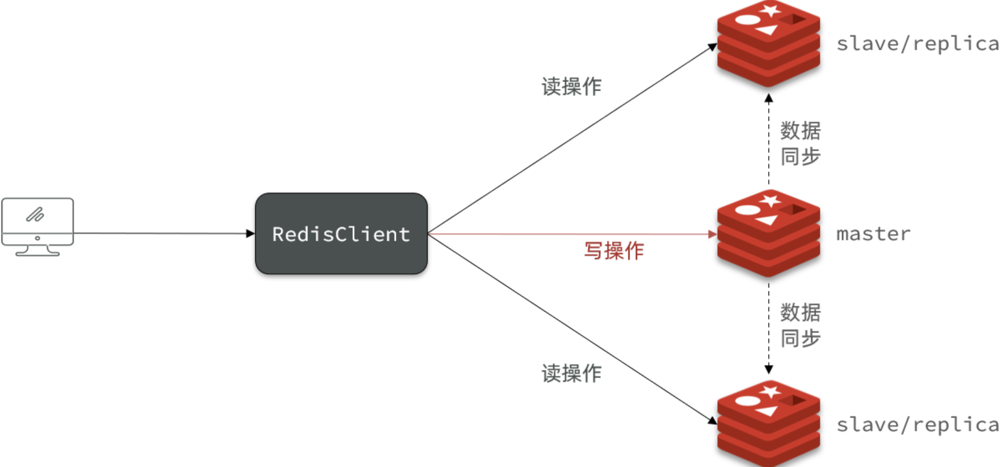
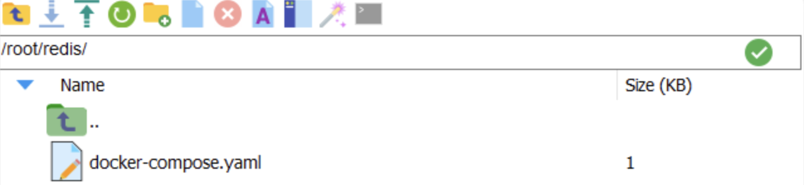
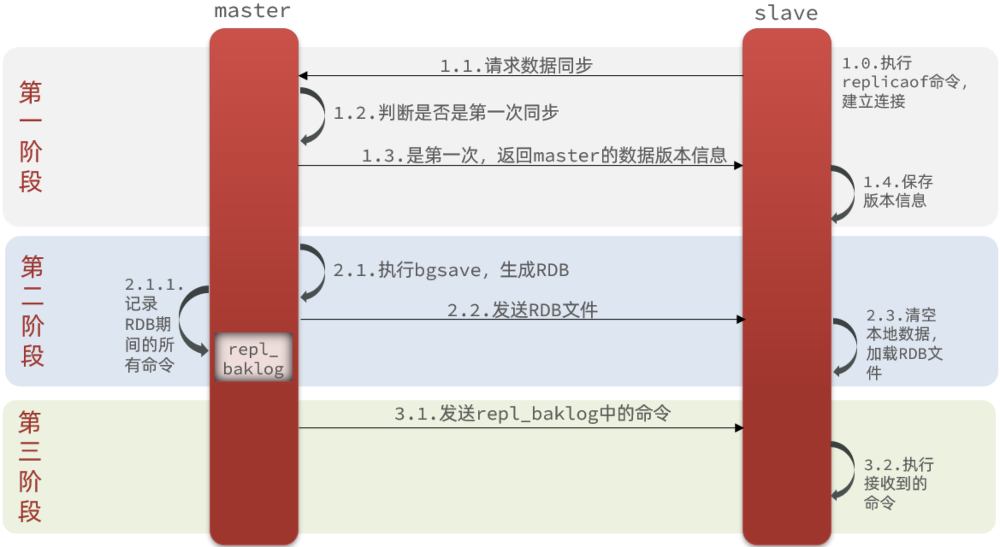
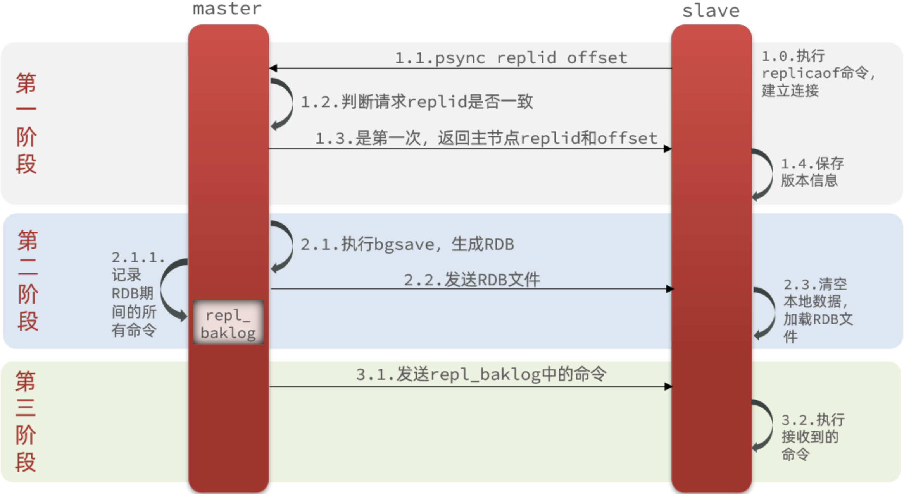
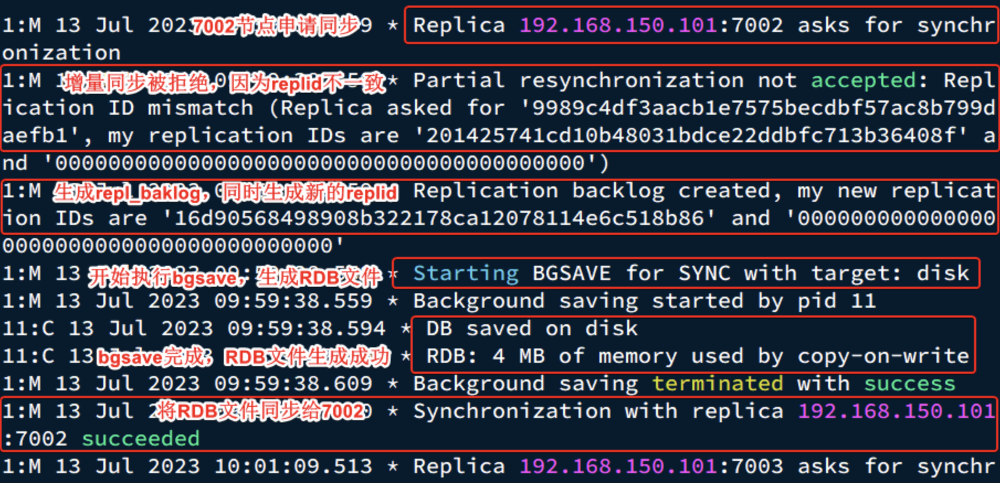
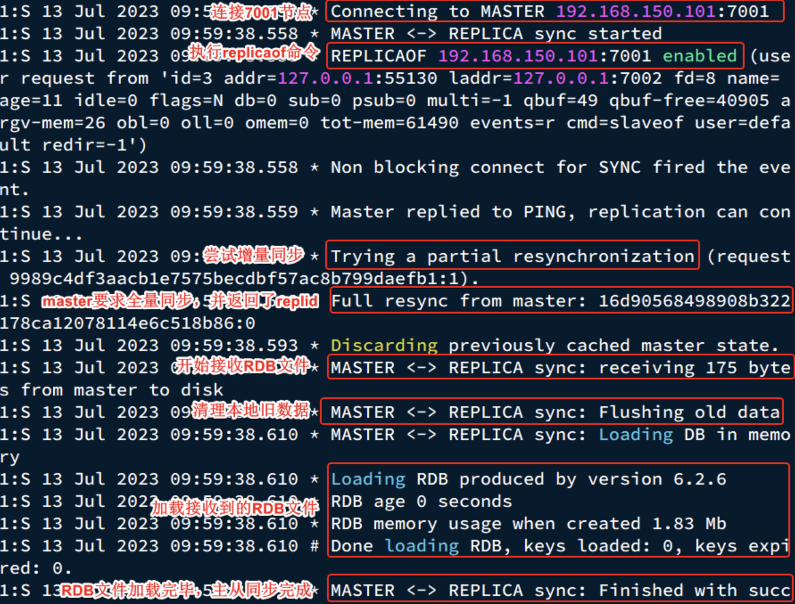
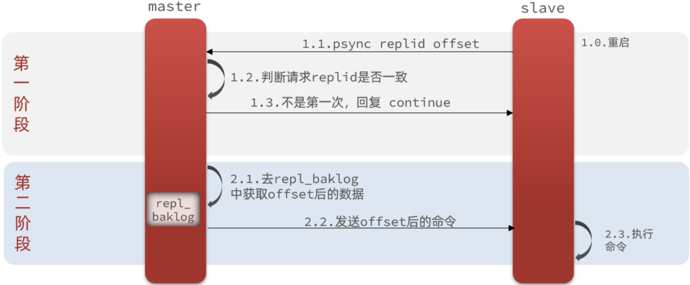

此处是一些 Redis 集群的高频面试题（持续更新中...）。

<!-- more -->

## 1.集群篇

### 1.1 主从集群

::: tip 为什么需要搭建集群？

单节点 Redis  的并发能力是有上限的，要进一步提高 Redis 的并发能力，就需要搭建主从集群，实现读写分离。

:::

#### 1.1.1 主从集群结构



**如图所示：**

集群中有一个 master 节点、两个 slave 节点（现在叫 replica）。

当我们通过 Redis 的 Java 客户端访问主从集群时应该做好路由。

- 如果是写操作：应该访问 master 节点，master 节点会自动将数据同步给两个 slave 节点。
- 如果是读操作：建议访问各个 slave 节点，从而分担并发压力。

### 1.2 搭建主从集群

我们会在同一个虚拟机中利用 3 个 Docker 容器来搭建主从集群。

容器信息如下：

| 容器名 | 角色   | IP              | 映射端口 |
| :----- | :----- | :-------------- | :------- |
| r1     | master | 192.168.150.101 | 7001     |
| r2     | slave  | 192.168.150.101 | 7002     |
| r3     | slave  | 192.168.150.101 | 7003     |

#### 1.2.1 启动多个 Redis 实例

我们利用 docker-compose 文件来构建主从集群。

文件内容如下：

```yaml
version: "3.2"

services:
  r1:
    image: redis
    container_name: r1
    network_mode: "host"
    entrypoint: ["redis-server", "--port", "7001"]
  r2:
    image: redis
    container_name: r2
    network_mode: "host"
    entrypoint: ["redis-server", "--port", "7002"]
  r3:
    image: redis
    container_name: r3
    network_mode: "host"
    entrypoint: ["redis-server", "--port", "7003"]
```

将其上传至虚拟机的`/root/redis`目录下：



执行命令并运行集群：

```bash
docker compose up -d
```

查看结果。

#### 1.2.2 建立集群关系

虽然我们启动了 3 个 Redis 实例，但是它们并没有形成主从关系。

我们需要通过命令来配置主从关系：

```bash
# Redis5.0 以前
slaveof <masterip> <masterport>
# Redis5.0 以后
replicaof <masterip> <masterport>
```

有临时和永久两种模式：

- 永久生效：在 `redis.conf` 文件中利用 `slaveof` 命令指定 `master` 节点。
- 临时生效：直接利用 `redis-cli` 控制台输入 `slaveof` 命令指定 `master` 节点。

我们测试临时模式：首先连接 `r2`，让其以 `r1` 为 master。

```bash
# 连接 r2
docker exec -it r2 redis-cli -p 7002
# 认 r1 主,也就是 7001
slaveof 192.168.150.101 7001
```

然后连接 `r3`，让其以 `r1` 为 master。

```bash
# 连接 r3
docker exec -it r3 redis-cli -p 7003
# 认 r1 主，也就是 7001
slaveof 192.168.150.101 7001
```

然后连接 `r1`，查看集群状态：

```bash
# 连接 r1
docker exec -it r1 redis-cli -p 7001
# 查看集群状态
info replication
```

结果如下：

```bash
127.0.0.1:7001> info replication
# Replication
role:master
connected_slaves:2
slave0:ip=192.168.150.101,port=7002,state=online,offset=140,lag=1
slave1:ip=192.168.150.101,port=7003,state=online,offset=140,lag=1
master_failover_state:no-failover
master_replid:16d90568498908b322178ca12078114e6c518b86
master_replid2:0000000000000000000000000000000000000000
master_repl_offset:140
second_repl_offset:-1
repl_backlog_active:1
repl_backlog_size:1048576
repl_backlog_first_byte_offset:1
repl_backlog_histlen:140
```

可以看到，当前节点 `r1:7001` 的角色是 `master`，有两个 `slave`  与其连接。

- `slave0`：`port` 是 `7002`，也就是 `r2` 节点。
- `slave1`：`port` 是 `7003`，也就是 `r3` 节点。

#### 1.2.3 测试集群

依次在 `r1`、`r2`、`r3` 节点上执行下面命令：

```bash
set num 123
get num
```

你会发现，只有在 `r1` 这个节点上可以执行 `set` 命令（**写操作**），其它两个节点只能执行 `get` 命令（**读操作**）。

也就是说读写操作已经分离了。

### 1.3 主从同步原理

在刚才的主从测试中，我们发现 `r1` 上写入 Redis 的数据，在 `r2` 和 `r3` 上也能看到，这说明主从之间确实完成了数据同步。

那么这个同步是如何完成的呢？

#### 1.3.1 全量同步

主从第一次建立连接时，会执行<strong style="color: #fb9b5f">全量同步</strong>，将 `master` 节点的所有数据都拷贝给 `slave` 节点（流程如下图所示）。



这里有一个问题：`master` 是如何得知 `salve` 是否是第一次来同步的呢？？？

有几个概念可以作为判断的依据：

- `Replication Id`：简称 `replid`，是数据集的标记，`replid` 一致则是同一数据集。
  - 每个 `master` 都有唯一的 `replid`，`slave` 则会继承 `master` 节点的 `replid`。
- `offset`：偏移量，随着记录在 `repl_baklog` 中的数据增多而逐渐增大，`slave` 完成同步时也会记录当前同步的`offset`。
  - 如果 `slave` 的 `offset` 小于 `master` 的 `offset`，则说明 `slave` 的数据落后于 `master`，需要更新。

因此 `slave` 做数据同步，必须向 `master` 声明自己的 `replication id` 和 `offset`，`master` 才可以判断到底需要同步哪些数据。

由于我们在执行 `slaveof` 命令之前，所有 Redis 节点都是 `master`，都有自己的 `replid` 和 `offset`。

当我们第一次执行 `slaveof` 命令，与 `master` 建立主从关系时，发送的 `replid` 和 `offset` 都是自己的，与 `master` 的肯定不一致。

所以 `master` 判断发现 `slave` 发送来的 `replid` 与自己的不一致，则说明这是一个全新的 `slave`，就知道要做全量同步了。

`master` 会将自己的 `replid` 和 `offset` 都发送给这个 `slave`，`slave` 保存这些信息到本地，自此以后 `slave` 的 `replid` 就与 `master` 一致了。

因此，<strong style="color: #fb9b5f">`master` 判断一个节点是否是第一次同步的依据，就是要看 `replid` 是否一致</strong>（最新的流程如下图所示）。



上图的完整流程描述：

- `slave` 节点请求增量同步。
- `master` 节点判断 `replid`，发现不一致，拒绝增量同步。
- `master` 将完整内存数据生成 `RDB`，发送 `RDB` 到 `slave`。
- `slave` 清空本地数据，加载 `master` 的 `RDB`。
- `master`将 `RDB` 期间的命令记录在 `repl_baklog`，并持续将log中的命令发送给 `slave`。
- `slave` 执行接收到的命令，保持与 `master` 之间的同步。

来看下 `r1` 节点的运行日志：



再看下 `r2` 节点执行 `replicaof` 命令时的日志：



与我们描述的完全一致。

#### 1.3.2 增量同步

全量同步需要先做 RDB，然后将 RDB 文件通过网络传输个 `slave`，成本太高了。

因此除了第一次做全量同步，其它大多数时候 `slave` 与 `master` 都是在做<strong style="color: #fb9b5f">增量同步</strong>。

什么是增量同步？

就是只更新 `slave` 与 `master` 存在差异的部分数据（如下图所示）。



那么 `master` 怎么知道 `slave` 与自己的数据差异在哪里呢?

#### 1.3.3 `repl_baklog` 原理

`master` 怎么知道 `slave` 与自己的数据差异在哪里呢？

这就要说到全量同步时的 `repl_baklog` 文件了。

这个文件是一个固定大小的数组，只不过数组是环形的，也就是说**角标到达数组末尾后，会再次从 0 开始读写**，这样数组头部的数据就会被覆盖。

`repl_baklog` 中会记录 Redis 处理过的命令及 `offset`，包括 `master` 当前的 `offset`，和 `slave` 已经拷贝到的 `offset`：

未完待续...
