::: note

此处是一些 Spring 高频面试题（持续更新中...）。

:::

<!-- more -->

## 目录

### Spring

- [SpringFramework](/audition/spring/spring-framework/README.md)
- [SpringMVC](/audition/spring/spring-mvc/README.md)
- [SpringBoot](/audition/spring/spring-boot/README.md)
- [SpringSecurity](/audition/spring/spring-security/README.md)
- [SpringCloud](/audition/spring/spring-cloud/README.md)

## 面试题汇总

### SpringFramework

::: info Spring 框架中的 Bean 是线程安全的吗？

> 不是线程安全的。
>
> Spring 框架的 Bean 默认是单例的。
>
> ```java
> @Service
> @Scope("singleton")
> public class UserServiceImpl implements UserService {
> }
> ```
>
> singleton：Bean 在每个 Spring IOC 容器中只有一个实例（默认）。
>
> prototype：一个 Bean 的定义可以有多个实例。
>
> 但 Spring Bean 并没有可变的状态（比如 Service 类和 DAO 类），所以在某种程度上说 Spring 的单例 Bean 是线程安全的。
>
> **参考回答**：
>
> 不是线程安全的。
>
> Spring 框架中有一个 `@Scope` 注解，默认的值就是 singleton，单例的。
>
> 因为一般在 Spring 容器中的 Bean 都是注入的无状态对象，是没有线程安全问题的，如果在 Bean 中定义了可修改的成员变量，是要考虑线程安全问题的，可以使用多例或者加锁来解决。

:::

::: info 什么是 AOP ？你们项目中有没有使用到 AOP ？

> **AOP 称为面向切面编程**：用于将那些与业务无关，但却对多个对象产生影响的公共行为和逻辑，抽取并封装为一个可重用的模块，这个模块被命名为“切面”（Aspect），减少系统中的重复代码，降低了模块间的耦合度，同时提高了系统的可维护性。
>
> **常见的AOP使用场景**：记录操作日志、缓存处理、Spring 中内置的事务处理。
>
> 记录操作日志思路：获取请求的用户名、请求方式、访问地址、模块名称、登录 IP、操作时间，记录到数据库的日志表中。
>
> 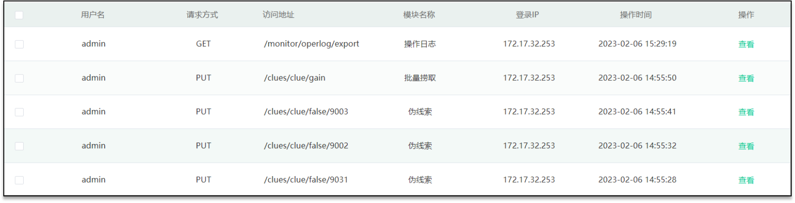
>
> ```java
> @Around("pointcut()")
> public Object around(ProceedingJoinPoint joinPoint) {
>   //  获取用户名
>   // 获取请求方式
>   // 获取访问结果
>   // 获取模块名称
>   // 登录 IP
>   // 操作时间
>   // 保存到数据库（操作日志）    
>   return null;
> }
> ```
>
> 示例代码如上：使用 AOP 中的环绕通知 + 切点表达式（找到要记录日志的方法）。

:::

::: info Spring 中的事务是如何实现的？

> Spring 支持编程式事务管理和声明式事务管理两种方式：
>
> - 编程式事务控制：需使用 TransactionTemplate 来进行实现，对业务代码有侵入性，所以项目中很少使用。
> - 声明式事务管理：声明式事务管理建立在 AOP 之上的。其本质是通过 AOP 功能，对方法前后进行拦截，将事务处理的功能编织到拦截的方法中，也就是在目标方法开始之前加入一个事务，在执行完目标方法之后根据执行情况提交或者回滚事务。
>
> 声明式事务的核心注解：`@Transactional`。

:::

::: info Spring 中事务失效的场景有哪些？

> 异常捕获处理：自己通过 `try{} catch{}` 捕获了异常又不主动抛出异常。
>
> 抛出检查异常：Spring 默认只会回滚非检查异常（解决：`@Transactional(rollbackFor=Exception.class)`）。
>
> 非 `public` 方法：Spring 为方法创建代理、添加事务通知、前提条件都是该方法是 `public` 的。

:::

::: info Spring 的 Bean 的生命周期。

> 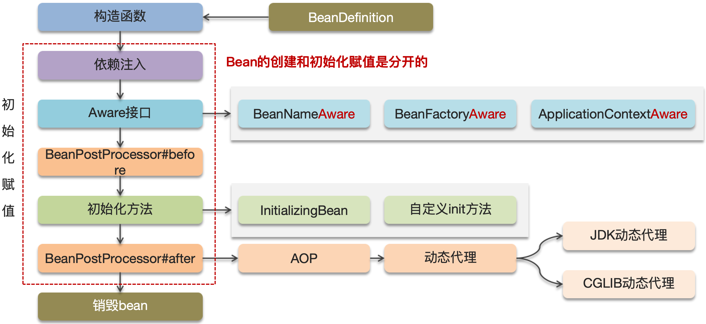
>
> **文字描述**：
>
> 1. 通过 BeanDefinition 获取 Bean 的定义信息。
> 2. 调用构造函数实例化 Bean。
> 3. Bean 的依赖注入。
> 4. 处理 Aware 接口（BeanNameAware、BeanFactoryAware、ApplicationContextAware）。
> 5. Bean 的后置处理器 BeanPostProcessor-前置。
> 6. 初始化方法（InitializingBean、init-method）。
> 7. Bean 的后置处理器 BeanPostProcessor-后置。
> 8. 销毁 Bean。
>
> 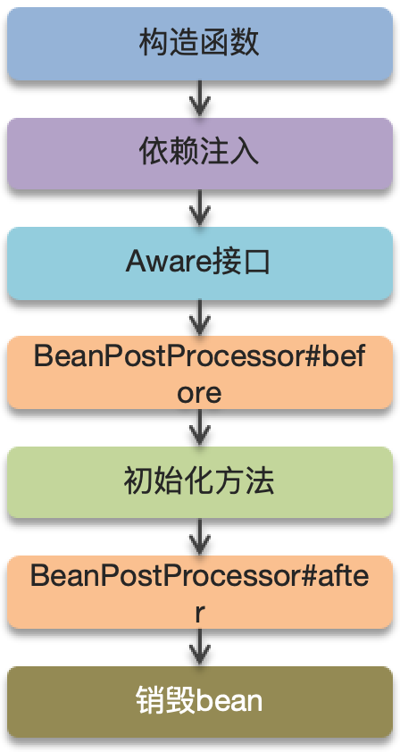

:::

::: info Spring 中的循环引用。

> 循环引用示例：
>
> 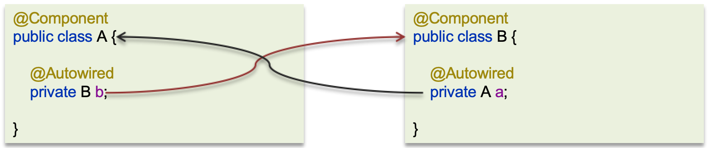
>
> **Spring 是通过三级缓存解决循环依赖问题的。**
>
> 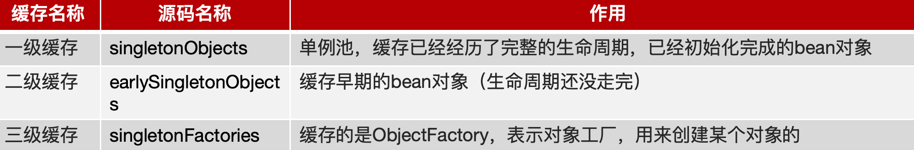
>
> 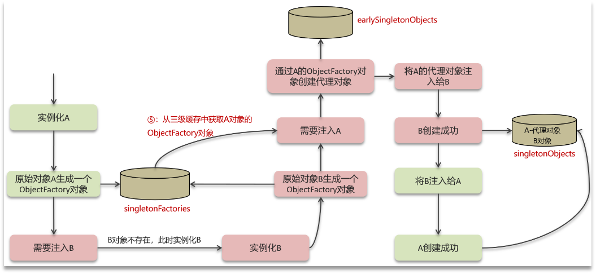
>
> **文字描述**：
>
> - 循环依赖：循环依赖其实就是循环引用，也就是两个或两个以上的 Bean 互相持有对方，最终形成闭环（比如 A 依赖于 B，B 依赖于 A）。
> - 循环依赖在 Spring 中是允许存在，Spring 框架依据三级缓存已经解决了大部分的循环依赖问题：
>   1. 一级缓存：单例池，缓存已经经历了完整的生命周期，已经初始化完成的 Bean 对象。
>   2. 二级缓存：缓存早期的 Bean 对象（生命周期还没走完）。
>   3. 三级缓存：缓存的是 ObjectFactory，表示对象工厂，用来创建某个对象的。

:::

::: info 构造方法出现了循环依赖怎么解决？

> 原因：由于 Bean 的生命周期中构造函数是第一个执行的，所以 Spring 框架并不能解决构造函数的的依赖注入。
>
> 解决方案：使用 `@Lazy` 懒加载注解解决，什么时候需要对象再进行 Bean 对象的创建。
>
> ```java
> public A(@Lazy B b){
>   System.out.println("A的构造方法执行了...");
>   this.b = b ;
> }
> ```

:::

::: info 。

>

:::

### SpringMVC

::: info SpringMVC 的执行流程知道嘛？

> **视图阶段（老旧 JSP 项目）**：
>
> 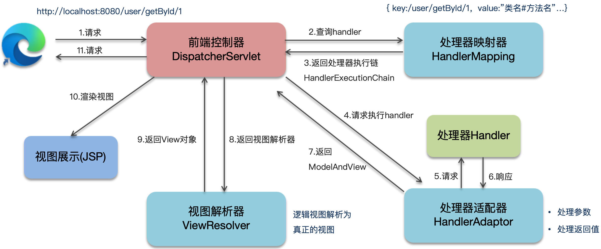
>
> 文字描述（视图阶段）：
>
> 1. 用户发送出请求到前端控制器 DispatcherServlet。
> 2. DispatcherServlet 收到请求调用 HandlerMapping（处理器映射器）。
> 3. HandlerMapping 找到具体的处理器，生成处理器对象及处理器拦截器（如果有），再一起返回给 DispatcherServlet。
> 4. DispatcherServlet 调用 HandlerAdapter（处理器适配器）。
> 5. HandlerAdapter 经过适配调用具体的处理器（Handler/Controller）。
> 6. Controller 执行完成返回 ModelAndView 对象。
> 7. HandlerAdapter 将 Controller 执行结果 ModelAndView 返回给 DispatcherServlet。
> 8. DispatcherServlet 将 ModelAndView 传给 ViewReslover（视图解析器）。
> 9. ViewReslover 解析后返回具体 View（视图）。
> 10. DispatcherServlet 根据 View 进行渲染视图（即将模型数据填充至视图中）。
> 11. DispatcherServlet 响应用户。
>
> **前后端分离阶段（接口开发）**：
>
> 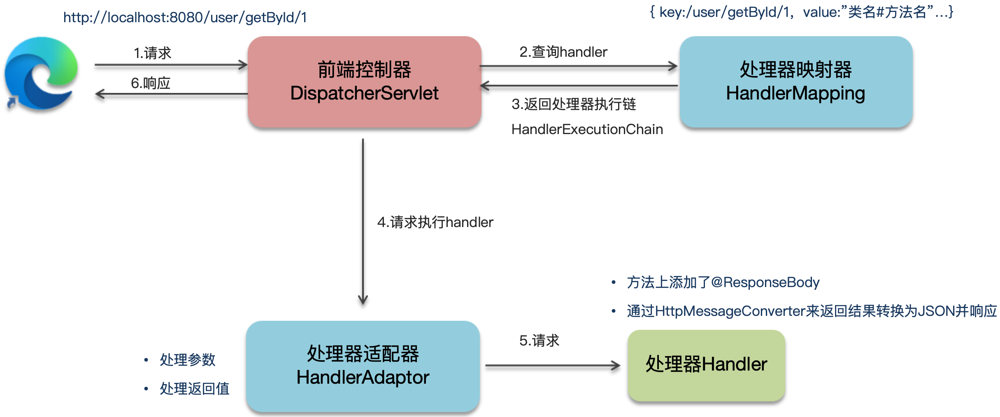
>
> 文字描述（前后端分离阶段）：
>
> 1. 用户发送出请求到前端控制器 DispatcherServlet。
> 2. DispatcherServlet 收到请求调用 HandlerMapping（处理器映射器）。
> 3. HandlerMapping 找到具体的处理器，生成处理器对象及处理器拦截器（如果有），再一起返回给 DispatcherServlet。
> 4. DispatcherServlet 调用 HandlerAdapter（处理器适配器）。
> 5. HandlerAdapter 经过适配调用具体的处理器（Handler/Controller）。
> 6. 方法上添加了@ResponseBody。
> 7. 通过 HttpMessageConverter 来返回结果转换为 JSON 并响应。

:::

::: info Spring 框架常见的注解有哪些？

> Spring 的常见注解有哪些？
>
> 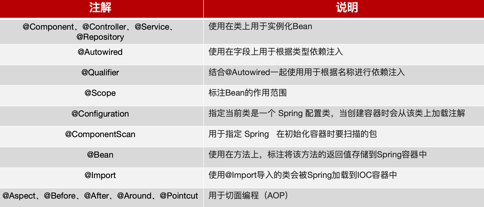
>
> SpringMVC 常见的注解有哪些？
>
> 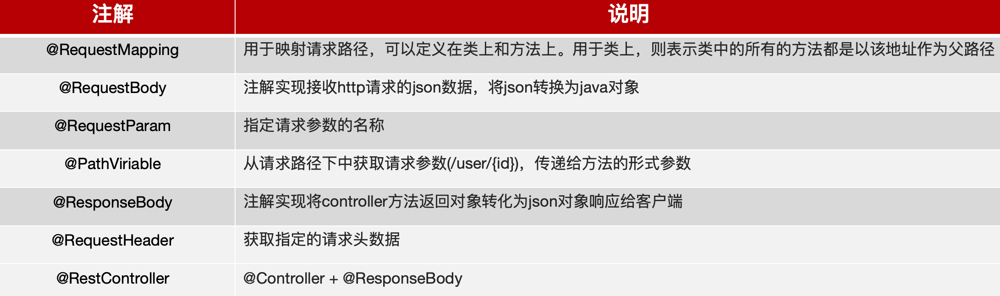
>
> SpringBoot 常见注解有哪些？
>
> 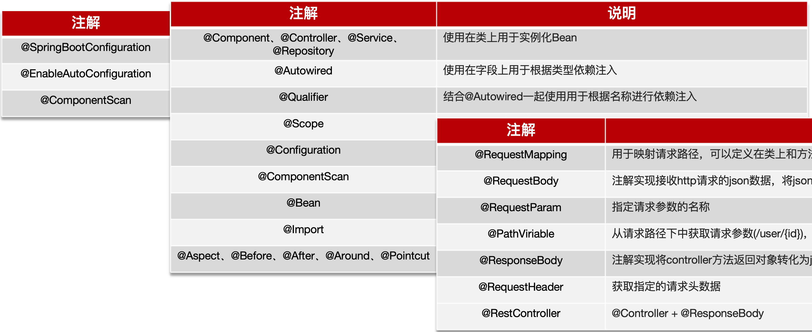

:::

### SpringBoot

::: info SpringBoot 自动配置原理。

> 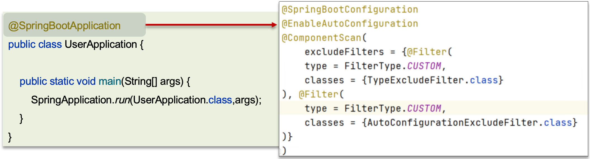
>
> `@SpringBootConfiguration`：该注解与 `@Configuration` 注解作用相同，用来声明当前也是一个配置类。
>
> `@ComponentScan`：组件扫描，默认扫描当前引导类所在包及其子包。
>
> `@EnableAutoConfiguration`：SpringBoot 实现自动化配置的核心注解。
>
> 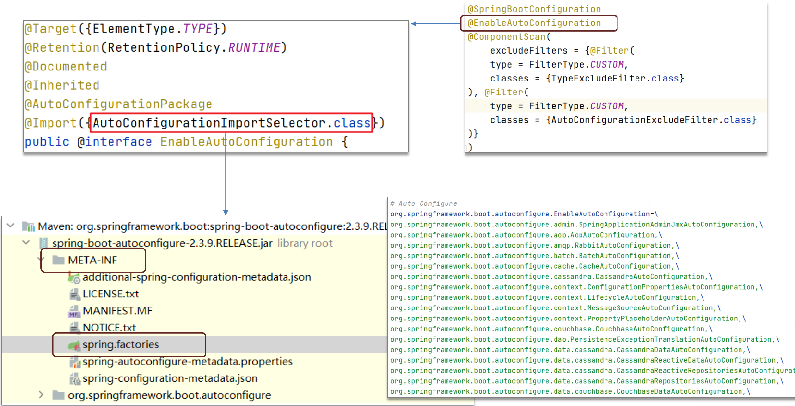
>
> 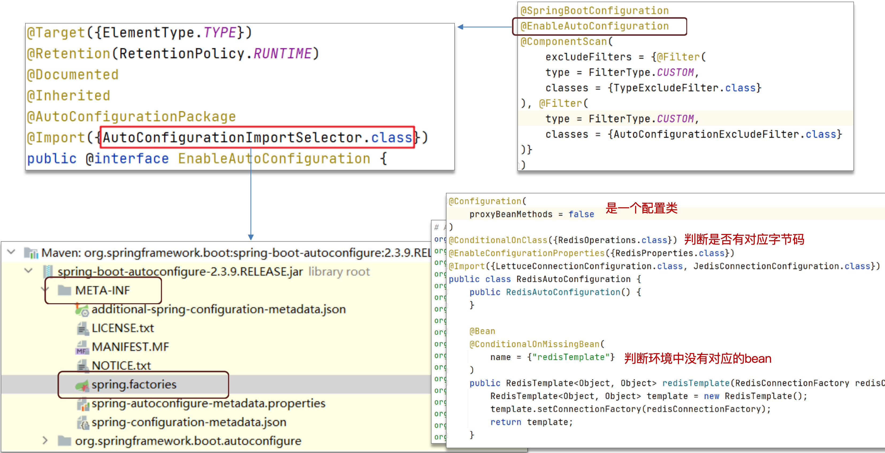
>
> **文字描述**：
>
> 1. 在 SpringBoot 项目中的引导类上有一个注解 `@SpringBootApplication`，这个注解是对三个注解进行了封装，分别是：
>    - `@SpringBootConfiguration`。
>    - `@EnableAutoConfiguration`。
>    - `@ComponentScan`。
> 2. 其中 `@EnableAutoConfiguration` 是实现自动化配置的核心注解：
>    - 该注解通过 `@Import` 注解导入对应的配置选择器。
>    - 内部就是读取了该项目和该项目引用的 Jar 包的的 classpath 路径下 META-INF/spring.factories 文件中的所配置的类的全类名。
>    - 在这些配置类中所定义的 Bean 会根据条件注解所指定的条件来决定是否需要将其导入到 Spring 容器中。
> 3. 条件判断会有像 `@ConditionalOnClass` 这样的注解，判断是否有对应的 Class 文件，如果有则加载该类，把这个配置类的所有的 Bean 放入 Spring 容器中使用。

:::

::: info 。

>

:::

### SpringCloud

::: info Spring Cloud 的 5 大组件有哪些？。

>注册中心、配置中心（Nacos）。
>
>负载均衡（Ribbon）。
>
>远程调用（Feign）。
>
>服务熔断（Hystrix、Sentinel）。
>
>网关（Zuul、Gateway）。

:::

::: info Nacos 和 Eureka 有哪些区别？

> Nacos 每 5s 心跳续约一次（零时实例、非临时实例、主动推送）。
>
> Eureka 每 30s 心跳续约一次（如果 Eureka 服务 90 秒没接收到心跳则剔除服务列表）。

:::

::: info 你们项目负载均衡如何实现的？

>OpenFeign 整合的 Ribbon。

:::

::: info Ribbon 负载均衡策略有哪些？

>RoundRobinRule：简单轮询服务列表来选择服务器。
>
>WeightedResponseTimeRule：按照权重来选择服务器，响应时间越长，权重越小。
>
>RandomRule：随机选择一个可用的服务器。
>
>BestAvailableRule：忽略那些短路的服务器，并选择并发数较低的服务器。
>
>RetryRule：重试机制的选择逻辑。
>
>AvailabilityFilteringRule：可用性敏感策略，先过滤非健康的，再选择连接数较小的实例。
>
>ZoneAvoidanceRule：以区域可用的服务器为基础进行服务器的选择。使用Zone对服务器进行分类，这个Zone可以理解为一个机房、一个机架等。而后再对Zone内的多个服务做轮询。

:::

::: info 什么是服务雪崩？怎么解决这个问题？

>Hystrix、Sentinel。
>
>**服务降级**：
>
>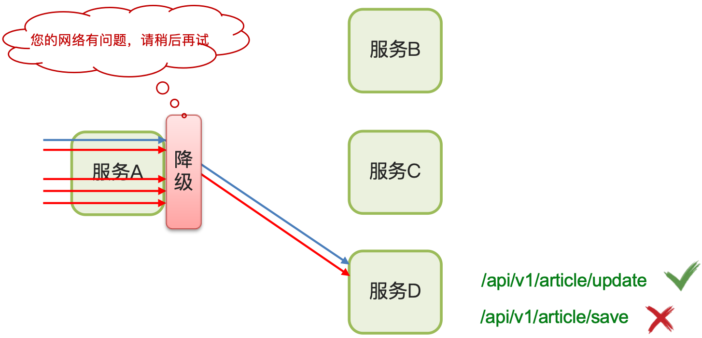
>
>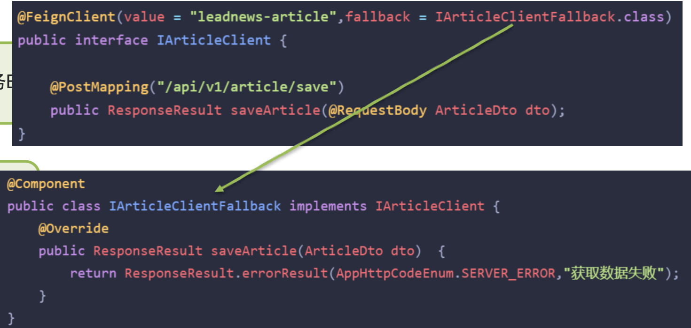
>
>注意：如果降级太多，则会触发熔断机制！
>
>**服务熔断**：
>
>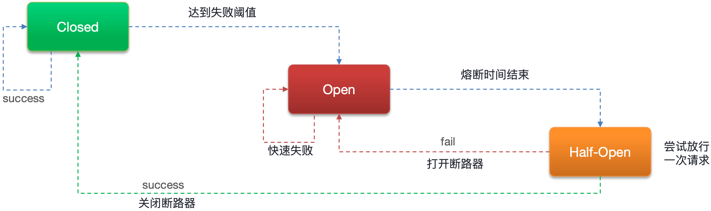
>
>**文字描述**：
>
>- 服务雪崩：一个服务失败，导致整条链路的服务都失败的情形。
>- 服务降级：服务自我保护的一种方式，或者保护下游服务的一种方式，用于确保服务不会受请求突增影响变得不可用，确保服务不会崩溃，==一般在实际开发中与 Feign 接口整合，编写降级逻辑==。
>- 服务熔断：默认关闭，需要手动打开，如果==检测到 10 秒内请求的失败率超过 50%==，就触发熔断机制。==之后每隔 5 秒重新尝试请求微服务==，如果微服务不能响应，继续走熔断机制。如果微服务可达，则关闭熔断机制，恢复正常请求。

:::

::: info 你们的微服务是怎么监控的？

>Skywalking。
>
>Prometheus + Grafana。
>
>**参考回答**：
>
>我们项目中采用的 Skywalking 进行监控的：
>
>- Skywalking 主要可以监控接口、服务、物理实例的一些状态。特别是在压测的时候可以看到众多服务中哪些服务和接口比较慢，我们可以针对性的分析和优化。
>- 我们还在 Skywalking 设置了告警规则，特别是在项目上线以后，如果报错，我们分别设置了可以给相关负责人发短信和发邮件，第一时间知道项目的 Bug 情况，第一时间修复。

:::

::: info 你们项目中有没有做过限流？怎么做的？

>为什么要限流？
>
>1. 并发的确大（突发流量）。
>2. 防止用户恶意刷接口。
>
>限流的实现方式：
>
>- Tomcat（可以设置最大连接数）。
>
>- Nginx（漏桶算法）。
>
> 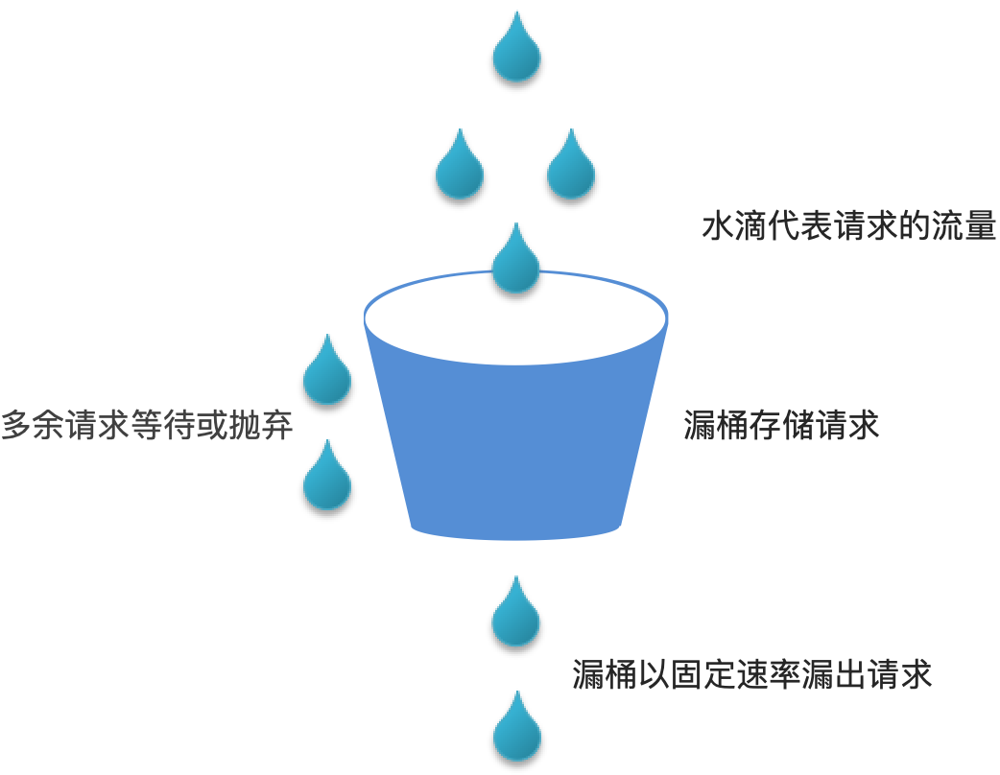
>
>- 网关（令牌桶算法）。
>
> 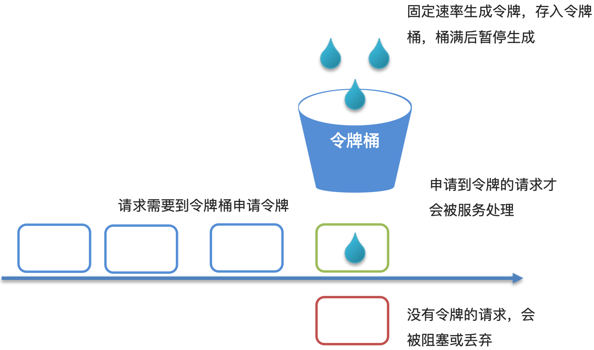
>
>- 自定义拦截器。
>
>**参考回答**：
>
>先要介绍下业务，什么情况下去做限流，需要说明 QPS 具体多少。
>
>- 我们当时有一个活动，到了假期就会抢购优惠券，QPS 最高可以达到 2000，平时 10～50 之间，为了应对突发流量，需要做限流。
>- 常规限流，是为了防止恶意攻击，保护系统正常运行，我们当时系统能够承受最大的 QPS 是多少（压测结果）。

:::

::: info 解释一下 CAP 定理和 BASE 理论。

>分布式事务方案的指导。
>
>分布式系统设计方向。
>
>根据业务指导使用正确的技术选择。
>
>**CAP 定理（分布式系统有三个指标）**：
>
>- ==C==onsistency（一致性）。
>- ==A==vailability（可用性）。
>- ==P==artition tolerance （分区容错性）。
>
>分布式系统无法同时满足这三个指标。
>
>因为服务于服务之间是通过网络进行连接，所以分区容错性（P）是必然会存在的。
>
>所以当分区出现时，系统的一致性（C）和可用性（A）就无法同时满足。
>
>如果要保证高可用性（A）那就不能保证数据的强一致性 ==> **AP**。
>
>如果要保证强一致性（C）那就要放弃高可用性 ==> **CP**。
>
>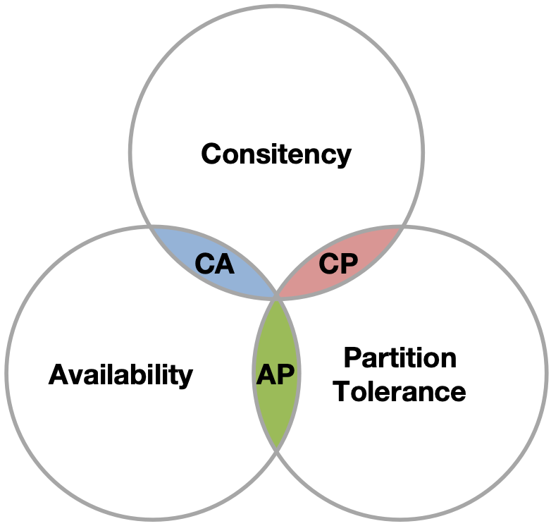
>
>**BASE 理论（BASE 理论是对 CAP 定理的一种解决思路 - 包含三个思想）**：
>
>- ==B==asically ==A==vailable （基本可用）：分布式系统在出现故障时，允许损失部分可用性，以保证核心功能可用。
>- ==S==oft State（软状态）：在一定时间内，允许出现中间状态，比如临时的不一致状态。
>- ==E==ventually Consistent（最终一致性）：虽然无法保证强一致性，但是在软状态结束后，最终达到数据一致。
>
>**解决分布式事务的思想和模型**：
>
>- 最终一致思想：各分支事务分别执行并提交，如果有不一致的情况，再想办法恢复数据（AP）。
>- 强一致思想：各分支事务执行完业务不要提交，等待彼此结果。而后统一提交或回滚（CP）。

:::

::: info 你们采用哪种分布式事务解决方案？

>MQ。
>
>Seata（XA、AT、TCC）。
>
>Seata 事务管理中有三个重要的角色：
>
>- TC（Transaction Coordinator） - 事务协调者：维护全局和分支事务的状态，协调全局事务提交或回滚。
>- TM (Transaction Manager) - 事务管理器：定义全局事务的范围、开始全局事务、提交或回滚全局事务。
>- RM (Resource Manager) - 资源管理器：管理分支事务处理的资源，与 TC 交谈以注册分支事务和报告分支事务的状态，并驱动分支事务提交或回滚。
>
>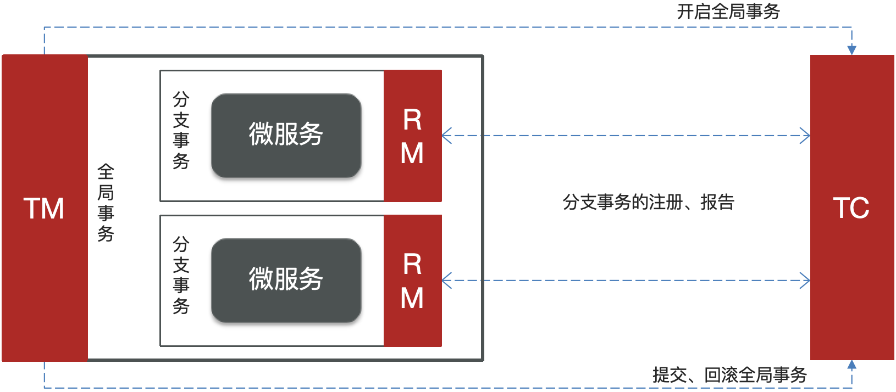
>
>**Seata 的 XA 模式**：
>
>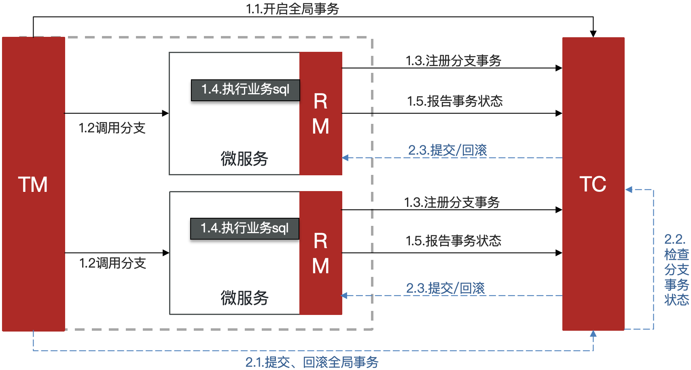
>
>**Seata 的 AT 模式**：
>
>
>
>**Seata 的 TCC 模式**：
>
>

:::

::: info 分布式服务的接口幂等性如何设计？

>幂等性：指的是多次调用方法或者接口，可以保证重复调用的结果和单次调用的结果一致。
>
>需要幂等场景：
>
>- 用户重复点击（网络波动）。
>- MQ 消息重复。
>- 应用使用失败或超时重试机制。
>
>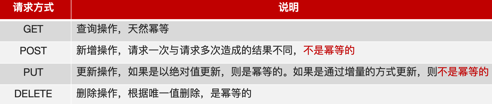
>
>**Token + Redis 实现接口幂等性**：
>
>
>
>
>
>**使用分布式锁也可以实现幂等性。**

:::

::: info 你们项目中使用了什么分布式任务调度？

>xxl-job。
>
>xxl-job路由策略有哪些？
>
>- xxl-job提供了很多的路由策略，我们平时用的较多就是：轮询、故障转移、分片广播、…。
>
>xxl-job任务执行失败怎么解决？
>
>- 路由策略选择故障转移，使用健康的实例来执行任务。
>- 设置重试次数。
>- 查看日志 + 邮件告警来通知相关负责人解决。
>
>如果有大数据量的任务同时都需要执行，怎么解决？
>
>- 让多个实例一块去执行（部署集群），路由策略==分片广播==。
>- 在任务执行的代码中可以获取分片总数和当前分片，按照取模的方式分摊到各个实例执行。

:::
