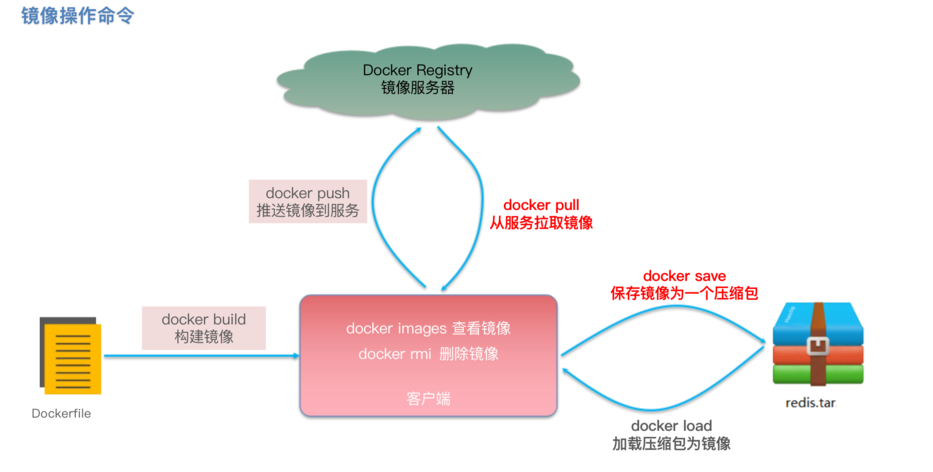
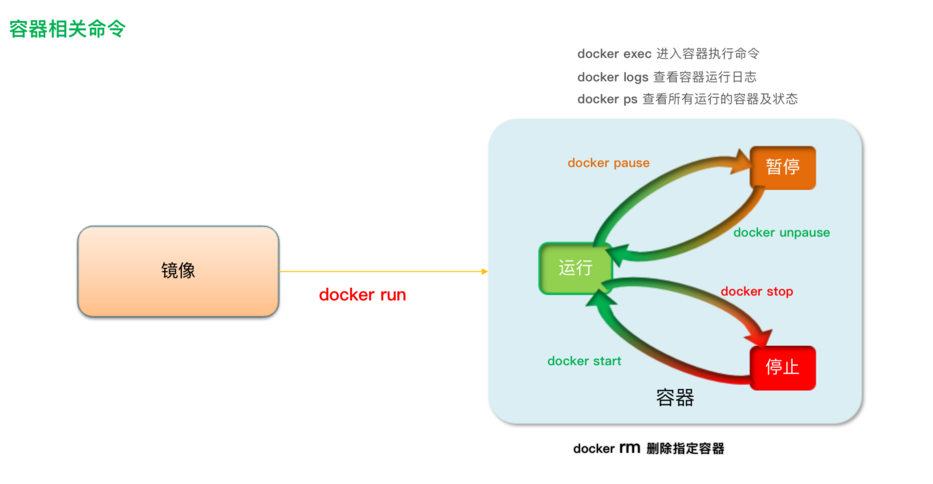

此处介绍 Docker 中的常用命令（持续更新中...）。

<!-- more -->

## 常用命令

::: tip 经验技巧！

可以通过 `docker --help` 查看帮助文档（例如查看指定命令的帮助文档：`docker save --help`）。

:::

### 镜像操作命令



### 容器操作命令



### 查询所有容器

```bash
# 查看所有运行中的容器
docker ps
# 查看所有状态下的容器
docker ps -a
# 格式化输出控制台信息
docker ps -a --format "table {{.ID}}\t{{.Image}}\t{{.Ports}}\t{{.Status}}\t{{.Names}}" # 只查看：容器ID、镜像版本、端口映射、容器状态、容器名称
```

### 监控容器内存

```bash
docker stats
```

### 持续查看日志

```bash
docker logs -f 容器名称 # 例如：docker logs -f nginx
```

### 进入容器内部

```bash
docker exec -it 容器名称 bash # 例如：docker exec -it nginx bash
# 或直接执行容器内的命令
docker exec -it redis redis-cli # 示例
# 退出容器
exit
```

### 查看容器信息

```bash
docker inspect 容器名称 # 例如：docker inspect nginx
```
