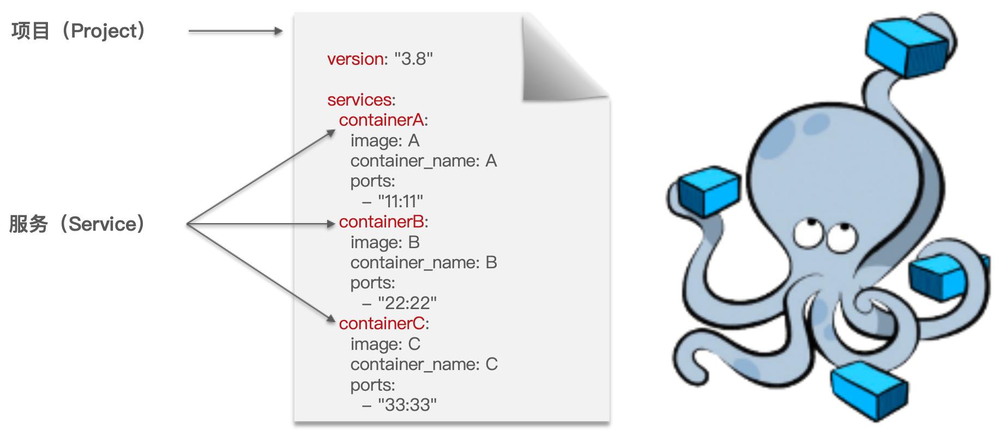

此处是 DockerCompose 的文件的编写和使用。

<!-- more -->

## DockerCompose

::: tip 什么是 DockerCompose？

DockerCompose 通过一个单独的 `docker-compose.yml` 模版文件（YAML 格式）来定义一组相关联的应用容器。

帮助我们实现多个互相关联的 Docker 容器的快速部署。

一个 `docker-compose.yml` 文件表示一个项目。

文件中的每个 Service 表示一个需要创建的容器。

DockerCompose 的详细语法参考官网：[https://docs.docker.com/compose/compose-file/compose-file-v3](https://docs.docker.com/compose/compose-file/compose-file-v3)



:::

### 基本语法

`docker-compose` 文件中可以定义多个相互关联的应用容器，每一个应用容器被称为一个服务（Service）。

由于 Service 就是在定义某个应用的运行时参数，因此与`docker run`参数非常相似。

例如用 `docker run` 部署 MySQL 的命令如下：

```bash
docker run -d \
  --name mysql \
  -p 3306:3306 \
  -e TZ=Asia/Shanghai \
  -e MYSQL_ROOT_PASSWORD=123456 \
  -v /opt/mysql/log:/var/log/mysql \
  -v /opt/mysql/data:/var/lib/mysql \
  -v /opt/mysql/conf:/etc/mysql \
  --network net-demo
  mysql
```

用 `docker-compose.yml` 文件来定义则如下所示：

```yaml
version: "3.8" # 表示的是当前 DockerCompose 的语法版本

services:
  mysql:
    image: mysql
    container_name: mysql
    ports:
      - "3306:3306"
    environment:
      TZ: Asia/Shanghai
      MYSQL_ROOT_PASSWORD: 123456
    volumes:
      - "/opt/mysql/log:/var/log/mysql"
      - "/opt/mysql/data:/var/lib/mysql"
      - "/opt/mysql/conf:/etc/mysql"
    networks:
      - net-demo
networks:
  net-demo:
    name: net-demo
```

对比如下：

| docker run 参数 | docker compose 指令 | 说明         |
| :-------------- | :------------------ | :----------- |
| --name          | container_name      | 容器名称。   |
| -p              | ports               | 端口映射。   |
| -e              | environment         | 环境变量。   |
| -v              | volumes             | 数据卷配置。 |
| --network       | networks            | 网络。       |

### 基础命令

> 常见的命令：[https://docs.docker.com/compose/reference](https://docs.docker.com/compose/reference)

### 部署示例

1. 编写一个 Java 应用的 `docker-compose.yml` 部署文件：

   ```yaml
   version: "3.8" # 表示的是当前 DockerCompose 的语法版本
   
   services:
     mysql: # 部署 MySQL
       image: mysql # 镜像
       container_name: mysql # 容器名称
       ports: # 端口
         - "3306:3306"
       environment: # 环境变量
         TZ: Asia/Shanghai
         MYSQL_ROOT_PASSWORD: 123456
       volumes: # 数据卷
         - "/opt/mysql/log:/var/log/mysql"
         - "/opt/mysql/data:/var/lib/mysql"
         - "/opt/mysql/conf:/etc/mysql"
       networks: # 网络
         - net-demo
     nginx: # 部署 Nginx
       image: nginx
       container_name: nginx
       ports:
         - "80:80"
       volumes:
         - "/opt/nginx/logs:/var/log/nginx"
         - "/opt/nginx/conf.d:/etc/nginx/conf.d"
         - "/opt/nginx/html:/usr/share/nginx/html"
         - "/opt/nginx/conf/nginx.conf:/etc/nginx/nginx.conf"
       networks:
         - net-demo
       depends_on: # 依赖的项目（会优先创建依赖的项目容器再创建本项目）
         - docker-demo
     docker-demo: # 部署 Java 项目
       build: # 构建镜像
         context: . # 当前目录中查找 Dockerfile 文件
         dockerfile: Dockerfile # 通过 Dockerfile 文件构架镜像
       container_name: docker-demo # 容器名称
       ports: # 端口
         - "8080:8080"
       networks: # 网络
         - net-demo
       depends_on: # 依赖的项目（会优先创建依赖的项目容器再创建本项目）
         - mysql
   networks:
     net-demo: # 网络标识
       name: net-demo # 网络名称
   ```

2. 部署的基本语法如下：

   ```bash
   docker compose [OPTIONS] [COMMAND]
   ```

   其中 OPTIONS 和 COMMAND 都是可选参数（查看所有选项参数：`docker compose --help`）：

   | 类型     | 参数或指令 | 说明                            |
   | :------- | :--------- | :------------------------------ |
   | Options  | -f         | 指定 compose 文件的路径和名称。 |
   |          | -p         | 指定 project 名称。             |
   | Commands | up         | 创建并启动所有 service 容器。   |
   |          | down       | 停止并移除所有容器、网络。      |
   |          | ps         | 列出所有启动的容器。            |
   |          | logs       | 查看指定容器的日志。            |
   |          | stop       | 停止容器。                      |
   |          | start      | 启动容器。                      |
   |          | restart    | 重启容器。                      |
   |          | top        | 查看运行的进程。                |
   |          | exec       | 在指定的运行中容器中执行命令。  |

   **启动应用**：`docker compose -p docker-demo up -d `（执行命令的目录在当前部署文件的目录则无需指定文件路径）。

   **停止应用**：`docker compose down`（会删除掉所有的容器并删除网络）。
