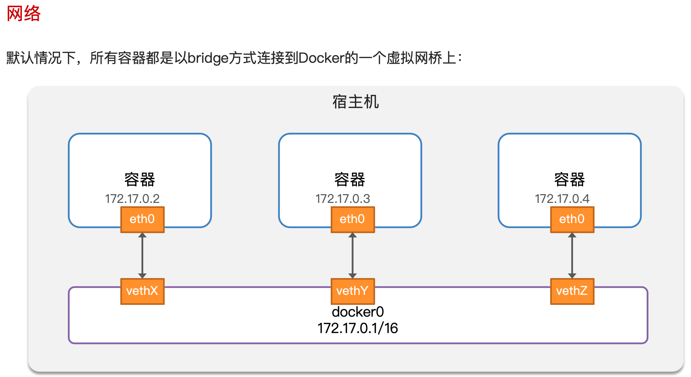

此处是 Docker 中网络的配置方式。

<!-- more -->

## 网络配置

::: tip 为什么需要在 Docker 中配置网络？

由于 Java 项目往往需要访问其它各种中间件（例如：MySQL、Redis）。

容器的网络 IP 其实是一个虚拟的 IP，其值并不固定与某一个容器绑定，如果我们在开发时写死某个 IP，而在部署时很可能容器的 IP 会发生变化，连接会失败。

所以，我们必须借助于 Docker 的网络功能来解决这个问题。



:::

> 查看帮助文档：`docker network --help`。
>
> 更多命令查看官方文档：[https://docs.docker.com/engine/reference/commandline/network](https://docs.docker.com/engine/reference/commandline/network)

常用命令如下：

| 命令                      | 说明                     | 文档地址                                                     |
| :------------------------ | :----------------------- | :----------------------------------------------------------- |
| docker network create     | 创建一个网络             | [docker network create](https://docs.docker.com/engine/reference/commandline/network_create/) |
| docker network ls         | 查看所有网络             | [docs.docker.com](https://docs.docker.com/engine/reference/commandline/network_ls/) |
| docker network rm         | 删除指定网络             | [docs.docker.com](https://docs.docker.com/engine/reference/commandline/network_rm/) |
| docker network prune      | 清除未使用的网络         | [docs.docker.com](https://docs.docker.com/engine/reference/commandline/network_prune/) |
| docker network connect    | 使指定容器连接加入某网络 | [docs.docker.com](https://docs.docker.com/engine/reference/commandline/network_connect/) |
| docker network disconnect | 使指定容器连接离开某网络 | [docker network disconnect](https://docs.docker.com/engine/reference/commandline/network_disconnect/) |
| docker network inspect    | 查看网络详细信息         | [docker network inspect](https://docs.docker.com/engine/reference/commandline/network_inspect/) |

可以通过 `docker inspect 容器名称` 命令查看某个容器的详细信息（`Networks` 字段则为容器网络信息）。

### 自定义网络

::: warning 注意！

加入自定义网络的容器可以直接通过容器名互相访问（默认网络则不支持通过容器名互相访问）。

:::

```bash
# 1.首先通过命令创建一个网络
docker network create net-demo

# 2.然后查看网络
docker network ls
# 可以通过 ip addr 查看 Linux 系统多了一个网卡
# 结果：
NETWORK ID     NAME      DRIVER    SCOPE
639bc44d0a87   bridge    bridge    local
403f16ec62a2   net-demo     bridge    local
0dc0f72a0fbb   host      host      local
cd8d3e8df47b   none      null      local
# 其中除了 net-demo 以外其它的都是默认的网络

# 3.让 docker-demo 和 mysql 都加入该网络（注意：在加入网络时可以通过 --alias 给容器起别名）
# 这样该网络内的其它容器就可以用别名来互相访问了！
# 其实每一个容器都有一个默认的别名就是其容器的名称！
# 3.1.把 mysql 容器加入到 net-demo 网络中并指定别名为 db
docker network connect net-demo mysql --alias db
# 3.2.把我们的 java 项目加入到 net-demo 网络中
docker network connect net-demo docker-demo
# 3.3.查看是否加入网络成功
docker inspect mysql
docker inspect docker-demo

# 4.进入 docker-demo 容器
# 尝试利用别名访问 db
# 4.1.进入容器
docker exec -it docker-demo bash
# 4.2.用 db 别名访问
ping db
# 结果
PING db (172.18.0.2) 56(84) bytes of data.
64 bytes from mysql.net-demo (172.18.0.2): icmp_seq=1 ttl=64 time=0.070 ms
64 bytes from mysql.net-demo (172.18.0.2): icmp_seq=2 ttl=64 time=0.056 ms
# 4.3.用容器名访问
ping mysql
# 结果：
PING mysql (172.18.0.2) 56(84) bytes of data.
64 bytes from mysql.net-demo (172.18.0.2): icmp_seq=1 ttl=64 time=0.044 ms
64 bytes from mysql.net-demo (172.18.0.2): icmp_seq=2 ttl=64 time=0.054 ms
```

现在则无需记住 IP 地址也可以实现容器之间互联了！！！

补充说明：也可以在创建容器的时候通过 `--newwork` 指令指定需要加入的网络（此时就不会加入默认网络了）。

```bash
# 注意：创建容器时指定了网络，则不会再加入默认的网络了
docker run -d --name docker-demo -p 8080:8080 --newwork net-demo docker-demo:1.0
```

**总结：**

- 在自定义网络中，可以给容器起多个别名，默认的别名是容器名的本身。
- 在同一个自定义网络中的容器，可以通过别名来互相访问。
