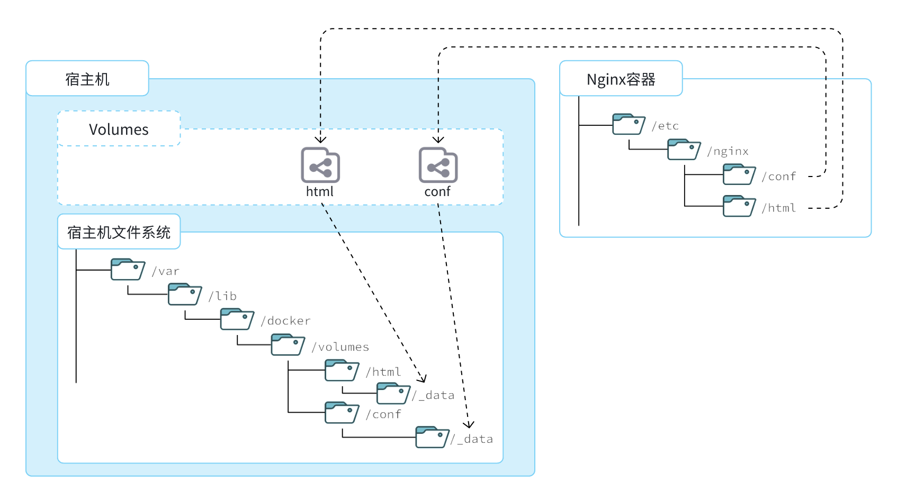

此处介绍的是数据券挂载的相关知识。

<!-- more -->

## 数据卷

::: tip 什么是数据卷？

<i>数据卷（Volume）</i>是一个虚拟的目录，是<i>容器内部的目录</i>与<i>宿主机目录</i>之间映射的桥梁。

容器内部的资源路径可查看 Docker Hub 中对应容器的介绍文档。

:::



### 相关命令

> 可通过命令查看相关帮助文档：`docker volume --help`。

| 命令                  | 说明                   | 文档地址                                                     |
| :-------------------- | :--------------------- | :----------------------------------------------------------- |
| docker volume create  | 创建数据卷。           | [docker volume create](https://docs.docker.com/engine/reference/commandline/volume_create/) |
| docker volume ls      | 查看所有数据卷。       | [docs.docker.com](https://docs.docker.com/engine/reference/commandline/volume_ls/) |
| docker volume rm      | 删除指定数据卷。       | [docs.docker.com](https://docs.docker.com/engine/reference/commandline/volume_prune/) |
| docker volume inspect | 查看某个数据卷的详情。 | [docs.docker.com](https://docs.docker.com/engine/reference/commandline/volume_inspect/) |
| docker volume prune   | 清除数据卷。           | [docker volume prune](https://docs.docker.com/engine/reference/commandline/volume_prune/) |

在执行 `docker run` 命令时，使用 `-v 数据卷名称:容器内部目录` 可以完成数据卷的挂载。

```bash
# 示例代码：数据卷名称为 html 与容器内部目录 html:/usr/share/nginx/html 进行了挂载
docker run -d --name nginx -p 80:80 -v html:/usr/share/nginx/html nginx:1.23.3
# 查看数据卷挂载的详情（可查看数据卷挂载在宿主机的那个目录下）
docker volume inspect nginx
```

::: warning 注意！

当创建容器时，如果挂载了数据卷，并且数据卷不存在时，则会自动的创建数据卷（如以上的 `html` 数据卷就会自动创建）。 

:::

### 挂载本地

::: tip

由于自动创建的数据卷目录结构较深，如果我们去操作数据卷目录会不太方便。

所以可以直接将容器内部的目录或文件与宿主机指定的目录或文件进行挂载。

:::

```bash
# 挂载本地目录（创建容器时）
-v 本地目录:容器内目录
# 挂载本地文件（创建容器时）
-v 本地文件:容器内文件
# 示例本地目录挂载：
docker run -d --name nginx -p 80:80 -v /opt/nginx/html:/usr/share/nginx/html nginx:1.23.3
```

::: warning 注意！

本地目录或文件必须以 `/` 或 `./` 开头，如果直接以名字开头，会被识别为是数据卷名而非本地目录/文件名。

```bash
# 例如：
-v mysql:/var/lib/mysql # 会被识别为一个数据卷叫 mysql 运行时会自动创建这个数据卷
-v /mysql:/var/lib/mysql # 会被识别为根目录下的 mysql 目录，运行时如果不存在会创建该目录
```

:::
