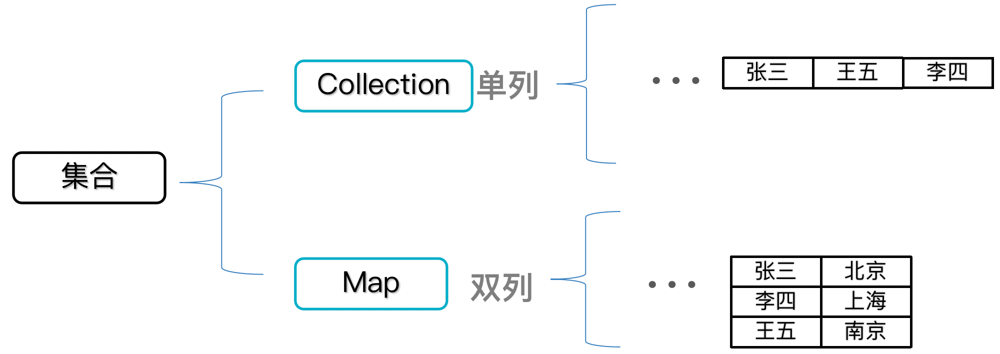
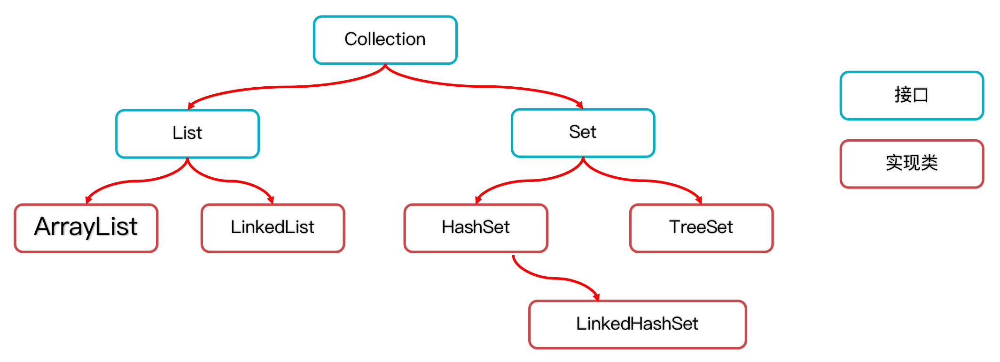
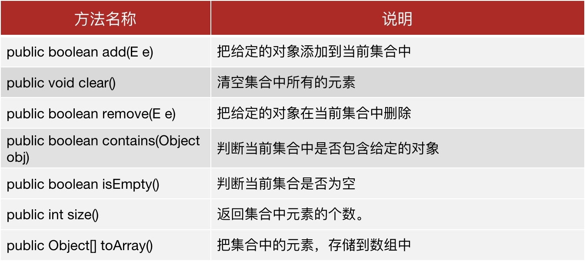

## 集合

**集合的特点：**

- 集合中存储的是元素对象的地址。
- 集合的大小不固定，启动后可以动态变化，类型也可以选择不固定。
- 集合非常适合元素个数不能确定，且需要做元素的增删操作的场景。
- 同时，集合提供的种类特别的丰富，功能也是非常强大的，开发中集合用的更多。

**注意事项：**

- 集合的泛型只支持引用数据类型，不支持基本数据类型。
- 可以在编译阶段约束集合只能操作某种数据类型。
- 所以集合中存储的元素都认为是对象。

**集合类体系结构：**

- Collection 代表单列集合，每个元素（数据）只包含一个值。
- Map 代表双列集合，每个元素（数据）包含两个值（健值对）。



## Collection

> Collection 代表单列集合，每个元素（数据）只包含一个值。
>
> 

**Collection 集合的特点：**

- <strong style="color: #fb9b5f">List 系列集合</strong>：添加的元素是有序、可重复、有索引。
  - `ArrayList`、`LinekdList`：有序、可重复、有索引。
- <strong style="color: #fb9b5f">Set 系列集合</strong>：添加的元素是无序、不重复、无索引。
  - `HashSet`：无序、不重复、无索引。
  - `LinkedHashSet`：有序、不重复、无索引。
  - `TreeSet`：按照大小默认升序排序、不重复、无索引。

### Collection集合常用API

> Collection 是单列集合的祖宗接口，它的功能是全部单列集合都可以继承使用的。



### Collection集合的遍历方式

#### 迭代器

> 遍历就是一个一个的把容器中的元素访问一遍。
>
> 迭代器在 Java 中的代表是 `Iterator` 迭代器是集合的专用的遍历方式。

Collection 集合获取迭代器：

| 方法名称               | 说明                                                         |
| ---------------------- | ------------------------------------------------------------ |
| `Iterator<E> iterator()` | 返回集合中的迭代器对象，该迭代器对象默认指向当前集合的 0 索引。 |

Iterator 中的常用方法：

| 方法名称          | 说明                                                         |
| ----------------- | ------------------------------------------------------------ |
| boolean hasNext() | 询问当前位置是否有元素存在，存在返回 true，不存在返回 false。 |
| E next()          | 获取当前位置的元素，并同时将迭代器对象移向下一个位置，注意防止取出越界。 |

示例代码：

```java
Iterator<String> iterator = lists.iterator();
while(iterator.hasNext()){
  String ele = it.next();
  System.out.println(ele);
}
```

注意事项：迭代器如果取元素越界会出现 `NoSuchElementException` 异常。

#### forEach或增强for

`forEach`：见以下 lambda 表达式。

增强 `for` 循环：既可以遍历集合也可以遍历数组。

```java
for(元素数据类型 变量名 : 数组或者Collection集合) {
       // 在此处使用变量即可 该变量就是元素
}

Collection<String> list = new ArrayList<>();
...
for(String ele : list) {
  System.out.println(ele);
}
```

####  lambda表达式

> 得益于 JDK8 开始的新技术 Lambda 表达式，提供了一种更简单、更直接的遍历集合的方式。

Collection 结合 Lambda 遍历的 API：

| 方法名称                                          | 说明                 |
| ------------------------------------------------- | -------------------- |
| default void forEach(Consumer<? super T> action); | 结合 lambda 遍历集合 |

示例代码：

```java
// 原来的代码
Collection<String> lists = new ArrayList<>();
...
lists.forEach(new Consumer<String>() {
  @Override
  public void accept(String s) {
    System.out.println(s);
  }
});

// 简化后的代码
lists.forEach(s -> {
   System.out.println(s);
});
// 或者
lists.forEach(s -> System.out.println(s));
```

### List系列集合

`List` 系列集合系列的特点：

- `ArrayList`、`LinekdList`：有序、可重复、有索引。
- 有序：指存储和取出的元素顺序一致。
- 有索引：可以通过索引操作元素。
- 可重复：存储的元素可以重复。

`List` 系列集合的特有方法：

- `List` 集合因为支持索引，所以多了很多索引操作的独特 API，其他 `Collection` 的功能 `List` 也都继承了。

  | 方法名称                      | 说明                                     |
  | ----------------------------- | ---------------------------------------- |
  | void add(int index,E element) | 在此集合中的指定位置插入指定的元素。     |
  | E remove(int index)           | 删除指定索引处的元素，返回被删除的元素。 |
  | E set(int index,E element)    | 修改指定索引处的元素，返回被修改的元素。 |
  | E get(int index)              | 返回指定索引处的元素。                   |

`List` 集合的遍历方式：

- 迭代器。
- 增强 `for` 循环。
- Lambda 表达式。
- `for` 循环（因为 `List` 集合存在索引）。

`List` 实现类的底层原理：

- `ArrayList` 的底层原理：

  - `ArrayList` 底层是基于数组实现的：根据索引定位元素快，增删需要做元素的移位操作。 

  - 第一次创建集合并添加第一个元素的时候，在底层创建一个默认长度为 10 的数组。


- `LinkedList` 的底层原理：
  - 底层数据结构是双链表，查询慢，首尾操作的速度是极快的，所以多了很多首尾操作的特有API。


`LinkedList` 集合的特有功能：

| 方法名称                  | 说明                               |
| ------------------------- | ---------------------------------- |
| public void addFirst(E e) | 在该列表开头插入指定的元素。       |
| public void addLast(E e)  | 将指定的元素追加到此列表的末尾。   |
| public E getFirst()       | 返回此列表中的第一个元素。         |
| public E getLast()        | 返回此列表中的最后一个元素。       |
| public E removeFirst()    | 从此列表中删除并返回第一个元素。   |
| public E removeLast()     | 从此列表中删除并返回最后一个元素。 |

#### ArrayList

ArrayList 代表的是集合类（集合是一种容器，与数组类似，不同的是<strong style="color: #fb9b5f">集合的大小是不固定的</strong>）。

通过创建 ArrayList 的对象表示得到一个集合容器，同时 ArrayList 提供了比数组更好用，更丰富的 API（功能）给程序员使用。

**ArrayList 集合的对象创建方式：**

| 构造器             | 说明                   |
| ------------------ | ---------------------- |
| public ArrayList() | 创建一个空的集合对象。 |

**ArrayList 集合添加元素的方法：**

| 方法名                               | 说明                                 |
| ------------------------------------ | ------------------------------------ |
| public boolean add(E e)              | 将指定的元素追加到此集合的末尾。     |
| public void add(int index,E element) | 在此集合中的指定位置插入指定的元素。 |

**ArrayList 对泛型的支持：**

`ArrayList<E>`：其实就是一个泛型类，可以在编译阶段约束集合对象只能操作某种数据类型。

举例说明：

- `ArrayList<String>`：此集合只能操作字符串类型的元素。
- `ArrayList<Integer>`：此集合只能操作整数类型的元素。

**ArrayList 常用方法、遍历：**

| 方法名称                          | 说明                                     |
| --------------------------------- | ---------------------------------------- |
| public E get(int index)           | 返回指定索引处的元素。                   |
| public int size()                 | 返回集合中的元素的个数。                 |
| public E remove(int index)        | 删除指定索引处的元素，返回被删除的元素。 |
| public boolean remove(Object o)   | 删除指定的元素，返回删除是否成功。       |
| public E set(int index,E element) | 修改指定索引处的元素，返回被修改的元素。 |


## Map

> Map 代表双列集合，每个元素（数据）包含两个值（健值对）。


