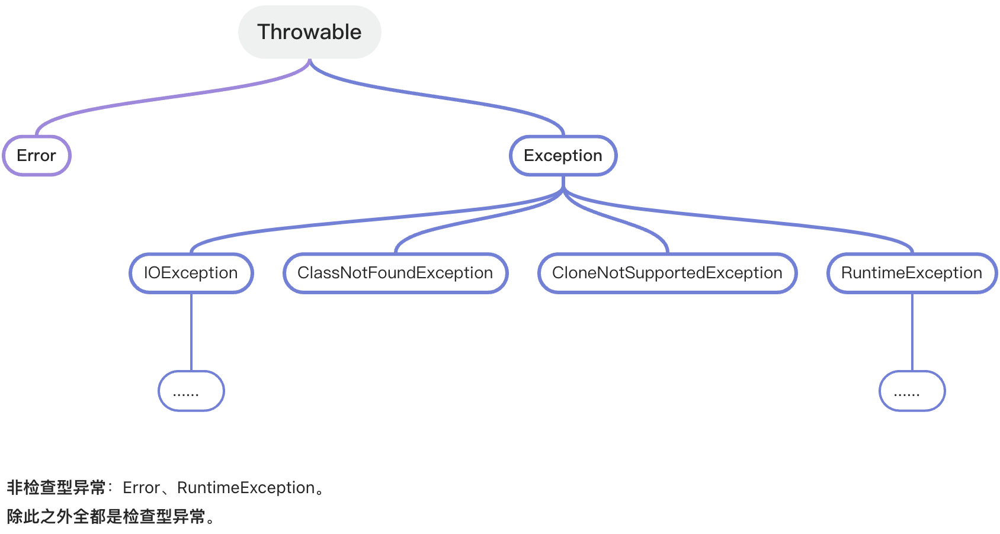

## 异常体系

`Error`：代表的是系统级别的错误（属于严重问题），也就是说系统一旦出现问题，则程序会立即停止运行（开发人员无需处理）。

`Exception`：它代表的是程序可能出现的问题，需要开发人员处理。

- 运行时异常（非检查型异常）：`Error`、`RuntimeException`。
  - 例如：空指针异常、索引越界异常、...。
- 编译时异常（检查型异常）：除运行时异常外的所有异常都属于编译时异常。
  - 例如：文件读取异常、日期解析异常、...。

### 自定义运行时异常

1. 定义一个异常类并继承 `RuntimeException`。
2. 重写构造器。
3. 通过 `throw new 自定义异常类(xxx)` 来创建异常对象并抛出。

运行时异常的特点：编译阶段不会报错，提醒不够强烈，运行时才可能会出现！

### 自定义编译时异常

1. 定义一个异常类并继承 `Exception`。
2. 重写构造器。
3. 通过 `throw new 自定义异常类(xxx)` 来创建异常对象并抛出。

编译时异常的特点：编译阶段就会报错，提醒更加的强烈！
