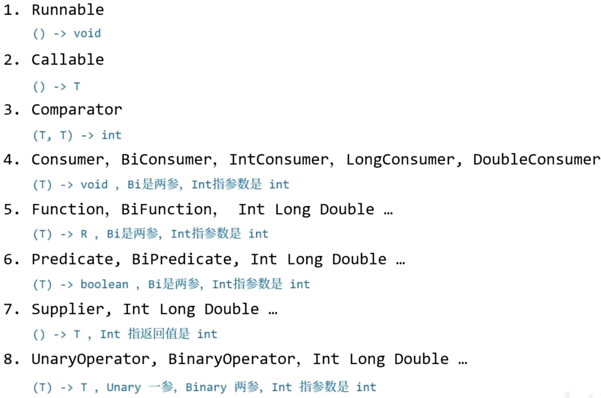
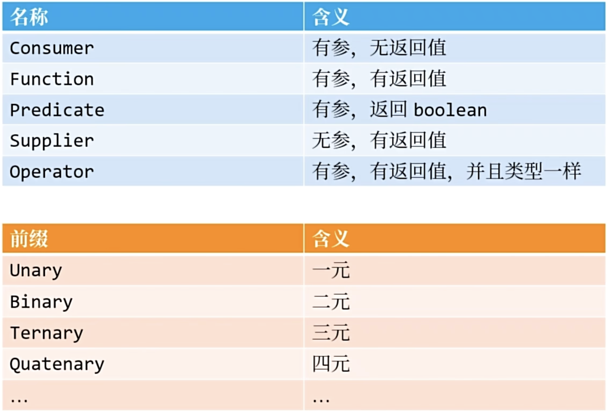
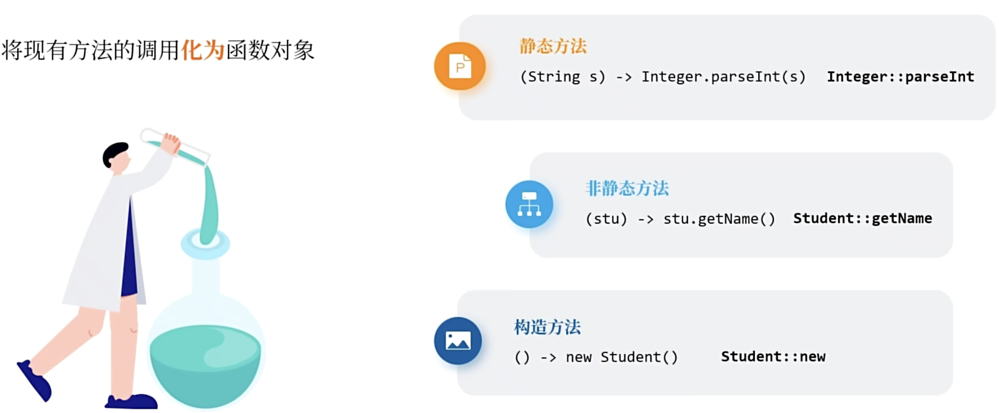
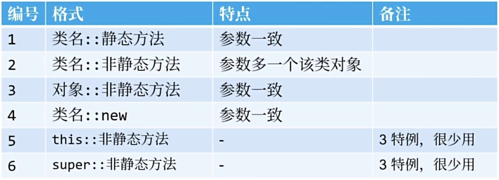
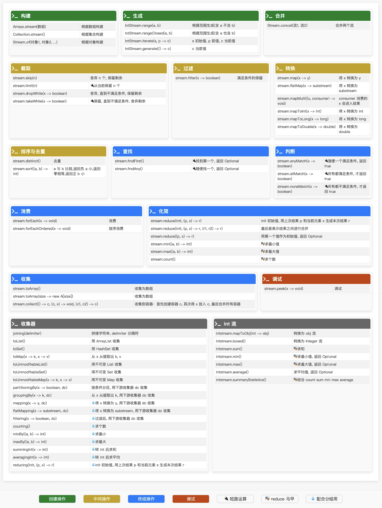

此处是一些 Java JDK8 的新特性（持续更新中...）。

<!-- more -->

## JDK8

**常见的函数接口：**

**函数接口的命名规则：**

**何为方法引用：**

**方法引用的格式说明：**

## Stream

### 1.构建流

**用已有数据构建出 Stream 对象：**

- 从集合构建：`集合.stream()`。
- 从数组构建：`Arrays.stream()`。
- 从对象构建：`Stream.of(对象...)`。

### 2.生成流

**不用现有数据生成 Stream 对象：**

> 以下只是举例说明（还有很多生成流的方式）。

- 简单生成：`IntStream.range(开始位置, 结束位置)` - 根据开始和结束位置生成中间的数据。
- 依赖上一个值生成当前值：`IntStream.iterate(初始元素, 终止条件, 生成规则)` - 可以根据上一个元素的值来生成当前元素。
- 不依赖上一个值生成当前值：`IntStream.generate(生成规则)` - 不依赖上一个元素的值来生成当前的元素。

### 3.合并与截取

- 将两个流合并成一个流：`Stream.concat(流1, 流2)`。
- 截取流中的一部分数据：
  - 根据位置：
    - `流.skip(long n)` - 跳过 n 个数据，保留剩下的数据。
    - `流.limit(long n)` - 保留 n 个数据，剩下的数据则不要了。
  - 根据条件：
    - `流.takeWhile(条件)` - 条件成立则保留，一旦条件不成立，则剩下的数据也不要了。
    - `流.dropWhile(条件)` - 条件成立则舍弃，一旦条件不成立，则剩下的数据保留下来。

### 总结

