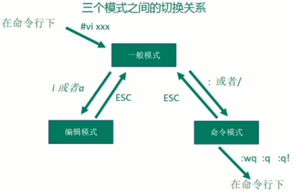
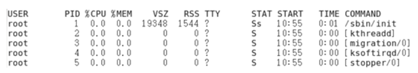

记录在开发过程中使用比较频繁的一些 Linux 命令（持续更新中...）。

<!-- more -->

## 1.帮助类命令

### 1.1 `man`

- 语法：
  - `man [命令或配置文件]`。

- 功能描述：
  - 获取相关命令或配置文件的帮助信息。

- 显示说明：

  | **信息**    | **功能**                 |
  | ----------- | ------------------------ |
  | NAME        | 命令的名称和单行描述     |
  | SYNOPSIS    | 怎样使用命令             |
  | DESCRIPTION | 命令功能的深入讨论       |
  | EXAMPLES    | 怎样使用命令的例子       |
  | SEE ALSO    | 相关主题（通常是手册页） |

- 示例：

  - 查看`ls`命令的帮助信息。

    ```bash
    man ls
    ```

### 1.2 `help`

- 语法：
  - `help 命令`。

- 功能描述：
  - 获得 Shell 内置命令的帮助信息。

- 示例：

  - 查看`cd`命令的帮助信息。

    ```bash
    help cd
    ```

## 2.开关机类命令

::: warning

一般 Linux 不会经常进行关机的操作。

正确的关机流程为：`sync > shutdown > reboot > poweroff`。

:::

- 语法：

  - `sync`：将内存中的数据同步到硬盘中。
  - `shutdown\[选项] now/时间`。
  - `reboot`：重启系统（等同于`shutdown -r now`）。

  - `poweroff`：关闭系统（等同于`shutdown -h now`）。

- 选项：

  | 选项 | 功能                 |
  | ---- | -------------------- |
  | -h   | -h=halt 表示关机。   |
  | -r   | -r=reboot 表示重启。 |

- 参数：

  | 参数 | 功能                     |
  | ---- | ------------------------ |
  | now  | 表示立刻关机。           |
  | 时间 | 等待多久之后关机（分钟） |

- **注意事项**：

  - Linux 系统中为了提高磁盘读写效率，对磁盘采取了"预读迟写"操作方式，当用户保存文件时，Linux 核心并不一定对保存的数据立刻写入物理磁盘，而是将数据保存在缓冲区中，等缓冲区写满时再写入磁盘。
  - 这种方式可以极大的提高磁盘写入数据的效率，同时也带来了安全隐患，如果数据还未写入磁盘时，系统掉电或者出现其他严重的问题造成宕机，可能会造成数据的丢失，使用`sync`指令可以立即将缓冲区的数据写入磁盘。

### 2.1 临时开关服务命令

- 语法：

  - Centos6.x 版本：

    - service 服务名 start 开启服务。

    - service 服务名 stop 关闭服务。

    - service 服务名 restart 重启服务。

    - service 服务名 status 查看服务状态。

  - Centos7.x 版本：

    - systemctl start 服务名 开启服务。

    - systemctl stop 服务名 关闭服务。

    - systemctl restart 服务名 重启服务。

    - systemctl status 服务名 查看服务。

    - systemctl --type service 查看正在运行的服务。

- 示例：

  - 查看网络服务状态：

    ```bash
    systemctl status network.service
    ```

  - 关闭服务：

    ```bash
    systemctl stop network.service
    ```

  - 启动服务：

    ```bash
    systemctl start network.service
    ```

  - 重启服务：

    ```bash
    systemctl restart network.service
    ```

  - 查看所有服务：

    ```bash
    systemctl --type service
    ```

- 补充说明：`.service`后缀可以省略不写。

### 2.2 永久开关服务命令

- 语法：

  - Centos6.x 版本：

    - chkconfig 查看所有服务自启配置。

    - chkconfig 服务名 off  关闭服务自启。

    - chkconfig 服务名 on 开启服务自启。

    - chkconfig 服务名 --list 查看服务开机启动状态。

  - Centos7.x 版本：

    - systemctl enable 服务名 打开自启。

    - systemctl disable 服务名 关闭自启。

    - systemctl is-enabled 服务名 查看服务是否自启。

    - systemctl list-unit-files 查看所有服务自启配置。

- 示例：

  - 关闭防火墙自动启动：

    ```bash
    systemctl status firewalld # 查看防火墙状态
    systemctl disable firewalld # 关闭防火墙自启
    ```
  
  - 开启防火墙自启：
  
    ```bash
    systemctl enable firewalld
    ```
  
  - 查看防火墙是否自启：
  
    ```bash
    systemctl is-enabled firewalld
    ```
  
  - 关闭网络管理器服务：
  
    ```bash
    systemctl status NetworkManager.service # 查看服务
    systemctl stop NetworkManager # 停止服务
    systemctl is-enabled NetworkManager # 查看自启动
    systemctl disable NetworkManager # 关闭自启动
    ```

### 2.3 Linux系统运行级别

Linux 系统有 7 种运行级别（runlevel）：常用的是级别有 3 和 5（CentOS7.x 中只有两个级别：3 和 5）。

- 运行级别 0：系统停机状态，系统默认运行级别不能设为 0，否则不能正常启动。
- 运行级别 1：单用户工作状态，root 权限，用于系统维护，禁止远程登陆。
- 运行级别 2：多用户状态（没有NFS），不支持网络。
- 运行级别 3：完全的多用户状态（有NFS），登陆后进入控制台命令行模式。
- 运行级别 4：系统未使用（保留级别）。
- 运行级别 5：X11 控制台，登陆后进入图形 GUI 模式。
- 运行级别 6：系统正常关闭并重启，默认运行级别不能设为 6，否则不能正常启动。


## 3.文件目录类命令

### 3.1 `pwd`

- 语法：

  - `pwd`。

- 功能描述：

  - 打印当前工作目录的绝对路径（）。

- 示例：

  - 显示当前工作目录的绝对路径：

    ```bash
    pwd
    ```

### 3.2 `ls`

- 语法：
  - `ls [选项] [目录或是文件]`。

- 选项：

  | 选项 | 功能                                                      |
  | ---- | --------------------------------------------------------- |
  | -a   | 列出全部的文件，连同隐藏的（开头为`.`的文件）一起列出来。 |
  | -l   | 长数据串列出，包含文件的属性与权限等信息。                |

- 显示说明：

  - 每行列出的信息依次是：

    - 文件类型与权限；

    - 链接数；

    - 文件属主；

    - 文件属组；

    - 文件大小（byte）；

    - 建立或最近修改的时间；

    - 名字。

- 功能描述：
  - 列出目录里的内容（list）。

- 示例：

  - 查看当前目录的所有内容信息：

    ```bash
    ls -al
    ```

### 3.3 `cd`

- 语法：

  - `cd [参数]`。

  - 参数：

    | 参数         | 功能                                   |
    | ------------ | -------------------------------------- |
    | cd 绝对路径  | 切换路径                               |
    | cd 相对路径  | 切换路径                               |
    | cd ~ 或者 cd | 回到自己的家目录                       |
    | cd -         | 回到上一次所在目录                     |
    | cd ..        | 回到当前目录的上一级目录               |
    | cd -P        | 跳转到实际物理路径（而非快捷方式路径） |
    | cd /         | 回到系统根目录                         |

- 功能描述：
  - 切换路径（Change Directory）。

- 示例：

  - 使用绝对路径切换到 root 目录：

    ```bash
    cd /root
    ```

### 3.4 `mkdir`

- 语法：
  - `mkdir [选项] 要创建的目录名称`。

- 选项：

  | 选项 | 功能         |
  | ---- | ------------ |
  | -p   | 创建多层目录 |

- 功能描述：
  - 建立目录（Make directory）。

- 示例：

  - 创建一个目录：

    ```bash
    mkdir dev
    ```

  - 创建一个多级目录：

    ```bash
    mkdir -p dev/test/project
    ```

### 3.5 `rmdir`

- 语法：
  - `rmdir 要删除的空目录`。

- 功能描述：
  - 删除一个空的目录（Remove directory）。

- 示例：

  - 删除一个空的文件夹：

    ```bash
    rmdir dev/test/project
    ```

### 3.6 `touch`

- 语法：
  - `touch 文件名称`。

- 功能描述：
  - 创建空文件。

- 示例：

  - 创建一个空的文件：

    ```bash
    touch dev/test/project/dev.txt
    ```

### 3.7 `cp`

- 语法：
  - `cp [选项] source target` - 命令解释：复制 source 文件到 target。

- 选项：

  | 选项 | 功能               |
  | ---- | ------------------ |
  | -r   | 递归复制整个文件夹 |

- 参数：

  > 复制 source 文件到 target。

  | 参数   | 说明       |
  | ------ | ---------- |
  | source | 源文件。   |
  | target | 目标文件。 |

- 功能描述：
  - 复制文件或目录。

- 示例：

  - 复制文件：

    ```bash
    cp dev/test/project/dev.txt /opt/dev
    ```

  - 递归复制整个文件夹：

    ```bash
    cp -r dev/test/project/ ./
    ```

- 注意事项：
  - 强制覆盖不提示的方法：`\cp [选项] source target`。

### 3.8 `rm`

- 语法：
  - `rm [选项] 文件/目录名称`。

- 选项：

  | 选项 | 功能                             |
  | ---- | -------------------------------- |
  | -r   | 递归删除目录所有内容。           |
  | -f   | 强制删除（不提示用户进行确认）。 |
  | -v   | 显示指令的详细执行过程。         |

- 功能描述：
  - 移除文件或者目录。

- 示例：

  - 删除目录中的内容：

    ```bash
    rm dev/test/project/dev.txt
    ```

  - 递归删除目录中所有内容：

    ```bash
    rm -rf  dev/
    ```

### 3.9 `mv`

- 语法：

  - 重命名：`mv 旧文件名称 新文件名称`。

  - 移动文件：`mv /目录/文件名称 /目标目录`。

- 功能描述：
  - 移动文件与目录或重命名。

- 示例：

  - 重命名：

    ```bash
    mv dev/test/project/dev.txt /root/new-dev.txt
    ```

  - 移动文件：

    ```bash
    mv /root/new-dev.txt ./
    ```

### 3.10 `cat`

- 语法：
  - `cat [选项] 文件名称`。

- 选项：

  | 选项 | 功能描述                       |
  | ---- | ------------------------------ |
  | -n   | 显示所有行的行号（包括空行）。 |

- 功能描述：
  - 查看文件内容（一般用于查看比较小的文件：一屏幕能显示全的）。

- 示例：

  - 查看文件内容并显示行号：

    ```bash
    cat -n dev.txt 
    ```

### 3.11 `more`

- 语法：
  - `more 要查看的文件名称`。

- 操作说明：

  > more 指令是一个基于 VI 编辑器的文本过滤器。
  >
  > 它以全屏幕的方式按页显示文本文件的内容。
  >
  > more 指令中内置了若干快捷键（详见操作说明）。

  | 操作            | 功能说明                                 |
  | --------------- | ---------------------------------------- |
  | 空白键（space） | 代表向下翻一页。                         |
  | Enter           | 代表向下翻『一行』。                     |
  | q               | 代表立刻离开 more ，不再显示该文件内容。 |
  | Ctrl+F          | 向下滚动一屏。                           |
  | Ctrl+B          | 返回上一屏。                             |
  | =               | 输出当前行的行号。                       |
  | :f              | 输出文件名和当前行的行号。               |

- 功能描述：
  - 文件分屏查看器。

- 示例：

  - 采用 more 查看文件。

    ```bash
    more redis.conf
    ```

### 3.12 `less`

- 语法：
  - `less 要查看的文件名称`。

- 操作说明：

  ::: note 补充说明

  less 指令用来分屏查看文件的内容。

  它的功能与 more 指令类似，但是比 more 指令更加强大，支持各种显示终端。

  less 指令在显示文件内容时，并不是一次将整个文件加载之后才显示，而是根据显示需要加载内容，对于显示大型文件具有较高的效率。

  :::

  | 操作       | 功能说明                                           |
  | ---------- | -------------------------------------------------- |
  | 空白键     | 向下翻动一页。                                     |
  | [pagedown] | 向下翻动一页。                                     |
  | [pageup]   | 向上翻动一页。                                     |
  | /字串      | 向下搜寻『字串』的功能：n：向下查找。N：向上查找。 |
  | ?字串      | 向上搜寻『字串』的功能：n：向上查找。N：向下查找。 |
  | q          | 离开 less 这个程序。                               |

- 功能描述：
  - 分屏显示文件内容。

- 示例：

  - 采用 less 查看文件：

    ```bash
    less redis.conf
    ```

### 3.13 `head`

- 语法：

  - `head 文件名称` - 命令解释：默认查看文件头 10 行内容。

  - `head -n 5 文件名称`或`head -5 文件名称` - 命令解释：查看文件头 5 行内容。

- 选项：

  | 选项            | 功能说明                 |
  | --------------- | ------------------------ |
  | -n <显示的行数> | 指定显示头部内容的行数。 |

- 功能描述：
  - 显示文件的开头部分内容（默认情况下 head 指令显示文件的前 10 行内容）。

- 示例：

  - 查看文件的头 2 行内容：

    ```bash
    head -n 2 redis.conf # 或 head -2 redis.conf
    ```

### 3.14 `tail`

- 语法：

  - `tail 文件名称` - 命令解释：默认查看文件后 10 行内容。

  - `tail -n 5 文件名称` - 命令解释：查看文件后 5 行内容。

  - `tail -f 文件名称` - 命令解释：实时追踪该文档的所有更新。

- 选项：

  | 选项            | 功能说明                                 |
  | --------------- | ---------------------------------------- |
  | -n <显示的行数> | 指定显示尾部内容的行数。                 |
  | -f              | 显示文件最新追加的内容（监视文件变化）。 |

- 功能描述：
  - 用于输出文件中尾部的内容（默认情况下 tail 指令显示文件的后 10 行内容）。

- 示例：

  - 查看文件头 1 行的内容：

    ```bash
    tail -n 1 redis.conf # 或 tail -1 redis.conf 
    ```

  - 实时追踪该档的所有更新：

    ```bash
    tail -f redis.log
    ```

### 3.15 `echo`

- 语法：
  - `echo [选项] [输出的内容]`。

- 选项：

  | 选项 | 功能描述                   |
  | ---- | -------------------------- |
  | -e   | 支持反斜线控制的字符转换。 |

  | 控制字符 | 作用                    |
  | -------- | ----------------------- |
  | \\\\     | 输出\本身。             |
  | \n       | 换行符。                |
  | \t       | 制表符（也就是Tab键）。 |

- 功能描述：
  - 输出内容到控制台（类似：System.out.println()）。

- 示例：

  - 打印文字信息：

    ```bash
    echo "hello\tworld" # hello\tworld echo -e "hello\tworld" # hello   world
    ```

  - 打印环境变量：

    ```bash
    echo $PATH
    ```

### 3.16 `>` `>>`

- 语法：

  - `ll > 文件名称` - 命令解释：将 ll 命令查询出的列表内容写入文件 a.txt 中（覆盖写）。

  - `ll >> 文件` - 命令解释：将 ll 命令查询出的列表内容追加到文件 a.txt 的末尾。

  - `cat 文件名称1 > 文件名称2` - 命令解释：将文件名称 1 中的内容覆盖到文件名称 2 中。

  - `echo “内容” >> 文件名称` - 命令解释：将“内容”两字追加到文件 a.txt 的末尾。

- 功能描述：
  - 一个 > 是覆盖。
  - 两个 >> 是追加。

- 示例：

  - 将 ls 查询出的信息写入到文件中：

    ```bash
    ls -l > a.txt
    ```

  - 将 ls 查询出的信息追加到文件中：

    ```bash
    ls -l >> a.txt
    ```

  - 采用 echo 将 hello 单词追加到文件中：

    ```bash
    echo "hello" >> a.txt
    ```

### 3.17 `ln`

- 语法：
  - `ln [-s] [原文件名称或目录名称] [链接名称]` - 命令解释：给原文件创建一个链接。

- 选项：

  | 选项 | 功能说明             |
  | ---- | -------------------- |
  | -s   | 创建的链接为软连接。 |

- 功能描述：

  - 创建链接和软链接。

    ::: note 补充说明

    链接表示的是目标资源另外的访问方式（表示一种路径）。

    软链接也称为符号链接，类似于 Windows 系统中的快捷方式，有自己的数据块，主要存放了链接其他文件的路径。

    :::

- 经验技巧：

  - 删除软链接：`rm -rf 软链接名名称`而不是`rm -rf 软链接名/`。

  - 查询：通过 ll 命令就可以查看，列表属性第 1 位是 l 的则表示是软连接，名称尾部会有位置指向。

- 示例：

  - 创建软连接：

    ```bash
    mv houge.txt xiyou/qujing/
    ln -s /root/xiyou/qujing/houge.txt /root/houzi
    ll
    # lrwxrwxrwx. 1 root  root   20 6月 17 12:56 houzi -> xiyou/qujing/houge.txt
    ```

  - 删除软连接：

    ```bash
    rm -rf houzi
    ```

  - 进入软连接实际物理路径：

    ```bash
    ln -s xiyou/qujing/ ./qujing cd -P qujing/
    ```

### 3.18 `history`

- 语法：
  - `history`。

- 功能描述：
  - 查看已经执行过历史命令。

- 示例：

  - 查看已经执行过的历史命令：

    ```bash
    history
    ```

  - `/root/.bash\_history`文件中也是历史命令：

    ```bash
    less /root/.bash_history
    ```

## 4.VI和VIM编辑器

### 4.1 `VI`和`VIM`简介

VI 是 Unix 和类 Unix 操作系统中出现的通用的文本编辑器。

VIM 是从 VI 发展出来的一个性能更强大的文本编辑器，可以主动的以字体颜色辨别语法的正确性，方便程序设计。

VIM 和 VI 编辑器完全兼容。

使用方式：`vi xxx文件`或者`vim xxx文件`，简单来说，就是用来编辑文件的一个工具，类似于我们再 Windows 上的一些文本编辑工具，只不过，这里是命令行形式的，不是图形用户界面形式的。

### 4.2 `VIM`的一般模式

::: note 默认模式

- 在这个模式中，可以使用『上下左右』按键来移动光标。
- 可以使用『删除字符』或『删除整行』来处理档案内容。
- 也可以使用『复制、贴上』来处理文件数据。

:::

#### 4.2.1 删除和复制操作


#### 4.2.2 光标的移动操作


### 4.3 `VIM`的编辑模式

在一般模式中可以进行删除、复制、贴上等等的动作，但是却无法编辑文件内容！需要等到你按下『i、I、o、O、a、A、r、R』等任何一个字母之后才会进入编辑模式（如下图所示）。

**注意**：通常在 Linux 中，按下这些按键时，在画面的左下方会出现『INSERT 或 REPLACE 』的字样，此时才可以进行编辑。

而如果需要回到一般模式时，则必须要按下『Esc』这个按键即可退出编辑模式。


### 4.4 `VIM`的命令模式

可以进行存盘、退出、显示行号、搜索、批量替换等操作（如下图所示）。

要在一般模式下输入`/`或`:`或者`?`可进入命令模式，当命令执行前按『Esc』或者命令执行完毕，自动回到一般模式。


### 4.5 三个模式之间的关系



::: warning

如果非正常退出，如使用`ctrl+z`退出，再次编辑会提示交换文件 `*.swp`已存在，并给出相应的处理方式选项，如果不删除该交换文件，每次编辑都会提示，这时可以删除交换文件，通过命令`rm -rf '*.swp'`即可。

:::

## 5.时间日期类命令

### 5.1 显示当前时间

- 语法：

  - `date` - 命令解释：显示当前时间。

  - `date +%Y` - 命令解释：显示当前年份。

  - `date +%m` - 命令解释：显示当前月份。

  - `date +%d` - 命令解释：显示当前是哪一天。

  - `date "+%Y-%m-%d %H:%M:%S"` - 命令解释：显示年月日时分秒。

- 功能描述：
  - 显示当前时间。

- 示例：

  - 显示当前时间信息：

    ```bash
    date # 2020年 02月 13日 星期二 15:08:30 CST
    ```

  - 显示当前时间年月日：

    ```bash
    date +%Y%m%d
    ```

  - 显示当前时间年月日时分秒：

    ```bash
    date "+%Y-%m-%d %H:%M:%S"
    ```

### 5.2 显示非当前时间

- 语法：

  - `date -d '1 days ago'` - 命令解释：显示前一天时间。

  - `date -d '-1 days ago'` - 命令解释：显示明天的时间。

- 功能描述：
  - 显示非当前时间。

- 示例：

  - 显示前一天：

    ```bash
    date -d '1 days ago'
    ```

  - 显示明天时间：

    ```bash
    date -d '-1 days ago'
    ```

### 5.3 设置的系统时间

- 语法：
  - `date -s 字符串时间`。

- 功能描述：
  - 设置系统的时间。

- 示例：

  - 设置系统当前时间。

    ```bash
    date -s "2018-09-01 20:00:00"
    ```

## 6.用户管理类命令

### 6.1 添加新用户

- 语法：

  - `useradd 用户名称` - 命令解释：添加新用户。

  - `useradd -g 组名称 用户名称` - 命令解释：添加新用户到某个组。

- 功能描述：
  - 添加新用户。

- 示例：

  - 添加一个新的用户：

    ```bash
    useradd zhangsan
    ```

- 注意事项：
  - 添加用户后需要设置用户密码才能够使用该用户登录系统。

### 6.2 设置用户密码

- 语法：
  - `passwd 用户名称` - 命令解释：给用户设置密码。

- 功能描述：
  - 设置用户密码。

- 示例：

  - 给用户设置密码：

    ```bash
    passwd zhangsan
    ```

### 6.3 查看用户是否存在

- 语法：
  - `id 用户名称`。

- 功能描述：
  - 查看用户是否存在。

- 示例：

  - 查看用户是否存在：

    ```bash
    id zhangsan
    ```

### 6.4 查看已创建的所有用户

- 语法：
  - `cat /etc/passwd`。

- 功能描述：
  - 查看所有创建的用户（主要是查看系统中记录用户的文件）。

- 示例：

  - 查看创建的所有用户：

    ```bash
    cat /etc/passwd
    ```

### 6.5 切换用户

- 语法：

  - `su 用户名称` - 命令解释：切换用户（只能获得用户的执行权限-不能获得环境变量）。

  - `su - 用户名称` - 命令解释：切换到用户并获得该用户的环境变量及执行权限。

- 功能描述：
  - 切换用户。

- 示例：

  - 切换用户：

    ```bash
    su zhangsan
    echo $PATH # /usr/lib64/qt-3.3/bin:/usr/local/sbin:/usr/local/bin:/sbin:/bin:/usr/sbin:/usr/bin:/root/bin
    
    exit
    su - zhangsan
    echo $PATH # /usr/lib64/qt-3.3/bin:/usr/local/bin:/bin:/usr/bin:/usr/local/sbin:/usr/sbin:/sbin:/home/tangseng/bin
    ```

  - 回退到上一个用户：

    ```bash
    exit
    ```

### 6.6 删除用户

- 语法：

  - `userdel 用户名称` - 命令解释：删除用户但保存用户主目录。

  - `userdel -r 用户名称` - 命令解释：用户和用户主目录都删除。

- 选项：

  | 选项 | 功能描述                                 |
  | ---- | ---------------------------------------- |
  | -r   | 删除用户的同时删除与用户相关的所有文件。 |

- 功能描述：
  - 删除用户。

- 示例：

  - 删除用户但保存用户主目录：

    ```bash
    userdel zhangsan
    ```

  - 删除用户和用户主目录都删除：

    ```bash
    userdel -r zhangsan
    ```

### 6.7 查看当前登录的用户

- 语法：

  - `whoami` - 命令解释：显示自身用户名称。

  - `who am i` - 命令解释：显示登录用户的用户名。

- 功能描述：
  - 查看当前登录的用户信息。

- 示例：

  - 显示自身用户名称：

    ```bash
    whoami
    ```

  - 显示登录用户的用户名：

    ```bash
    who am i
    ```

### 6.8 设置普通用户具有Root权限

- 语法：
  - `sudo 命令` - 命令解释：“命令”是指需要执行的必须要有 root 权限才能执行的命令。

- 功能描述：
  - 设置普通用户也能执行 root 权限。

- 示例：

  - 添加一个新的用户并且让其可以执行 root 权限：

    1. 添加`zhangsan`用户并对其设置密码：

       ```bash
       useradd zhangsan passwd ZhangSan
       ```

    2. 然后修改配置文件：

       ```bash
       # 第一步：
       vim /etc/sudoers
       
       # 第二步：
       # 修改 /etc/sudoers 文件；
       # 找到下面一行（大约在 101 行）在 root 下面添加一行；
       # 如下：
       ## Allow root to run any commands anywhere
       root  ALL=(ALL)   ALL
       zhangsan  ALL=(ALL)   ALL
       
       # 第二步（推荐）：
       # 或者配置成采用 sudo 命令时不需要输入密码
       ## Allow root to run any commands anywhere
       root   ALL=(ALL)   ALL
       zhangsan  ALL=(ALL)   NOPASSWD:ALL
       
       # 修改完毕就可以使用 zhangsan 帐号登录；
       # 然后用 sudo 命令即可获得 root 权限进行操作。
       ```

    3. 检验用普通用户在 /opt 目录下创建一个文件夹：

       ```bash
       # 1.切换用户
       su zhangsan
       
       # 2.执行命令
       sudo mkdir module
       ```

## 7.组管理类命令

每个用户都有一个用户组。

系统可以对一个用户组中的所有用户进行集中管理。

不同的 Linux 系统对用户组的规定有所不同，如 Linux 下的用户属于与它同名的用户组，这个用户组在创建用户时同时创建。

用户组的管理涉及用户组的添加、删除和修改。

组的增加、删除和修改实际上就是对`/etc/group`文件的更新。

### 7.1 新增组

- 语法：
  - `groupadd 组名称`。

- 功能描述：
  - 新增用户组。

- 示例：

  - 添加一个 demo 组：

    ```bash
    groupadd demo
    ```

### 7.2 删除组

- 语法：
  - `groupdel 组名称`。

- 功能描述：
  - 删除用户组。

- 示例：

  - 删除 demo 组：

    ```bash
    groupdel demo
    ```

### 7.3 查看已创建的组

- 语法：
  - `cat /etc/group` - 命令解释：实际就是查看`/etc/group`文件中的内容。

- 功能描述：
  - 查看已经创建了那些组。

- 示例：

  - 查看已创建的组：

    ```bash
    cat /etc/group
    ```

### 7.4 修改用户所属的组

- 语法：
  - `usermod -g 用户组名称 用户名称`。

- 选项：

  | 选项 | 功能描述                                   |
  | ---- | ------------------------------------------ |
  | -g   | 修改用户的初始登录组（给定的组必须存在）。 |

- 功能描述：
  - 修改用户所属的组。

- 示例：

  - 将用户加入到用户组：

    ```bash
    usermod -g test zhangsan
    ```

## 8.文件权限类命令

### 8.1 文件属性信息解读

- 文件类型和权限的表示（如下图所示）。

  

  1. 0 首位表示该文件的类型（在 Linux 中第一个字符代表的是这个文件的类型是目录、文件、链接文件、...）。

     | 符号 | 对应的文件类型          |
     | ---- | ----------------------- |
     | -    | 代表文件。              |
     | d    | d 代表目录。            |
     | l    | 链接文档（link file）。 |

  2. 第 1～3 位确定属主（该文件的所有者）拥有该文件的权限（U -> User）。

  3. 第 4～6 位确定属组（所有者的同组用户）拥有该文件的权限（G -> Group）。

  4. 第 7～9 位确定的是其他用户拥有该文件的权限（O -> Other）。

- `rwx`权限作用到目录和文件的不同含义。

  - 作用到文件：

    `r`代表可读（read）：可以读取、查看。

    `w`代表可写（write）：可以修改，但是不能删除该文件，对该文件所在的目录有写的权限才能删除。

    `x`代表可执行（execute）：可以被系统执行。

  - 作用到目录：

    `r`代表可读（read）：可以读取、`ls`查看目录中的内容。

    `w`代表可写（write）：可以修改，目录内创建、删除、重命名目录。

    `x`代表可执行（execute）：可以进入该目录。

- 如下图示例中是某个文件的权限解读（可通过`ls -l`或`ll`命令列出文件的详细信息）：

  

::: important

如果查看到是文件：链接数指的是硬链接个数。

如果查看的是文件夹：链接数指的是子文件夹个数。

:::

### 8.2 `chmod`改变文件权限

- 基本语法：

  

  - 第一种方式变更权限：

    ```bash
    chmod [{ugoa}{+-=}{rwx}] 文件名称或目录名称
    ```

  - 第二种方式变更权限：

    ```bash
    chmod [mode=421 ] [文件名称或目录名称]
    ```

::: important 经验技巧

- 如上图（基本语法中的图）所示：

  - u -> 表示该文件所有者拥有的权限。

  - g -> 表示该文件所有者同组用户的权限。

  - o -> 表示其他用户对该文件拥有的权限。

  - a -> 代表所有人的权限（u、g、o 的总和）。

- “可读可写可执行”分别用数字来表示：`r=4`、`w=2`、`x=1`。

- 则完全拥有“可读可写可执行”权限的数字是 7：`rwx=4+2+1=7`。
- 那我们在设置权限的时候可以简化为：`chmod -R 777 demo.sh`。

:::

- 实操案例：

  - 修改文件使其所属主用户具有执行权限：

    ```bash
    chmod u+x demo.txt
    ```

  - 修改文件使其所属组用户具有执行权限：

    ```bash
    chmod g+x demo.txt
    ```

  - 修改文件所属主用户执行权限，并使其他用户具有执行权限：

    ```bash
    chmod u-x,o+x demo.txt
    ```

  - 采用数字的方式，设置文件所有者、所属组、其他用户都具有可读可写可执行权限：

    ```bash
    chmod 777 demo.txt
    ```

  - 修改整个文件夹里面的所有文件的所有者、所属组、其他用户都具有可读写执行权限：

    ```bash
    chmod -R 777 test/
    ```

### 8.3 `chown`改变所有者

- 基本语法：

  - `chown [选项] [最终用户名称] [文件名称或目录名称]`。

- 选项：

  | 选项 | 功能       |
  | ---- | ---------- |
  | -R   | 递归操作。 |

- 功能描述：

  - 改变文件或者目录的所有者。

- 示例：

  - 修改文件所有者：

    ```bash
    chown zhangsan demo.txt 
    ```

  - 递归改变文件所有者和所有组：

    ```bash
    chown -R zhangsan:zhangsan test/
    ```

### 8.4 `chgrp`改变所属组

- 基本语法：

  - `chgrp [最终用户组名称] [文件名称或目录名称]`。

- 功能描述：

  - 改变文件或者目录的所属组。

- 示例：

  - 修改文件的所属组：

    ```bash
    chgrp root demo.txt
    ```

## 9.搜索查找类命令

### 9.1 `find`查找文件或者目录

- 基本语法：

  - `find [搜索范围] [选项]`。

- 选项：

  | 选项            | 功能                               |
  | --------------- | ---------------------------------- |
  | -name<查询方式> | 按照指定的文件名查找模式查找文件。 |
  | -user<用户名>   | 查找属于指定用户名所有文件。       |
  | -size<文件大小> | 按照指定的文件大小查找文件。       |

- 功能描述：

  - `find`指令将从指定目录向下递归地遍历其各个子目录，将满足条件的文件显示在终端。

- 示例：

  - 按文件名：根据名称查找`/`目录下的`filename.txt`文件。

    ```bash
    find / -name "*.txt"
    ```

  - 按拥有者：查找`/opt`目录下，用户名称为`-user`的文件。

    ```bash
    find opt/ -user zhangsan
    ```

  - 按文件大小：在`/home`目录下查找大于 200m 的文件（+n 大于 -n 小于  n 等于）。

    ```bash
    find /home -size +204800
    ```

### 9.2 `grep`过滤查找及`|`管道符

- 基本语法：

  - `grep 选项 查找的内容 源文件名称`。

- 选项：

  | 选项 | 功能             |
  | ---- | ---------------- |
  | -n   | 显示匹配及行号。 |

- 功能描述：

  - 管道符`|`表示将前一个命令的处理结果输出传递给后面的命令处理。

- 示例：

  - 查找某文件在第几行：

    ```bash
    ls | grep -n demo
    ```

## 10.压缩和解压缩命令

### 10.1 `gzip`/`gunzip`压缩

- 基本语法：

  - `gzip 文件名称` - 命令解释：压缩文件（只能将文件压缩为`*.gz`文件）。
  - `gunzip 文件名称.gz` - 命令解释：解压缩`*.gz`文件的命令。

- 经验技巧：

  - 该命令只能压缩文件，不能压缩目录。
  - 该命令不会保留原来的文件。

- 示例：

  - gzip 压缩文件：

    ```bash
    gzip demo.txt # 输出的结果为：demo.txt.gz
    ```

  - gunzip 解压缩文件：

    ```bash
    gunzip demo.txt.gz
    ```

### 10.2 `zip`/`unzip`压缩

- 基本语法：

  - `zip [选项] xxx.zip 将要压缩的内容` - 命令解释：压缩文件或目录的命令。

  - `unzip [选项] xxx.zip` - 命令解释：解压缩文件的命令。

- 选项：

  | zip 的选项 | 功能       |
  | ---------- | ---------- |
  | -r         | 压缩目录。 |

  | unzip 的选项 | 功能                       |
  | ------------ | -------------------------- |
  | -d<目录>     | 指定解压后文件的存放目录。 |

- 经验技巧：

  - `zip`压缩命令在 Window/Linux 系统中都通用（可以压缩目录且保留源文件）。

- 示例：

  - zip 压缩文件：

    ```bash
    zip demo.txt test.txt # 可以同时压缩多个文件
    # 输出结果：demo.zip test.zip
    ```

  - 解压文件：

    ```bash
    unzip demo.zip test.zip # 可以同时解压多个文件
    ```

  - 解压到指定目录：

    ```bash
    unzip demo.zip -d /opt
    ```

### 10.3 `tar`打包

- 基本语法：

  - `tar [选项] xxx.tar.gz 将要打包进去的内容` - 命令解释：打包目录（压缩后的文件格式`.tar.gz`）。

- 选项：

  | 选项 | 功能                 |
  | ---- | -------------------- |
  | -z   | 打包同时压缩。       |
  | -c   | 产生 .tar 打包文件。 |
  | -v   | 显示详细信息。       |
  | -f   | 指定压缩后的文件名。 |
  | -x   | 解包 .tar 文件。     |

- 示例：

  - 压缩多个文件：

    ```bash
    tar -zcvf demo.tar.gz test.txt zhangsan.txt
    ```

  - 压缩目录：

    ```bash
    tar -zcvf demo.tar.gz test/
    ```

  - 解压到当前目录：

    ```bash
    tar -zxvf demo.tar.gz
    ```

  - 解压到指定目录：

    ```bash
    tar -zxvf demo.tar.gz -C /opt
    ```

## 11.磁盘分区类命令

### 11.1 `df`

- 基本语法：

  - `df 选项` - 命令解释：df 是 disk free（空余硬盘） 的缩写。

- 选项：

  | 选项 | 说明                                                     |
  | ---- | -------------------------------------------------------- |
  | -h   | 以人们较易阅读的 GBytes, MBytes, KBytes 等格式自行显示。 |

- 功能描述：

  - 可以列出文件系统的整体磁盘使用量（检查文件系统的磁盘空间占用情况）。

- 示例：

  - 查看磁盘使用情况：

    ```bash
    df -h
    ```

### 11.2 `fdisk`

- 基本语法：

  - `fdisk -l`。

- 选项：

  | 选项 | 功能                     |
  | ---- | ------------------------ |
  | -l   | 显示所有硬盘的分区列表。 |

- 功能描述：

  - 查看磁盘分区的详情。

  - Linux 分区：

    - Device：分区序列。
    - Boot：引导。
    - Start：从X磁柱开始。
    - End：到Y磁柱结束。
    - Blocks：容量。
    - Id：分区类型ID。
    - System：分区类型。

  - Windows 分区如下图所示：

    

- 经验技巧：

  - 该命令必须在`root`用户下才能使用。

- 示例：

  - 查看 Linux 系统分区情况：

    ```bash
    fdisk -l
    ```

### 11.3 `mount`/`umount`

::: info 什么是挂载和卸载？

对于 Linux 用户来讲，不论有几个分区，分别分给哪一个目录使用，它总归就是一个根目录、一个独立且唯一的文件结构。

Linux 中每个分区都是用来组成整个文件系统的一部分，它在用一种叫做“挂载”的处理方法，它整个文件系统中包含了一整套的文件和目录，并将一个分区和一个目录联系起来，要载入的那个分区将使它的存储空间在这个目录下获得。

:::

挂载前的准备工作（必须要有光盘或者已经连接镜像文件）。


- 基本语法：

  - `mount [-t vfstype] [-o options] device dir`  - 命令解释：挂载设备。
  - `umount 设备文件名或挂载点` - 命令解释：卸载设备。

- 参数：

  | 参数       | 功能                                                         |
  | ---------- | ------------------------------------------------------------ |
  | -t vfstype | 指定文件系统的类型，通常不必指定。mount 会自动选择正确的类型。常用类型有：<br />1.光盘或光盘镜像：iso9660<br />2.DOS fat16文件系统：msdos<br />3.Windows 9x fat32文件系统：vfat<br />4.Windows NT ntfs文件系统：ntfs<br />5.Mount Windows文件网络共享：smbfs<br />6.UNIX (LINUX) 文件网络共享：nfs |
  | -o options | 主要用来描述设备或档案的挂接方式。常用的参数有：<br />loop：用来把一个文件当成硬盘分区挂接上系统。 <br />ro：采用只读方式挂接设备。<br />rw：采用读写方式挂接设备。<br />iocharset：指定访问文件系统所用字符集。 |
  | device     | 要挂接（mount）的设备。                                      |
  | dir        | 设备在系统上的挂接点（mount point）。                        |

- 示例：

  - 挂载光盘镜像文件：

    ```bash
    mkdir /mnt/cdrom/ # 建立挂载点
    mount -t iso9660 /dev/cdrom /mnt/cdrom/ # 将设备名称iso9660 /dev/cdrom 挂载到 /mnt/cdrom 中
    ll /mnt/cdrom/ # 查看
    ```

  - 卸载光盘镜像文件：

    ```bash
    umount /mnt/cdrom
    ```

  - 设置开机自动挂载：

    ```bash
    vi /etc/fstab
    ```

    添加红框中内容后保存退出：

    

## 12.进程线程类命令

::: info 什么是进程和线程？

进程是正在执行的一个程序或命令，每一个进程都是一个运行的实体，都有自己的地址空间，并占用一定的系统资源。

:::

### 12.1 `ps`

- 基本语法：

  - `ps -aux | grep xxx` - 命令解释：查看系统中所有进程。
  - `ps -ef | grep xxx` - 命令解释：可以查看子父进程之间的关系。

- 选项：

  | 选项 | 功能                     |
  | ---- | ------------------------ |
  | -a   | 选择所有进程。           |
  | -u   | 显示所有用户的所有进程。 |
  | -x   | 显示没有终端的进程。     |

- 功能描述：

  - `ps`是 process status（进程状态）的简写。

  - 作用是查看当前系统进程的状态。

- 显示说明：

  - `ps -aux`命令输出的显示信息说明。
    - USER：该进程是由哪个用户产生的。
    - PID：进程的 ID 号。
    - %CPU：该进程占用 CPU 资源的百分比，占用越高，进程越耗费资源。
    - %MEM：该进程占用物理内存的百分比，占用越高，进程越耗费资源。
    - VSZ：该进程占用虚拟内存的大小，单位 KB。
    - RSS：该进程占用实际物理内存的大小，单位 KB。
    - TTY：该进程是在哪个终端中运行的。其中 tty1-tty7 代表本地控制台终端，tty1-tty6 是本地的字符界面终端，    tty7是图形终端，pts/0-255 代表虚拟终端。
    - STAT：进程状态（常见的状态有：R：运行、S：睡眠、T：停止状态、s：包含子进程、+：位于后台）。
    - START：该进程的启动时间。
    - TIME：该进程占用CPU的运算时间（注意不是系统时间）。
    - COMMAND：产生此进程的命令名。
  - `ps -ef`命令输出的显示信息说明。
    - UID：用户 ID。
    - PID：进程 ID。
    - PPID：父进程 ID。
    - C：CPU 用于计算执行优先级的因子。数值越大，表明进程是 CPU 密集型运算，执行优先级会降低；数值越小，表明进程是 I/O 密集型运算，执行优先级会提高。
    - STIME：进程启动的时间。
    - TTY：完整的终端名称。
    - TIME：CPU 时间。
    - CMD：启动进程所用的命令和参数。

- 经验技巧：

  - 如果想查看进程的 **CPU** 占用率和内存占用率，可以使用`aux`。
  - 如果想查看**进程的父进程 ID** 可以使用`ef`。

- 示例：

  - `ps -aux`：

    ```bash
    ps -aux
    ```

    

  - `ps -ef`：

    ```bash
    ps -ef
    ```

    

### 12.2 `kill`

- 基本语法：

  - `kill [选项] 进程号` - 命令解释：通过进程号杀死进程。
  - `killall 进程名称` - 命令解释：通过进程名称杀死进程（也支持通配符）。

- 选项：

  | 选项 | 功能                   |
  | ---- | ---------------------- |
  | -9   | 表示强迫进程立即停止。 |

- 功能描述：

  - 根据进程名称或进程号来终止某一个进程。

- 示例：

  - 强迫杀死浏览器进程：

    ```bash
    kill -9 5102
    ```

  - 通过进程名称杀死进程：

    ```bash
    killall firefox
    ```

## 13.系统定时任务命令

### 13.1 `crond`

- 功能描述：
  - 服务管理。

- 示例：

  - 重新启动`crond`服务：

    ```bash
    systemctl restart crond
    ```

### 13.2 `crontab`

- 基本语法：

  - `crontab [选项]`。

- 选项：

  | 选项 | 功能                              |
  | ---- | --------------------------------- |
  | -e   | 编辑 crontab 定时任务。           |
  | -l   | 查询 crontab 任务。               |
  | -f   | 删除当前用户所有的 crontab 任务。 |

- 功能描述：

  - 定时任务设置。

- 参数：

  - 进入`crontab`的编辑界面（会打开`vim`编辑你的工作，通过 "\*    " 定义任务周期）。

    ```bash
    crontab -e
    ```

    | 项目        | 选项                   | 范围                       |
    | ----------- | ---------------------- | -------------------------- |
    | 第一个“ \*” | 一小时当中的第几分钟。 | 0-59                       |
    | 第二个“ \*” | 一天当中的第几小时。   | 0-23                       |
    | 第三个“ \*” | 一个月当中的第几天。   | 1-31                       |
    | 第四个“ \*” | 一年当中的第几月。     | 1-12                       |
    | 第五个“ \*” | 一周当中的星期几。     | 0-7（0 和 7 都代表星期日） |

  - 每个星号上可以使用的特殊符号。

    | 特殊符号 | 含义                                                         |
    | -------- | ------------------------------------------------------------ |
    | \*       | 代表任何时间。比如第一个“ \*”就代表一小时中每分钟都执行一次的意思。 |
    | ,        | 代表不连续的时间。比如“0 8,12,16 \* \* \* 命令”，就代表在每天的8点0分，12点0分，16点0分都执行一次命令。 |
    | -        | 代表连续的时间范围。比如“0 5 \*   \* 1-6命令”，代表在周一到周六的凌晨5点0分执行命令。 |
    | \*/n     | 代表每隔多久执行一次。比如“ \*/10       命令”，代表每隔10分钟就执行一遍命令。 |

  - 特定时间执行命令。

    | 时间                           | 含义                                       |
    | ------------------------------ | ------------------------------------------ |
    | 45 22 \* \* \* 命令            | 在22点45分执行命令。                       |
    | 0 17 \* \* 1 命令              | 每周1 的17点0分执行命令。                  |
    | 0 5 1,15 \* \* 命令            | 每月1号和15号的凌晨5点0分执行命令。        |
    | 40 4 \* \* 1-5 命令            | 每周一到周五的凌晨4点40分执行命令。        |
    | \*/10 4 \* \* \* 命令          | 每天的凌晨4点，每隔10分钟执行一次命令。    |
    | 0 0 1,15 \* 1 命令（错误案例） | 每月1号和15号，每周1的0点0分都会执行命令。 |

    **注意**：星期几和几号最好不要同时出现，因为他们定义的都是天（非常容易让管理员混乱）。

- 示例：

  - 每隔 1 分钟向`/root/demo.txt`文件中添加一些内容：

    ```bash
    */1 * * * * /bin/echo "11" >> /root/demo.txt
    ```
