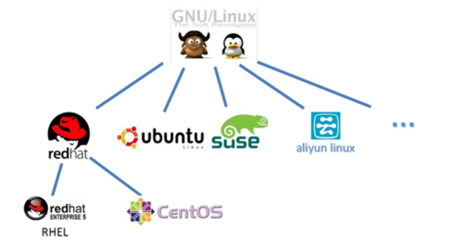

Linux 的入门概述，可了解到 Linux 的发展历史和各类发行版本。

<!-- more -->

## 1.Linux简介

Linux 全称 GNU/Linux。

其内核由“林纳斯·本纳第”、“克特·托瓦兹”在赫尔辛基大学上学时出于个人爱好而编写的操作系统内核。

于 1991 年 10 月 5 日首次发布。

它主要受到 Minix 和 Unix 思想的启发，是一套免费使用和自由传播的类 Unix 操作系统，它是一个基于 POSIX 的多用户、多任务、支持多线程和多 CPU 的操作系统。

它能运行主要的 Unix 工具软件、应用程序和网络协议。

它支持 32 位和 64 位硬件。

Linux 继承了 Unix 以网络为核心的设计思想，是一个性能稳定的多用户网络操作系统。

## 2.Linux历史

1946 年 2 月 14 日在美国宾夕法尼亚大学诞生人类第一台计算机，用了 18000 个电子管，占地 170 平方米，重达 30吨，耗电功率约 150 千瓦，每秒钟可进行高达 5000 次运算！！美国国防部用它来进行弹道计算！！！

1969 年，Ken Thompson（C 语言之父）利用汇编语言（B 语言）开发了 File Server System（Unics，即 UNIX 的原型）。

1973 年，Dennis Ritchie 和 Ken Thompson 发明了 C 语言，随后二人使用 C 语言重写 UNIX 的内核。

1983 年 11 月 10 日，为向 IBM 公司研发的计算机提供图形用户界面和多任务环境的操作系统，微软公司在纽约广场酒店宣布开发 Microsoft Windows；同月，微软公司 CEO 比尔·盖茨向 IBM 展示了 Windows 的测试版本，命名为“界面管理器”（后经过营销专家罗兰·汉森的建议改为现名）。

1985 年 11 月 20 日，在宣布开发 Windows 两年后，微软公司正式发布 Windows 1.0，硬件要求极高！！！最低 256KB 内存、两个双面软盘驱动器和一个图形适配卡。

1990 年 5 月 22 日，Windows 3.0 正式发布，改善了系统外观，增加了虚拟内存和 VxD 功能及程序管理器、文件管理器和打印管理器，在首销的六个月中便卖出了 200 多万份。

1991 年，芬兰赫尔辛基大学的研究生 Linus Torvalds 基于 gcc、bash 开发了针对 386 机器的 Linux 内核。

1994 年，Torvalds 发布 Linux-v1.0。

1996 年，Torvalds 发布 Linux-v2.0，确定了 Linux 的吉祥物为“企鹅”。

1997 年经过许多失败的项目后，苹果于是出新操作系统 - Mac OS 的测试版，而后推出的正式版取得了巨大的成功。

## 3.Linux特点

1. 一切皆文件。

   系统中的所有都归结为一个文件，包括命令、硬件和软件设备、操作系统、进程等等对于操作系统内核而言，都被视为拥有各自特性或类型的文件,每个文件都有确定的用途。

2. 开源免费。

   用户可以通过网络或其他途径免费获得，并可以任意修改其源代码。

   也正是由于这一点，来自全世界的无数程序员参与了 Linux 的修改、编写工作，程序员可以根据自己的兴趣和灵感对其进行改变，这让 Linux 吸收了无数程序员的精华，不断壮大。

3. 兼容 POSIX.0 标准。

   许多用户在考虑使用 Linux 时，就想到以前在 Windows 下常见的程序是否能正常运行，完全兼容 POSIX.0 标准使得可以在 Linux 下通过相应的模拟器运行常见的 DOS、Windows 的程序。这为用户从 Windows 转到 Linux 奠定了基础。

4. 良好的图形用户界面。

   Linux 同时具有字符界面和图形界面。

   在字符界面通过指令来进行操作。

   它同时也提供了类似 Windows 图形界面，用户可以使用鼠标对其进行操作。

5. 多用户和多任务。

   Linux 支持多用户，各个用户对于自己的文件设备有自己特殊的权利，保证了各用户之间互不影响。

   多任务则是现代电脑最主要的一个特点，Linux 可以使多个程序同时并独立地运行。

6. 支持多平台。

   Linux 可以运行在多种硬件平台上，如具有 x86、680x0、SPARC、Alpha 等处理器的平台。

   此外 Linux 还是一种嵌入式操作系统，可以运行在掌上电脑、机顶盒或游戏机上。

   2001 年 1 月份发布的 Linux 2.4 版内核已经能够完全支持 Intel64 位芯片架构。

   同时 Linux 也支持多处理器技术，多个处理器同时工作，使系统性能大大提高。

## 4.Linux 应用场景

Linux 是一款开源、高效、稳定、安全漏洞少的操作系统，对程序员来说，其主要应用领域为服务端，是一款非常优秀的服务端操作系统。

今天各种场合都有使用各种 Linux 发行版，从嵌入式设备到超级计算机，并且在服务器领域确定了地位，通常服务器使用组合：LAMP（Linux + Apache + MySQL + PHP）、LNMP（ Linux + Nginx+ MySQL + PHP  ）。

PC 端 Windows 和服务端 Linux 对比如下图：

## 5.Linux常见版本

严格来讲，Linux 这个词本身只表示 Linux 的内核，但实际上人们已经习惯了用 Linux 来形容整个基于 Linux 内核的发行版本。

各不同版本的 Linux 都是基于相同的内核版本，只是用的内核版本可能有高有低，同时各厂家自己加了自己有特点的工具，还有某些文件位置不一样，不同版本的 Linux 相同度可以达 90%。

### 5.1 RedHat家族

- Redhat 企业版：这个需要授权费，主要用在高要求的服务器商用系统。
- CentOS：CentOS 全名为“社区企业操作系统”，CentOS 社区将 Red hat 的网站上的所有源代码下载下来，进行重新编译。
- Fedara：被红帽公司定位为新技术的实验场地，许多新的技术都会在 FC 中检验。
- 其他：Scientific Linux  、Oracle Linux。

### 5.2 Debian家族

- Debian：运行起来极其稳定，这使得它非常适合用于服务器，Debian 这款操作系统无疑并不适合新手用户，而是适合系统管理员和高级用户。
- Ubuntu：Debian 的一款衍生版，也是当今最受欢迎的免费操作系统，是一个以桌面应用为主的 Linux 操作系统。
- 其他基于 Debian 的版本有：Linux Mint、Knoppix、MEPIS、sidux、CrunchBang Linux、Chromium OS、Google Chrome OS。

### 5.3 SUSE家族

- SUSE：是欧洲大陆最流行的 Linux 起源于德国，于 2003 年末被 Novell 收购。
- SUSE Linux：针对个人用户，可以免费下载。
- SUSE Linux Enterprise Server。
- SUSE Linux Enterprise Desktop。
- SUSE Manager。
- SUSE Studio。

### 5.4 Gentoo家族

- Gentoo：是 Linux 世界最年轻的发行版本，正因为年轻，所以能吸取在她之前的所有发行版本的优点。
- Gentoo Linux。
- Sabayon Linux。
- Calculate Linux。
- Funtoo Linux。
