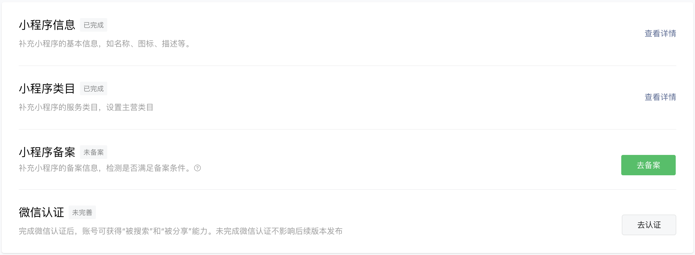
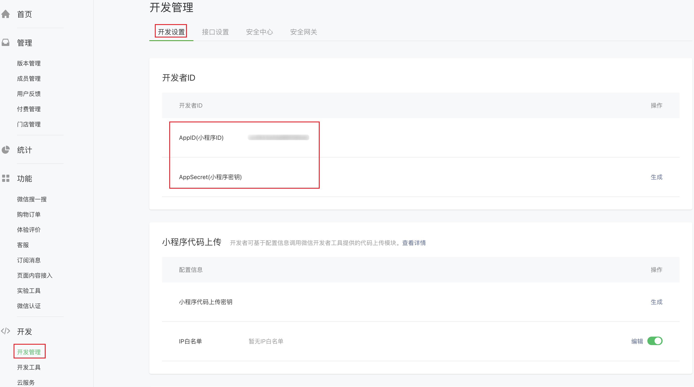
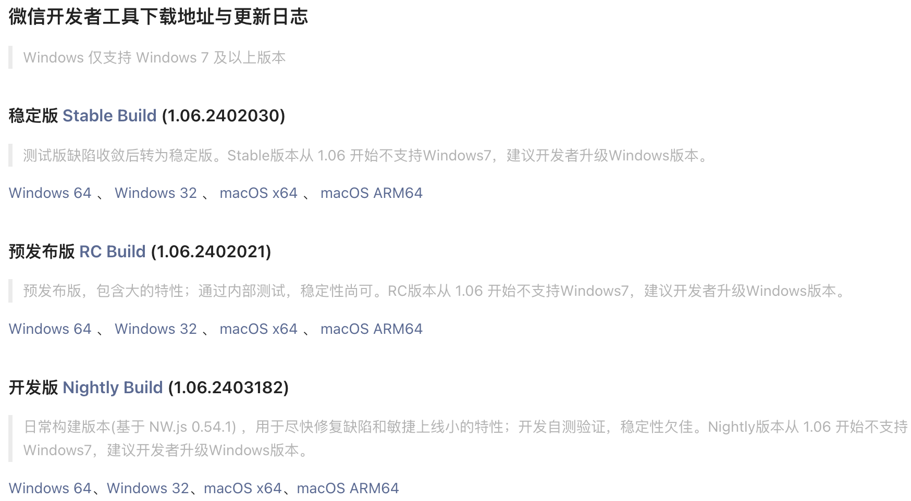
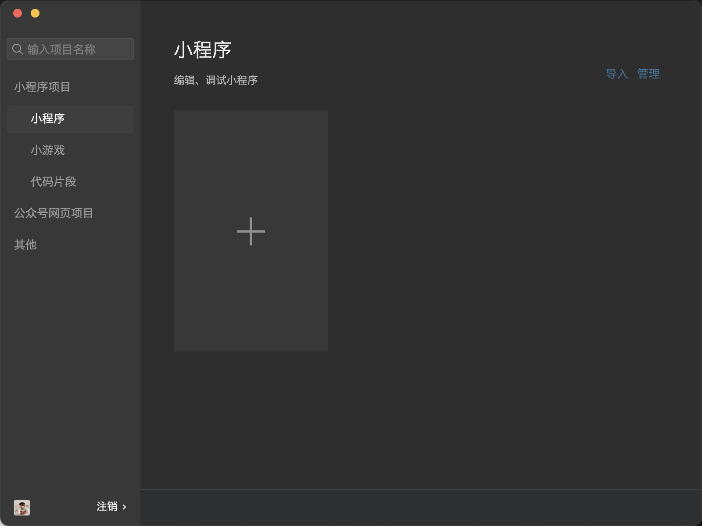
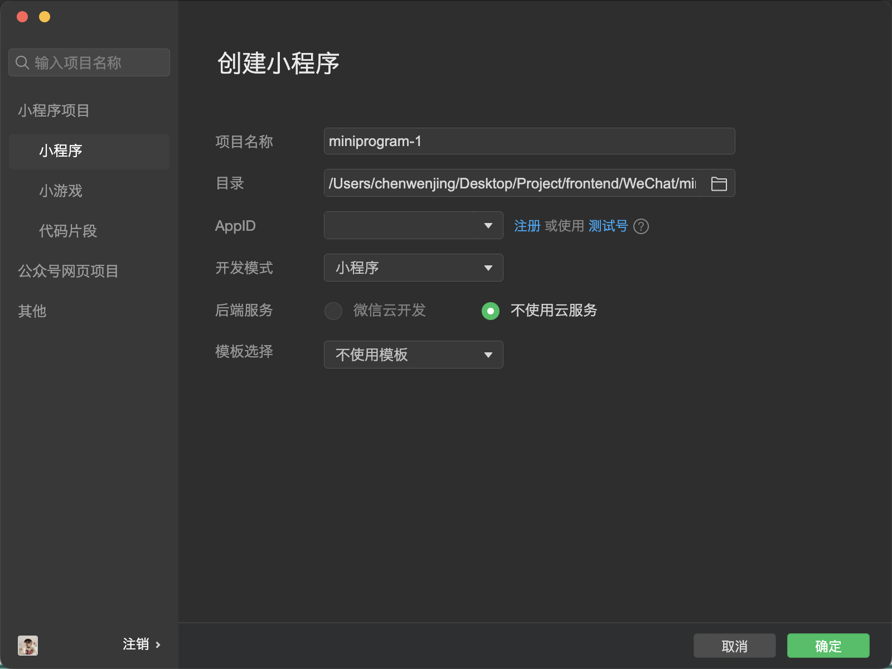
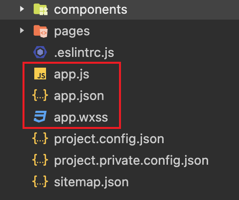
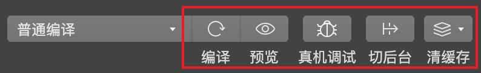
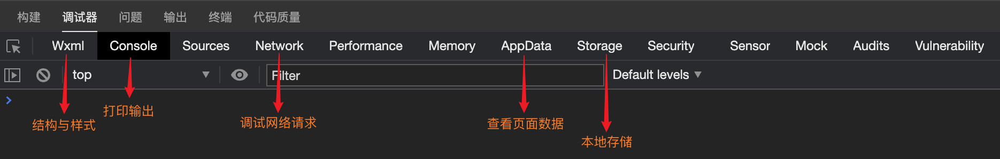
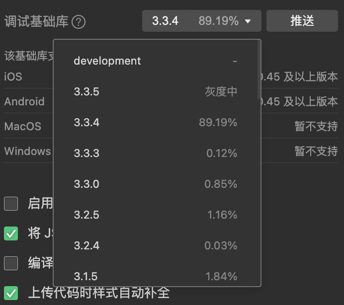

::: note

此处是一些 微信小程序 的基础知识（持续更新中...）。

:::

<!-- more -->

## 简介

微信小程序是一种运行在微信内部的轻量级应用程序。

在使用小程序时不需要下载安装，用户扫一扫或搜一下即可打开应用。

它也体现了 “用完即走” 的理念，用户不用关心安装太多应用的问题。

它实现了应用“触手可及”的梦想，应用无处不在，随时可用，但又无须安装卸载。

小程序的四大特性：**无须安装**、**用完即走**、**无须卸载**、**触手可及**。

## 小程序账号注册

小程序开发与网页开发不一样，在开始微信小程序开发之前，需要访问[微信公众平台](https://mp.weixin.qq.com)，注册一个微信小程序账号。

有了小程序的账号以后，我们才可以开发和管理小程序，后续需要通过该账号进行开发信息的设置、开发成员的添加，也可以用该账
号查看小程序的运营数据。

在申请账号前，我们需要先准备一个邮箱，该邮箱要求：

1. 未被微信公众平台注册！
2. 未被微信开放平台注册！
3. 未被个人微信号绑定过（如果被绑定了需要解绑或使用其他邮箱）！

在完成小程序账号的注册后，需要打开微信公众平台对小程序账号进行一些设置，这是因为小程序在上线阶段 - 提交审核的时候，
小程序账号信息是必填项，因此在注册小程序以后，需要补充小程序的基本信息，如名称、图标、类目等。

同时需要进行小程序备案和微信认证。

## 项目成员和体验成员

小程序提供了两种不同的成员角色：项目成员和体验成员。

**项目成员**：表示参与小程序开发、运营的成员，包括运营者、开发者及数据分析者，项目成员则可登陆微信公众后台，管理员可以在成
员管理中添加、删除项目成员，并设置项目成员的角色。

**体验成员**：表示参与小程序内测体验的成员，可使用体验版小程序，但不属于项目成员（管理员及项目成员均可添加、删除体验成员）。

## 小程序开发者ID

微信小程序账号只要开发者满足开发资质都可以进行注册，并且会获得对应的开发者 ID。

一个完整的开发者 ID 由小程序 ID（AppID）和一个小程序密钥（AppSecret）组成。

**小程序 ID**：是小程序在整个微信账号体系内的唯一身份凭证，后续在很多地方都会用到（例如：新建小程序项目、真机调试、发布小程序等操作时都必须要有小程序 ID）。

**小程序密钥**：是开发者对小程序拥有所有权的凭证，在进行微信登录、微信支付，或进行发送消息等高级开发时会使用到。

## 微信开发者工具

为了帮助开发者简单和高效地开发和调试微信小程序，微信官方提供了[微信开发者工具](https://developers.weixin.qq.com/miniprogram/dev/devtools/download.html)，利用开发者工具可以很方便地进行小程序开
发、代码查看以及编辑、预览和发布等。

微信开发者工具包含三个版本：

1. 稳定版：稳定性高（开发中一般推荐大家使用稳定版本）。
2. 预发布版：稳定性尚可（一般包含新的、大的特性，通过了内部测试）。
3. 开发版：稳定性差（主要用于尽快修复缺陷和敏捷上线小的特性）。

::: warning

微信开发者工具必须联网使用！！！

:::

## 创建小程序项目

1. 打开微信开发者工具，左侧选择小程序并点击 + 号即可新建项目。

   

2. 在弹出的新页面中填写项目信息。

   

## 文件和目录结构介绍

一个完整的小程序项目分为两个部分：主体文件、页面文件。

主体文件又称**全局文件**，能够作用于整个小程序，影响到小程序的每个页面，主体文件必须放到项目的根目录下。

**主体文件由三部分组成：**

1. `app.js`：小程序入口文件。
2. `app.json`：小程序的全局配置文件。
3. `app.wxss`：小程序的全局样式。

::: warning

主体文件的名字必须是 `app` 并且 `app.js` 和 `app.json` 文件是必须的！！！

:::

页面文件是每个页面所需的文件，小程序页面文件都存放在 pages 目录下，一个页面一个文件夹。

**页面文件由四个文件组成（每个文件只对当前页面有效）：**

1. `xxx.js`：定义页面的逻辑。
2. `xxx.wxml`：定义页面的结构。
3. `xxx.wxss`：定义页面的样式。
4. `xxx.json`：页面配置文件。

::: warning

`xxx.js` 文件和 `xxx.wxml` 文件是必须的！！！

:::

## 调试微信小程序

在进行项目开发的时候，不可避免的需要进行调试，那么如何调试小程序呢？

::: warning

微信开发者工具的缓存非常严重。

如果发现代码和预期的不一样，先点击编译！

编译后如果还是没有达到预期的效果，就需要先清除缓存，甚至需要重启项目才可以！！！

:::

### 小程序调试基础库

小程序调试基础库是指微信开发者工具中可以选择的微信基础库的版本。

微信基础库是指小程序的运行环境，给小程序提供了运行所需的各种 API 和工具，以及基础框架和运行逻辑等。

小程序开发者可以在微信开发者工具中选择所需的微信基础库版本，作为运行和调试小程序时的运行环境。

每个小程序都有自己所允许使用的基础库最低版本要求，开发者需要选择要兼容的基础库版本，从而确保小程序的功能正常运行。

