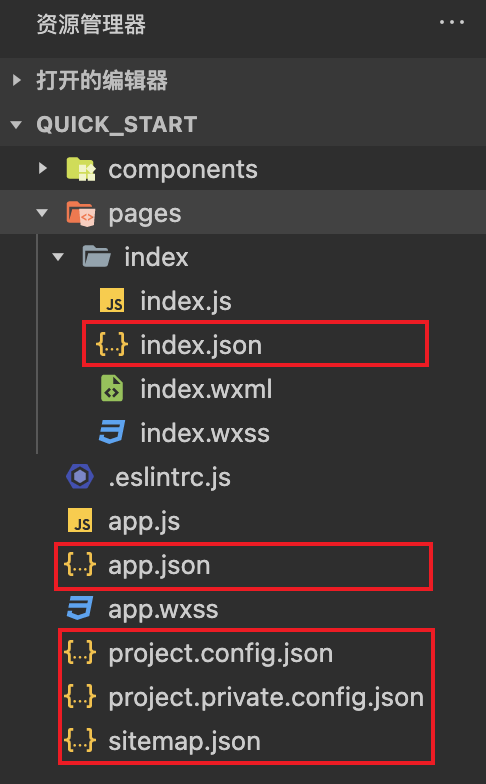

微信小程序的配置文件详解。

<!-- more -->

## 配置文件介绍

<strong style="color: #fb9b5f">JSON</strong> 是一种轻量级的数据格式，常用于前后端数据的交互，但是在小程序中，<strong style="color: #fb9b5f">JSON 扮演的是配置项的角色</strong>，用于配置项目或者页面的属性和行为，每个页面或组件也都有一个对应的 JSON 文件。

小程序中常见的配置文件有以下几种：

1. `app.json`：小程序全局配置文件，用于配置小程序的一些全局属性和页面路由。
2. `页面.json`：小程序页面配置文件，也称局部配置文件，用于配置当前页面的窗口样式、页面标题等。
3. `project.config.json`：小程序项目的公共配置文件，用于保存项目公共的配置信息。
4. `project.private.config.json`：小程序项目的私有配置文件，用于保存项目开发者的个人配置。
5. `sitemap.json`：配置小程序及其页面是否允许被微信索引，提高小程序在搜索引擎搜索到的概率。

::: warning

`project.private.config.json` 建议写到 `.gitignore` 避免版本管理的冲突。

与项目最终编译结果有关的配置必须配置到 `project.config.json` 文件中！！！

:::

未完待续...
